# Introductie

## Sociocratie 3.0 - Een praktische gids voor de ontwikkeling van wendbare en veerkrachtige organisaties

### Effectief samenwerken op elke schaal

Sociocratie 3.0 - **oftewel S3** is een praktische gids om wendbare en veerkrachtige organisaties te ontwikkelen van elke schaalgrootte, van kleine start-ups tot aan grote internationale netwerken en landelijke samenwerkingen bestaande uit meerdere entiteiten. Het voorziet in een samenhangende manier om integriteit in een organisatie te laten groeien en **een sociocratische, agile manier van denken** te ontwikkelen.

S3 bestaat uit een zeer volledige verzameling van richtlijnen en werkwijzen (patronen), die effectief zijn gebleken voor organisatie om **prestaties te verbeteren, op elkaar af te stemmen, zingeving te vergroten en welzijn te verbeteren**.

Deze patronen helpen ontdekken hoe doelen het best bereikt kunnen worden en hoe om te gaan met complexe situaties., Stap voor stap, **zonder de noodzaak aan radicale verandertrajecten, reorganisaties of lange termijn verander initiatieven:**

Begin gewoon daar waar de grootste behoefte aan verandering ligt, selecteer een of meer patronen om te proberen, **beweeg in je eigen tempo** en ontwikkel vaardigheden terwijl je bezig bent.

Er zitten voor iedereen handige en relevante patronen bij **ongeacht positie in de organisatie**.

Sociocratie 3.0 is:

- **flexibel**: aanpasbare patronen, onafhankelijk inzetbaar en wederzijds versterkend, in te zetten op alle aspecten van samenwerking
- **op principes gebaseerd:** 7 kernprincipes uit agile en sociocratische manieren van samenwerken worden weerspiegeld in elk patroon
- **gratis**: gelicentieerd onder een Creative Commons Free Culture Licentie

### Wat zit er in voor mij?

**Sociocratie 3.0:**

- biedt een samenhangende verzameling van op principes gebaseerde patronen om samen te werken, om te gaan met complexiteit, aan te blijven passen aan de context en te blijven ontwikkelen.
- ondersteunt mensen om in kleine stapjes beschikbare informatie te verwerken om werkprocessen, producten, diensten en vaardigheden continue te blijven verbeteren.
- helpt organisaties om zo goed mogelijk gebruik te maken van aanwezig talent en flexibele organisatiestructuren te ontwikkelen om de stroom van informatie en invloed goed af te stemmen op de waardestroom.
- biedt een organische, iteratieve aanpak voor verandering die daar begint waar de organisatie is en helpt te bewegen op een tempo dat passend is bij hen, de behoeften en de context waar zij zich in bevinden.
- maakt gebruik van de collectieve intelligentie van een groep.
- faciliteert de ontwikkeling van strategieën die "goed genoeg voor nu zijn" en "veilig genoeg om te proberen".
- bevordert accountability en een gevoel van betrokkenheid.
- helpt zowel individuen als organisaties om te veranderen.

**Sociocratie 3.0 kan worden toegepast binnen:**

- start-ups
- MKB's
- grote, internationale, netwerkorganisaties
- families
- door beleggers gefinancierde organisaties
- gemeenschappen
- en meer…

### Inhoud van deze handleiding

- een klein beetje geschiedenis en een kort overzicht van enkele basisconcepten achter S3
- een beschrijving van alle patronen in S3
- een bijlage 
    - changelog
    - info over auteurs en dank aan
    - de licentie
    - de Intentionele Commitment voor Beoefenaars en Leraren van Sociocratie 3.0 (ICPT, uit het Engels)
    - woordenlijst en index

## Invloeden en geschiedenis van Sociocratie 3.0

De letterlijke betekenis van de term **sociocratie** is "heerschappij van de kameraden": *socio* — van het Latijnse *socius* — betekent "kameraad", of "vriend", en de toevoeging *-cratie* — van het oud Griekse (krátos) — betekent "macht", of "heers".

Het woord sociocratie kan worden herleid tot 1851, toen **Auguste Comte** voorstelde een wetenschappelijke benadering van de samenleving toe te passen: staten zouden worden bestuurd door een orgaan van wetenschappers die deskundigen zijn in de samenleving (die hij "sociologen" noemde). Volgens hem zou deze toekomst, hoewel nog niet haalbaar, onvermijdelijk zijn.

Een paar decennia later, gebruikte **Lester Frank Ward** het woord 'sociocratie' om de heerschappij van mensen met relaties met elkaar te beschrijven. In plaats van sociologen in het middelpunt, wilde hij meer macht en verantwoordelijkheid geven aan het individu, en stelde hij zich sociologen voor in een rol van onderzoeker en adviseur.

In 1926 heeft de Nederlandse onderwijshervormer en Quaker **Kees Boeke** een residentiële school opgezet op basis van consent. Medewerkers en studenten werden behandeld als gelijkwaardige deelnemers aan het bestuur van de school, alle beslissingen moesten voor iedereen aanvaardbaar zijn. Hij heeft deze versie van sociocratie gebouwd op de Quaker-beginselen en -praktijken en schreef in 1945 een plan, welke later werd gepubliceerd door zijn vrouw Beatrice Cadbury Boeke, “Sociocracy: Democracy as it might be”, waarin hij sociocratie omschrijft als een werkelijke democratische samenleving.

**Gerard Endenburg**, ook een Quaker en een student op de school van Boeke, wilde sociocratie toepassen in zijn gezinsbedrijf, Endenburg Elektrotechniek. Hij heeft de *Sociocratische Kring Organisatie Methode (SKM)* (later de "Sociocratische Methode") gecreëerd en geëvolueerd, waarbij de vorm van sociocratie van Boeke wordt geïntegreerd met techniek en cybernetica. In 1978 heeft Endenburg het Sociocratisch Centrum in Utrecht (nu het Sociocratische Centrum in Rotterdam) opgericht als een manier om sociocratie in en buiten Nederland te promoten. Sinds 1994 zijn organisaties in Nederland die SKM gebruiken vrijgesteld van de wettelijke verplichting om een ondernemingsraad te hebben.

In de jaren negentig en begin 2000 raakten verschillende niet Nederlands sprekende mensen in aanraking met sociocratie, maar het was niet tot 2007 toen **Sharon Villines en John Buck** hun boek "Wij de mensen" lanceerden, dat sociocratie breed toegankelijk werd voor de Engelstalige wereld en vanaf daar is men het in verschillende andere talen gaan omschrijven.

Sociocratie is effectief gebleken voor veel organisaties en gemeenschappen rond de hele wereld, maar moet nog viraal gaan.

In 2014 zijn ** James Priest en Bernhard Bockelbrink** samengekomen om een set aan lesmaterialen te ontwikkelen, onder de Creative Commons license, waarin ideeën uit Sociocratie, Agile en Lean worden samengevoegd. Zij ontdekten dat organisaties van alle groottes een flexibel menu van werkwijzen en structuren nodig hebben – passend binnen hun specifieke context – die de ontwikkeling van een sociocratische en agile mindset mogelijk maakt om meer effectiviteit, afstemming, zingeving en welzijn te bereiken. De eerste versie van **Sociocratie 3.0.** is gelanceerd in maart 2015.

**Liliana David** is kort hierna onderdeel van het team geworden en zij werken regelmatig samen om zowel het raamwerk als de website verder te ontwikkelen.

Gezamenlijk proberen zij S3 beschikbaar en toepasbaar te maken voor zoveel mogelijk organisaties en verstrekken zij te gebruiken materialen en informatie onder een **Creative Commons Free Culture License**. Dit is te gebruiken door mensen die over Sociocratie 3.0 willen leren, het willen toepassen en er anderen over willen vertellen.

### De Sociocratie 3.0 beweging

Aangezien de belangstelling voor de Sociocratie 3.0 snel groeit, ontstaat er ook een groter wordende gemeenschap van mensen met verschillende achtergronden – pioniers consultants, coaches, leerfacilitatoren en mensen die S3 in verschillende context toepassen – die hun waardering delen voor het transformationele potentieel van Sociocratie 3.0 om organisaties en hun leden te helpen bloeien. Velen wijden een deel van hun tijd aan het experimenteren met en delen van S3, en ze werken samen om van elkaar te leren en leggen ervaringen vast om de voortdurende ontwikkeling en evolutie van het kader en de verschillende toepassingen ervan te ondersteunen.

## Waarom Sociocratie 3.0?

Sociocratie als bestuursvorm wordt al genoemd sinds 1851. Hier is op voortgebouwd en doorontwikkeld door veel verschillende mensen en organisaties, zoals Gerard Endenburg, het Sociocratisch Centrum (the Sociocracy Group, TSG) en Brian Robertson (HolacracyOne).

En toch is sociocratie buiten Nederland tot recentelijk altijd redelijk onbekend gebleven.

Wij houden van sociocratie, omdat wij zien dat organisaties en hun leden floreren als zij elementen ervan gebruiken om wat zij momenteel doen aan te vullen of aan te passen.

We houden ook van agile, lean, Kanban, de Core Protocols, NVC en vele andere ideeën. Wij geloven dat de wereld een betere plek wordt wanneer meer organisaties leren om gebruik te maken van de weldaad aan geweldige werkwijzen die vandaag de dag naar boven komen en leren deze te integreren in dat wat zij al kennen.

Om die reden besloten wij om een deel van onze tijd te besteden aan de ontwikkeling en evolutie van sociocratie, deze te integreren met vele andere ideeën met hoge potentie, om dit beschikbaar en toepasbaar te maken voor zoveel organisaties als mogelijk.

In zoverre erkennen wij de waarde van ene sterke identiteit, een radicaal andere manier van distributie en van het aanpassen van de * Sociocratische Kring Organisatie Methode* om de toepasbaarheid hiervan te vergroten.

### De naam

De naam *Sociocratie 3.0* toont zowel respect voor waar het vandaan komt als de significante stap vooruit die het ook is.

Het helpt ook om te voorkomen dat er wordt gedacht dat we een verkeerde voorstelling geven van de *Sociocratische Kring Organisatie Methode*, zoals gepromoot door het Sociocratisch Centrum.

### Het nieuwe distributiemodel

*Sociocratie 3.0* gebruikt een niet-gecentraliseerd distributiemodel. Dit is een paradigmawisseling in de manier waarop sociocratie naar mensen en organisaties wordt gebracht, en waar veel mensen zich aan kunnen relateren.

We ondersteunen "virale" distributie door twee hoofdstrategieën:

* **Sociocratie 3.0 is open:** Wij willen de groei van een levendig ecosysteem van manieren om het toe te passen en verschillende samen van Sociocratie bevorderen, waar mensen hun inzichten en de aanpassingen die ze maken voor hun specifieke context delen en bespreken. Om deze reden benadrukt Sociocratie 3.0 het belang van de onderliggende principes en nodigt expliciet uit tot creativiteit bij het vervoegen, aanpassen en veranderen ervan om beter aan te sluiten bij hun behoeften.
* **Sociocratie 3.0 is gratis:** Om de grens voor mensen en organisaties zo laag mogelijk te houden, bieden we gratis middelen aan onder een *Creative Commons Free Culture License* om *Sociocratie 3.0*te leren, gebruiken en overbrengen. Iedereen kan onze middelen gebruiken zonder onze uitdrukkelijke toestemming, zelfs in een commerciële context, of als basis voor het bouwen van zijn eigen bronnen [^zolang hij zijn nieuwe bronnen onder dezelfde licentie deelt]. Wij moedigen andere organisaties, adviseurs, coaches, leer facilitatoren en trainers aan ons voorbeeld te volgen en hun middelen ook vrij te maken.

### De Evolutie van de Sociocratische Kring Organisatie Methode

Misschien moeten we dit duidelijk maken: Sociocratie 3.0 is niet specifiek gericht op de bestaande gemeenschap van mensen die de *Sociocratische Kring Organisatie Methode* verkenden, of op de Sociocracy Group (TSG). De *Sociocratische Kring Organisatie Methode* (SCM) is al goed ontwikkeld en veel mensen lijken er meestal blij mee te zijn.

Maar uit onze directe ervaring, zelfs voor de organisaties die al over sociocratie hebben gehoord, zijn er veel hindernissen die voorkomen dat zij echt investeren. Met *Sociocratie 3.0* werken we actief aan het aanpakken en elimineren van de hindernissen die in de weg staan.

#### Vermindering van risico's en weerstand

*Sociocratie 3.0* ontmoet organisaties waar ze zijn en brengt ze op een reis van voortdurende verbetering. Er is geen radicale verandering of reorganisatie. *Sociocratie 3.0* biedt een verzameling van onafhankelijke en op principes gebaseerde patronen die een organisatie één voor één kan binnenhalen om effectiever te worden. Alle patronen hebben betrekking op een set aan kernprincipes, zodat ze gemakkelijk kunnen worden aangepast aan de context.

#### Focus van doel (of Purpose) naar behoefte verschuiven

*Sociocratie 3.0* beweegt de primaire focus van visie, missie, doelen of doel, naar de bron van motivatie en helpt de organisatie ontdekken en aanpakken wat ze nodig heeft. Organisaties die al behoefte, waarde of klant gedreven zijn, vinden dit onmiddellijk toegankelijk.

In *Sociocratie 3.0*, is het doel impliciet in alle gevallen – om waarde te stromen naar de drivers van de organisatie.

#### Samengeperst tot de essentie

Als je naar de normen kijkt, kan de *Sociocratische Kring Organisatie Methode* er groot en angstig uitzien. Door alleen op de essentiële punten te focussen, biedt *Sociocratie 3.0* een lichtgewicht kader om aan te passen en zo nodig op voort te bouwen.

Dit betekent niet dat het allemaal makkelijk is: kiezen om *Sociocratie 3.0* patronen te naar binnen te trekken vereist een investering in aanleren en afleren. Daarom is het belangrijk om alleen te pakken wat je nodig hebt, want het heeft geen zin om dingen te veranderen die al goed gaan.

#### Integratie met Agile en Lean denken

De *Sociocratische Kring Organisatie Methode* is een "lege" methode als het gaat om het uitvoeren van werk en het creëren van een cultuur van nauwe samenwerking. Veel organisaties passen Lean en Agile al toe en laten een voorkeur zien voor deze manier van werken en samenwerken. Wij geloven dat dit een goed idee is, dus is *S3* ontwikkeld om makkelijk in Lean en Agile organisaties te passen.

#### Een nieuwe manier om een organisatiestructuur te evolueren

De organisatiestructuur volgens de *Sociocratische Kring Organisatie Methode* is gemodelleerd naar een hiërarchie van domeinen. We zien een toenemende opkomst van gemeenschappelijke multi-stakeholder omgevingen en de noodzaak van een bredere verscheidenheid aan patronen voor een organisatiestructuur. De evolutie van de organisatiestructuur gebeurt natuurlijk wanneer de stroom van informatie en invloed in een organisatie geleidelijk aan op de waardestroom wordt afgestemd. *Sociocratie 3.0* biedt een verscheidenheid aan structurele patronen die kunnen worden gecombineerd om op flexibele wijze de nodige structuur te ontwikkelen.

*James Priest, Bernhard Bockelbrink, Liliana David*

## Basisbegrippen

Voordat je in de inhoud duikt, overweeg om tijd te nemen om te leren over enkele basisconcepten achter S3:

- Wat is een patroon?
- De zeven principes
- Organisaties begrijpen: 
    - Drivers, waarde en verspilling
    - Domeinen, delegeren en accountability
    - Governance en Activiteiten

Voor een uitleg over termen verwijzen we naar de woordenlijst aan het eind.

### Patronen

_Een **patroon** is een sjabloon om een specifieke context succesvol te navigeren._

- S3 patronen worden ontdekt door veel organisaties te observeren als ze problemen oplossen en op kansen reageren
- S3 patronen kunnen worden geëvolueerd en aangepast aan verschillende contexten
- Patronen zijn per onderwerp gegroepeerd in tien categorieën

### De zeven principes

Sociocratie is gebouwd op zeven principes die de organisatiecultuur vormgeven. Aangezien de zeven principes in alle patronen aanwezig zijn, is het van belang om deze te begrijpen om Sociocratie 3.0 patronen toe te passen en aan te passen.

Het beoefenen van S3 helpt mensen om deze essentiële waardes te waarderen, voor zowel individuen als organisaties.

**Effectiviteit:** *Besteed alleen tijd aan wat je dichter bij het bereiken van je doelstellingen brengt.*

**Consent:** *Zoek bewust naar en benoem bezwaren op beslissingen en acties en zoek naar oplossingen voor deze bezwaren.*

**Empirie:** *Test alle veronderstellingen door te experimenteren en te reviseren.*

**Continue verbeteren:** *Incrementeel veranderen zodat gestaag empirisch leren kan plaatsvinden.*

**Gelijkwaardigheid:** *Betrek mensen bij het nemen van de beslissingen die hen raken.*

**Transparantie:** *Alle informatie toegankelijk maken voor iedereen in een organisatie, tenzij er een goede reden is om dit niet te doen.*

**Accountability:** *Reageer wanneer er iets nodig is, houd je aan afspraken, en neem verantwoordelijkheid over het beloop van de organisatie.*

#### Het principe van Accountability

*Reageer wanneer er iets nodig is, houd je aan afspraken, en neem verantwoordelijkheid over het beloop van de organisatie.*

Handel binnen de kaders van elke overeenkomst van toepassing op het domein waar jij de verantwoording voor draagt, inclusief die organisatie als geheel, teams waar jij bij hoort en rollen die jij invult.

Elk lid van de organisatie is verantwoordelijk voor een effectieve reactie op drivers van de organisatie, zowel in het uitvoeren van werk als in het mogelijk maken van een effectieve samenwerking.

Individuen zijn ook verantwoordelijk voor hun werk, voor permanent blijven leren en ontwikkelen en voor het ondersteunen van elkaar.

Iedereen in een organisatie is verantwoordelijk voor de overeenstemming van acties op de waarden van de organisatie.

### Organisaties begrijpen

#### Drivers

_Een **driver** is het motief van een persoon of een groep om te reageren op een specifieke situatie._

Drivers:

- kunnen worden gebruikt om doelen, doelstellingen, missies, visies, streven en de bedoeling af te leiden
- kan veranderen met de tijd

##### Drivers, waarde en verspilling

_**Waarde** is het belang of nut van iets in relatie tot de driver._

_**Verspilling** is alles dat onnodig is of in de weg staat om op een (meer) effectieve manier te reageren op de driver._

Door het concept van waarde en verspilling aan te nemen, kunnen veel werkwijzen en ideeën van **lean productie** en **lean software ontwikkeling** worden gebruikt door organisaties S3 patronen beginnen te gebruiken:

- value stream mapping
- verschillende strategieën voor het elimineren van verspilling
- de Kanban methode

#### Domeinen

_Een **domein** een afgebakend gebied van invloed, activiteit en besluitvorming binnen een organisatie._

Alle domeinen vallen binnen het algemene domein van een organisatie en kunnen overlappen en/of volledig binnen andere domeinen vallen.

Domeinen worden gedelegeerd aan mensen (bijvoorbeeld aan een eenheid, afdeling, team of aan individuen), die aansprakelijk en verantwoordelijk zijn voor het domein, binnen de vastgestelde kaders van hun invloed en autonomie.

##### Domeinen delegeren

Degenen die een domein delegeren (de *delegatoren*) behouden nog steeds de algehele verantwoordelijkheid voor dat domein, wijzen **middelen** toe en definiëren vaak:

- de **behoefte van de organisatie** waarvoor het domein is ontwikkeld om op te reageren
- **kernverantwoordelijkheden** (belangrijkste op te leveren resultaten, eventuele kritieke risico's om te beheren, andere essentiële taken en te nemen besluiten die worden gedelegeerd)
- **kaders van de autonomie en invloed** voor degenen waaraan het domein wordt gedelegeerd (de *gedelegeerden*), meestal gerelateerd aan de organisatie zelf (bijv. afhankelijkheden, betrokkenheid van de delegator, rapporteren, etc.)

##### Drivers en domeinen

Het is ook mogelijk om een domein te begrijpen in relatie tot drivers van de organisatie:

- de **primaire driver** van het domein is de hoofddriver waar de mensen die voor dat domein verantwoordelijk zijn (de *gedelegeerden*) op reageren
- de reeks subdrivers waar de organisatie aandacht aan moet besteden om te reageren op de primaire driver. Denk hierbij aan: 
    - **kernverantwoordelijkheden** (elke driver die direct voortkomt uit de primaire driver van het domein)
    - drivers voor **kaders van het domein** (die meestal betrekking hebben op de bredere context van de organisatie)

### Governance en Activiteiten

S3 wil productiviteit mogelijk maken door mensen vrij te maken om zoveel mogelijk zelf te doen en te beslissen, en dit tegelijkertijd te doen in samenwerking om zo een succesvolle en effectieve organisatie te waarborgen.

Meer autonomie van individuen en teams vereist duidelijke overeenkomsten (dat wil zeggen richtlijnen en kaders) om een soepele samenwerking tussen deze teams en individuen mogelijk te maken en die het bereiken van zowel langetermijn- als kortetermijndoelstellingen ondersteunen. Regelmatige reviews en een geleidelijke ontwikkeling van overeenkomsten zorgen ervoor dat ze blijven passen bij het doel.

Hoewel besluiten met korte termijn gevolgen gemakkelijk ter plaatse kunnen worden gewijzigd, profiteren overeenkomsten die meer consequenties kunnen hebben voor de lange termijn van een participatief en weloverwogen _besluitvormingsproces_.

Dergelijke overeenkomsten moeten worden vastgelegd, zowel om ze te onthouden als om effectieve _reviews te ondersteunen_ en om te worden doorgegeven aan degenen die het raakt (die het liefst ook _betrokken zijn bij de ontwikkeling en evolutie_ van deze overeenkomsten).

Het is daarom waardevol om een onderscheid te maken tussen twee categorieën activiteiten in een organisatie, waarvan we één governance noemen, en de andere activiteiten:

_**Governance** in een organisatie (of een domein) is het vaststellen van doelstellingen en het nemen en ontwikkelen van besluiten die ervoor moeten zorgen dat deze doelstellingen ook worden bereikt._

_**Activiteiten** is het doen en organiseren van werk en dagelijks activiteiten binnen de kaders die zijn gedefinieerd door governance._

Voor elk domein in een organisatie is er een *bestuursorgaan*: mensen met een mandaat om overeenkomsten te maken en te ontwikkelen die bepalen hoe de mensen die het werk doen in dat domein waarde creëren.

Er zijn veel manieren om werk en governance te verdelen. Soms is het bestuursorgaan één persoon, bijvoorbeeld in het geval van een team lead, en soms is het een groep mensen, bijvoorbeeld in een cirkel waarin alle leden van de cirkel de verantwoordelijkheid voor governance delen binnen de kaders van het domein.

**Governance besluiten** kaderen acties en sturen toekomstige beslissingen.

Dit omvat:

- definiëren van domeinen
- invloed delegeren aan mensen
- toewijzing van middelen en capaciteit
- specificeren en prioriteren van op te leveren resultaten

Governance besluiten kunnen op elk moment en op elke plaats worden genomen, niet alleen in een specifieke vergadering, hoewel een _regelmatige vergadering voor het maken en ontwikkelen van overeenkomsten_ vaak een goed idee is.

#### Gerelateerde Concepten

**Zelfsturing**: Mensen die zichzelf besturen binnen
de kaders van een domein.

**Semi-autonomie**: De autonomie van mensen om waarde te creëren binnen hun domein, verder beperkt door hun eigen governance besluiten en bezwaren (waaronder die van de delegator en van vertegenwoordigers).

**Zelforganisatie**: Elke activiteit of proces waarmee mensen hun dagelijkse werk organiseren zonder invloed van een externe tussenpersonen, en binnen kaders die zijn gedefinieerd door governance. In elke organisatie of team bestaan zelforganisatie en externe invloed naast elkaar.

Afhankelijk van de kaders die de delegator stelt, hebben teams min of meer de bevoegdheid om governance te doen en te bepalen hoe ze hun activiteiten organiseren, en zijn ze dus min of meer zelfsturend en zelforganiserend.

# De patronen

## Co-Creatie en Evolutie 

###  Patroon 1.1: Reageren op Drivers van de organisatie

**Verduidelijk drivers van de organisatie (d.w.z. wat er gebeurt en wat er nodig is in relatie tot de organisatie), en reageer op passende wijze.**

Reacties op drivers van de organisatie omvatten:

- directe actie (activiteiten)
- (zelf) organiseren hoe werk zal worden gedaan 
- governance besluiten nemen

De reactie op een driver van de organisatie wordt doorgaans behandeld als een experiment dat in de loop der tijd geëvalueerd en ontwikkeld wordt.

#### Drivers van de Organisatie Kwalificeren

Een driver is het motief van een persoon of groep om te reageren op een specifieke situatie. Een driver is een **driver van de organisatie** als een reactie op deze driver de organisatie zou helpen om waarde te genereren, verspilling te elimineren of schade te voorkomen.

Een eenvoudige manier om te kwalificeren of een driver binnen het domein van een organisatie valt is door te controleren:

*Zou het de organisatie helpen om op deze driver te reageren? Of is het schadelijk om dit niet te doen?*

###  Patroon 1.2: Navigeren via spanning

**Let goed op spanningen die je ervaart in relatie tot de organisatie. Onderzoek hoe de spanning ontstaat en geef drivers van de organisatie waar je achterkomt aan de mensen in het juiste domein om ze op te pakken.**

**Uitdagingen en kansen** voor een organisatie worden onthuld wanneer mensen zich bewust worden van de spanningen zij ervaren.

**Opmerking:** Een *spanning* is een persoonlijke ervaring: een teken van dissonantie tussen hoe een persoon vindt dat het nu is en hoe iemand zou verwachten of willen dat het is.

Onderzoek wat zorgt voor spanning om **drivers te ontdekken** en omschrijf wat er gebeurt en wat er nodig is. Soms kom je erachter dat het is gebaseerd op misvatting en verdwijnt de spanning weer.

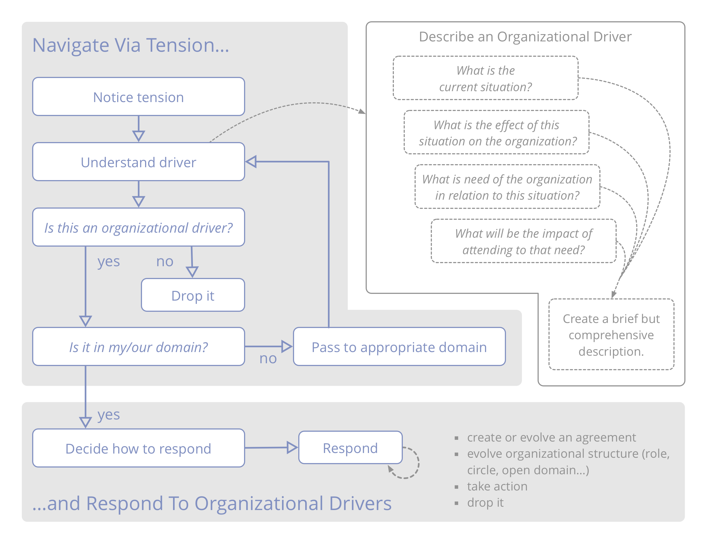

###  Patroon 1.3: Drivers van de organisatie beschrijven

**Beschrijf drivers van de organisatie om ze te begrijpen, te communiceren en te onthouden.**

Het omschrijven van drivers kan worden gedaan door een groep of een individu. Afhankelijk van hun perspectief, kunnen ze besluiten om een driver uit te leggen als een **probleem** om op te lossen of een **kans** om te grijpen.

Een eenvoudige manier om een driver te beschrijven is door uit te leggen:

- **Wat gebeurt er...:** 
    - de **huidige situatie**
    - het **effect** van deze situatie op de organisatie
- ...en **wat is er nodig:** 
    - de **behoefte**van de organisatie in relatie tot deze situatie
    - de **impact** van het vervullen van deze behoefte

Maak een korte maar toereikende samenvatting met voldoende informatie om duidelijk te maken waarom er actie of een besluit nodig is.

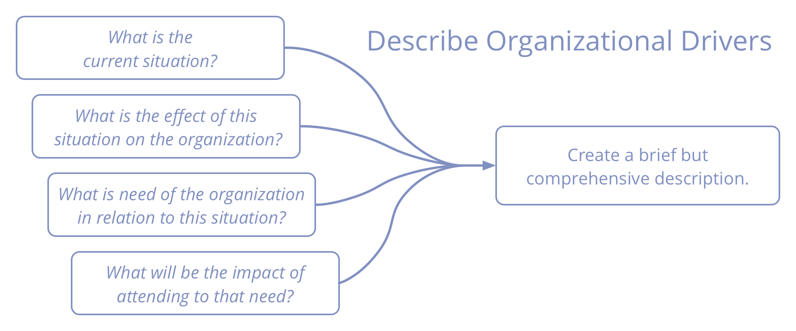

#### Voorbeeld:

> *“De keuken is een puinhoop: er zijn geen schone kopjes, de wasbak zit vol borden en het is niet mogelijk om snel een koffie te pakken en weer te gaan werken. We hebben de keuken in een bruikbare staat nodig, zodat we ons op ons werk kunnen blijven concentreren.”*

#### 1. Huidige situatie

> *“De keuken is een puinhoop: er zijn geen schone kopjes, de wasbak zit vol borden*

Beschrijf de huidige situatie:

- Vat kort samen wat er gebeurt en, indien nodig, de context waarin dit gebeurt.
- Wees objectief: Beschrijf observaties en vermijd interpretaties en oordelen.

#### 2. Effect

> *“...het is niet mogelijk om snel koffie te pakken en weer aan het werk te gaan.”*

Verduidelijk het effect van de huidige situatie op de organisatie:

- Verduidelijk **waarom** de situatie aandacht nodig heeft: hoe beïnvloedt het de organisatie? 
- Wees expliciet over welke effecten er nu plaatsvinden of verwacht worden. 
- Leg uitdagingen, verliezen, kansen of winst uit. 

#### 3. Behoefte

> *“We hebben de keuken in een bruikbare staat nodig...”*

Leg uit wat de organisatie nodig heeft in relatie tot deze situatie:

- Een **behoefte van een organisatie** is iets dat een team (of individu) nodig heeft om effectief te zijn in zijn domein. 
- Wees specifiek over wiens behoefte het is (“wij hebben nodig”, “zij hebben nodig”, “Ik heb nodig”).
- Als er onenigheid bestaat over de noodzaak, helpt het om niet in te gaan op specifieke oplossingen, maar te concentreren op wat de organisatie in deze situatie mist.

#### 4. Impact

> *“...zodat we ons op ons werk kunnen blijven concentreren”.*

Beschrijf de impact van het vervullen van die behoefte:

- Leg de beoogde resultaten uit, potentiële voordelen of kansen.
- De gevolgen kunnen duidelijk of impliciet zijn, vooral wanneer de gevolgen van de huidige situatie al worden beschreven.

#### Vat de driver samen

Richt op een of twee zinnen, zodat de informatie gemakkelijk te onthouden en te verwerken is.

Naast de samenvatting kunnen er meer details over de driver in het logboek worden bewaard.

#### Review drivers

Zorg ervoor dat de drivers regelmatig worden herzien, om je inzicht in wat er gebeurt en nodig is te vergroten.

Handige vragen voor een review zijn:

- Is de omschrijving van de situatie nog steeds kloppend?
- Denken we nog steeds dat hetzelfde nodig is als wat we eerder hadden vastgesteld?
- Ligt de driver nog steeds binnen ons domein?
- Is de driver nog relevant?

###  Patroon 1.4: Consent Besluitvorming

**Een (gefaciliteerd) groepsproces voor besluitvorming: het uitnodigen van bezwaren en het overwegen van informatie en kennis die aan het licht zijn gekomen om voorstellen of bestaande overeenkomsten verder te ontwikkelen.**

Voorstellen worden overeenkomsten wanneer zij *goed genoeg voor nu zijn en veilig genoeg om te proberen* tot de volgende review.

Onopgeloste bezwaren zorgen ervoor dat voorstellen geen overeenkomsten worden.

Het achterhouden van bezwaren kan het bereiken van de doelstellingen van een team bemoeilijken.

#### Impliciet Contract van Consent

1. Het is mijn intentie om, in de afwezigheid van bezwaren op een overeenkomst, uitvoering te geven aan hetgeen is afgesproken.
2. Ik stem ermee in om bezwaren te delen op de momenten dat ik mij daarvan bewust ben.

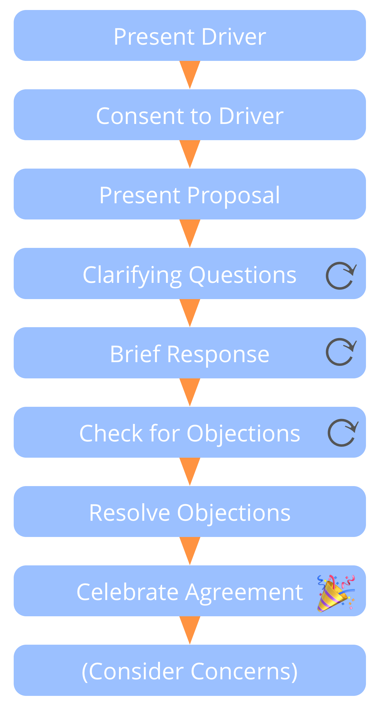

###  Patroon 1.5: Bezwaar

_Een **bezwaar** is een reden waarom iets doen in de weg staat van een (meer) effectieve reactie op een driver van de organisatie (dat wil zeggen een vereiste van de organisatie)._

Bezwaren onthullen informatie over **onbedoelde gevolgen**, of over **potentiële manieren om te verbeteren**.

Het is de verantwoordelijkheid van individuen om potentiële bezwaren tegen voorstellen, besluiten, bestaande overeenkomsten of acties te uiten.

Achterhouden van bezwaren kan schade toebrengen aan individuen, teams of de hele organisatie, omdat dit het effectief reageren op drivers van de organisatie bemoeilijkt.

Het vermogen om *mogelijke* bezwaren op elk moment in te brengen, betekent dat besluiten alleen *goed genoeg moeten zijn voor nu en veilig genoeg om te proberen*.

Degenen die verantwoordelijk zijn voor de actie of (voorgestelde) overeenkomst, zijn verantwoordelijk voor het *overwegen van argumenten en het verwerken van gekwalificeerde bezwaren.*

Bij het zoeken naar potentiële bezwaren, overweeg:

- waarom de beoogde uitkomst niet (volledig) bereikt gaat worden: **effectiviteit**
- waarom het verspilling zou zijn om door te gaan zoals voorgesteld (of eerder overeengekomen): **efficientie**
- de negatieve gevolgen van iets op andere plekken (in hetzelfde domein, in de bredere organisatie of daarbuiten): **bijwerkingen**

De informatie die door bezwaren wordt onthuld, kan worden gebruikt om te verbeteren:

- huidige en geplande actie
- hoe mensen besluiten uitvoeren
- bestaande overeenkomsten
- voorstellen
- gedeeld begrip van drivers

#### Bezwaren kwalificeren

Niet alle argumenten zijn ook bezwaren. Maak onderscheid tussen bezwaren, die altijd waardevolle informatie onthullen, en andere argumenten die gebaseerd zijn op aannames of persoonlijke voorkeuren.

Om te ontdekken of een argument als bezwaar wordt aangemerkt, zou een facilitator in een groepscontext kunnen vragen:

*"Denken jullie dat dit argument gekwalificeerd is als een bezwaar?"*

Als niemand het met het argument oneens is, is een bezwaar doorgaans in aanmerking genomen. Anders wil men het werkelijke bezwaar ontdekken of misverstanden blootleggen.

#### Bezwaren begrijpen

Enkele nuttige vragen:

- Hoe is dit argument gerelateerd aan dit specifieke voorstel of deze overeenkomst?
- Geeft het argument aan hoe een (voorgesteld of huidig) **actie of overeenkomst**: 
    - de reactie op een driver van de organisatie bemoeilijkt?
    - nu verbeterd kan worden?
    - iemands bijdrage aan het reageren op een driver voorkomt of vermindert?
    - in strijd is met de waarden van de organisatie?
    - gezien wordt als niet “veilig genoeg” om te proberen?

#### Zorgen

_Een **zorg** is een aanname dat iets doen (zelfs in de afwezigheid van bezwaren) **mogelijk** in de weg kan staan van een (meer) effectieve reactie op een organisatiedrijfveer._

In _consent besluitvorming_ kunnen zorgen aangeven hoe overeenkomsten in de toekomst mogelijk verder ontwikkeld kunnen worden (bijvoorbeeld de evaluatiecriteria of reviewfrequentie).

Noem zorgen wanneer ze belangrijk genoeg zijn om ze ten minste op te nemen bij de evaluatiecriteria.

Bij twijfel over of het een zorg of bezwaar is, gebruik dan de anderen om het argument te kwalificeren.

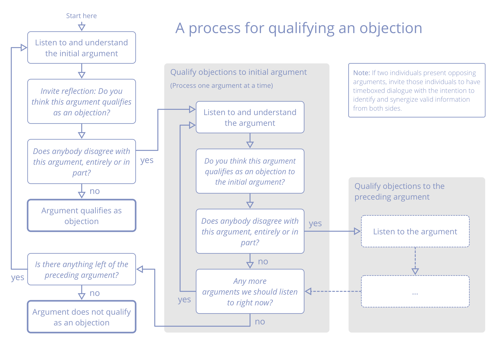

###  Patroon 1.6: Bezwaren Oplossen

**Los bezwaren één voor één op door de informatie die zij bevatten te gebruiken om voorstellen aan te passen.**

Kies de meest veelbelovende optie om bezwaren op te lossen en kies, als dat niet lukt, een andere. Elke poging zal helpen om meer informatie te krijgen over de inhoud van het bezwaar en een fractie dichter bij de aanpassing van het voorstel brengen die het bezwaar oplost.

Vaak is het handig om te beginnen bij de persoon die het bezwaar uitte wanneer er wordt gezocht naar een aanpassing van het voorstel.

Meestal is het het meest effectief om**één bezwaar per keer** op te lossen, alle op de voorgestelde aanpassing op te lossen en vervolgens door te gaan met het volgende bezwaar op het gehele voorstel.

###  Patroon 1.7: Overeenkomsten evalueren en doorontwikkelen

**Blijf overeenkomsten voortdurend ontwikkel en elimineer verspilling.**

Een regelmatige herziening van overeenkomsten is essentieel voor een lerende organisatie:

- pas overeenkomsten aan om beter te passen bij de context
- integreer het geleerde om ze effectiever te maken

Zorg ervoor dat alle overeenkomsten een passende reviewdatum hebben.

Evaluatie van overeenkomsten kan zo eenvoudig zijn als even snel checken of iets nog relevant is en of er bezwaar is op het handhaven van de overeenkomst zoals die is.

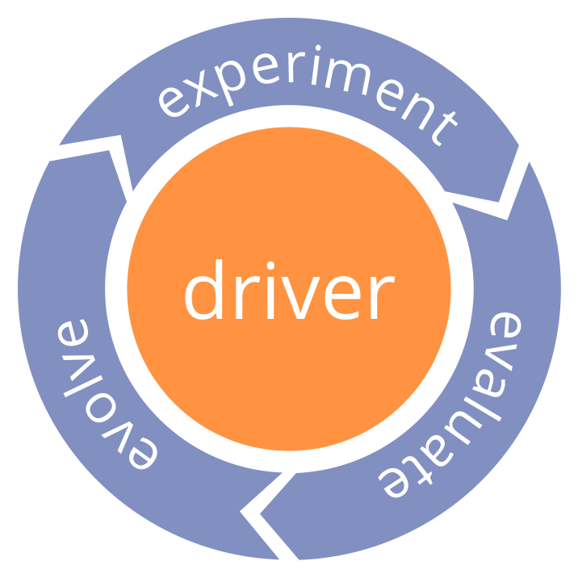

Overeenkomsten worden vaak herzien in _Governance vergaderingen_, maar soms is het effectiever om een speciale sessie te plannen.

Pas de review frequentie aan indien nodig en doe het eerder indien nodig.

Elementen van dit proces kunnen ook door individuen worden gebruikt om beslissingen die zij nemen te evalueren.

#### Korte formats

- *Hoe heeft deze overeenkomst ons geholpen?*
- *Is er reden om deze overeenkomst te laten vallen?*
- *Hoe kan deze overeenkomst worden verbeterd?*
- Zet de datum voor de volgende review vast.

#### Lang Format

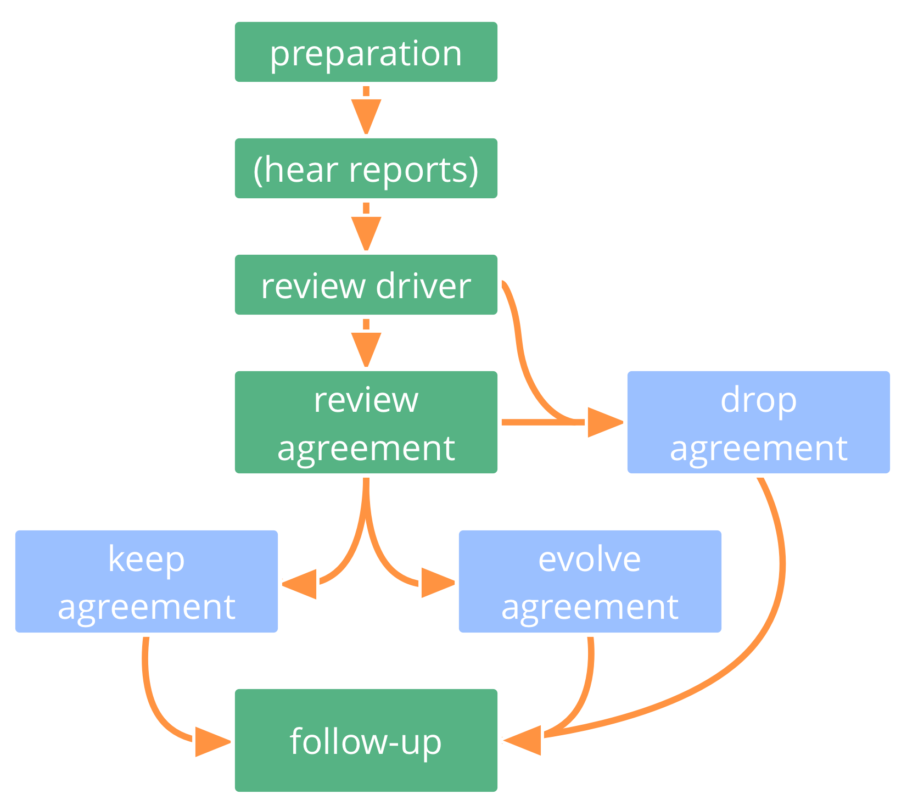

Voorbereiding:

- Plan de review.
- Zorg ervoor dat alle noodzakelijke informatie beschikbaar is.

Opvolging:

- Zet de datum voor de volgende review vast.
- Leg besluiten en taken vast en deel deze met relevante personen.
- Denk aan de gevolgen voor alle overeenkomsten die hiermee verband houden.

###  Patroon 1.8: Degenen die Geraakt Worden Besluiten

**Iedereen die door een besluit wordt getroffen, moet betrokken worden bij het nemen van het besluit. Zo behoud je gelijkwaardigheid en accountability en vergroot je de informatie die beschikbaar is over het onderwerp.**

Voor grotere groepen:

- faciliteer een proces in verschillende fasen en maak kleinere groepen die gedelegeerden selecteren
- gebruik een online tool en voer een asynchroon _timeboxed_ en gefaseerd proces uit

Overweeg om degenen die door een besluit geraakt worden ook te betrekken bij de evaluatie en doorontwikkeling van de besluiten.

###  Patroon 1.9: Voorstellen co-creëren

**Breng mensen samen om voorstellen te co-creëren in reactie op drivers van de organisatie: maak gebruik van de collectieve intelligentie, vergroot het gevoel van eigenaarschap en betrokkenheid en accountability.**

Er zijn veel manieren om voorstellen te co-creëren. Ze volgen meestal een soortgelijk patroon:

1. Stem in met de driver (of probleem / kans / behoefte)
2. Verken het onderwerp en begrijp kaders
3. Genereer ideeën
4. Ontwerp een voorstel (vaak gedaan door een kleinere groep)

Een manier om voorstellen te maken is om S3's _Voorstel vorm_ patroon te gebruiken.

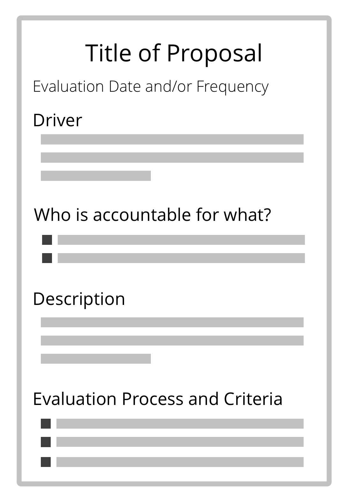

Voor inspiratie voor stappen 2 en 3, kijk naar klassieke groepsfaciliteringstechnieken of Design Thinking activiteiten.

Naast een face-to-face workshop kun je dit proces aanpassen voor online vergaderingen. Het kan zelfs asynchroon (en gedurende een langere periode) gebruiken om veel mensen erbij te betrekken.

###  Patroon 1.10: Voorstel Vormen

**Een (gefaciliteerd) groepsproces waarmee in co-creatie bedacht wordt hoe er het best op een driver gereageerd kan worden.**

- maakt gebruik van de collectieve intelligentie en diversiteit aan perspectief binnen een groep
- mensen betrekken bij het co-creeëren van afspraken
- bevordert accountability en een gevoel van eigenaarschap

*Voorstel vormen* kan ook worden gebruikt door een individu.

#### Voorstel vorm stappen

**Consent over de driver:** Presenteer de driver kort. *Is deze driver relevant voor ons om op te reageren? Zijn er essentiële aanpassingen op wat er is voorgesteld?*

**Verdiep gedeeld begrip van de driver:** nodig uit om essentiële vragen te stellen en meer details te verzamelen over de driver.

**Verzamel overwegingen** geformuleerd als vragen met betrekking tot mogelijke oplossingen. Vragen onthullen beperkingen (vragen verzamelen van informatie) of mogelijkheden (generatieve vragen).

**Antwoord** alle informatieve vragen waar direct een antwoord op is te geven.

**Prioriteer** overwegingen.

**Verzamel ideeën** als mogelijke ingrediënten voor een voorstel.

**Ontwerp een voorstel** over hoe te reageren op de driver, door de creatieve ideeën en informatie die tot nu toe verzameld is te gebruiken. Dit wordt meestal gedaan door een kleinere groep (fine)"tuners".

#### Selecteer tuners

Denk aan:

- wie zou er moeten er zijn?
- wie wil er zijn?
- wie kan eventueel nog meer een waardevolle bijdrage leveren?
- denk aan expertise, blik van buiten, en inspiratie

Tussen twee en drie tuners is meestal geschikt. Controleer of er bezwaren zijn tegen de voorgestelde tuner(s).

###  Patroon 1.11: Rolselectie

**Een groepsproces om een persoon te selecteren voor een rol op grond van de reden.**

In plaats van simpelweg het toewijzen van mensen aan _rollen_, of het maken van een keuze alleen gebaseerd op meerderheid, kan men gebruik maken van het rol selectieproces om:

- gebruik collectieve intelligentie door alle reden voor nominaties te horen en deze te overdenken
- vergroot gevoel van eigenaarschap over het besluit
- te zorgen voor steun voor de rolhouder door de betrokkenen.

Een voorwaarde voor het selectieproces is een _duidelijke beschrijving_ van het rol domein.

#### Rolselectie - Stappen

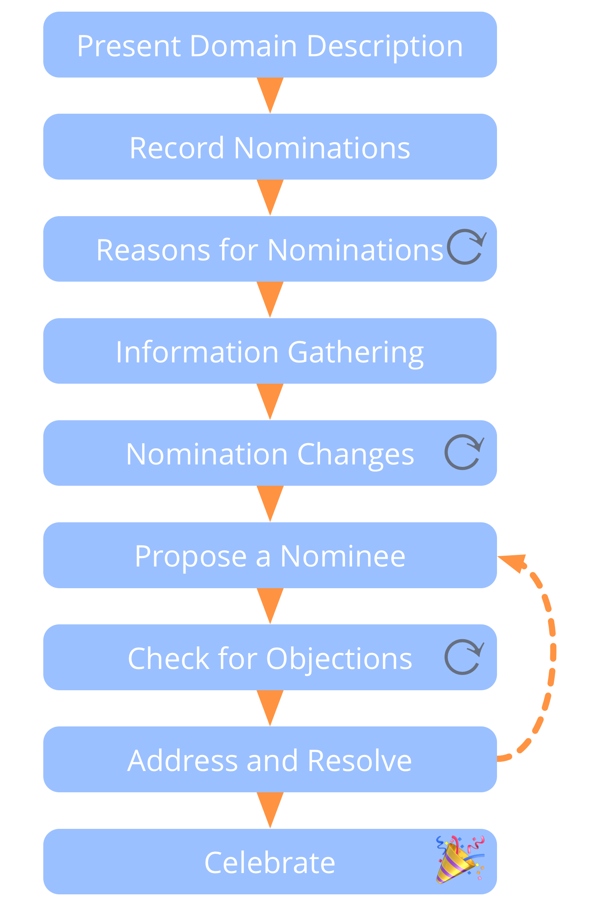

1. **Presenteer Rolomschrijving:** indien mogelijk, stuur de domeinnaam van de rol vooraf.
2. **Leg nominaties vast:** Deelnemers schrijven hun voordracht op een papiertje. Mensen kunnen zichzelf nomineren, iemand anders, of passen.
3. ** Redenen voor nominaties: ** Elke persoon deelt wie ze hebben genomineerd en waarom.
4. **Informatie Verzamelen:** Deelnemers delen of vragen informatie die de groep kan ondersteunen bij het maken van een passende selectie.
5. **Nominatie Wijzigingen:** Controleer of iemand zijn nominatie wil wijzigen in het licht van redenen en informatie die tot nu toe gedeeld zijn, en luister naar de redenen voor elke verandering.
6. **Stel een genomineerde voor** voor de rol: De facilitator leidt het proces om een geschikte genomineerde te identificeren op basis van de redenen die zijn gehoord, bijvoorbeeld door: 
    - zelf een genomineerde voor te stellen of een groepslid te vragen
    - enkele genomineerde uit te nodigen om samen tot een voorstel te komen voor wie er genomineerd zou moeten zijn
    - uitnodiging tot groepsdialoog om te helpen bij het vinden van de sterkste genomineerde
7. **Vraag om bezwaren:** Vraag deelnemers (inclusief de voorgestelde genomineerde) om tegelijkertijd te laten zien of ze al dan niet bezwaar hebben. 
8. **Adresseer en los bezwaren op** begin met een van de voorgestelde genomineerden. _Bezwaren_ op een genomineerde kunnen op meerdere manieren <1>worden opgelost</1>, inclusief het aan passen van de rolomschrijving of iemand anders te nomineren. Als alle bezwaren worden opgelost, controleer dan opnieuw of de (uiteindelijke) kandidaat de rol aanvaardt.
9. **Vieren!:** Erken de bereikte overeenstemming en bedank de persoon die vanaf nu rolhouder is.

Om te voorkomen dat anderen worden beïnvloed, vermijd het uiten van persoonlijke belangstelling of meningen voordat de selectie plaatsvindt.

Soms blijkt uit een rol selectie dat er een gebrek aan capaciteit, relevante ervaring, kwaliteiten of vaardigheden is. Een groep zal dan ook moeten overwegen om externe kandidaten te kiezen, prioriteiten te heroverwegen of een alternatieve manier te vinden om het domein te verantwoorden.

Dit patroon kan ook worden gebruikt in een situatie waarin een keuze tussen verschillende opties nodig is.

###  Patroon 1.12: Driver Mapping

Een workshop format om een effectieve manier te vinden om om te gaan met een complexe situatie: start-ups opzetten, projecten starten, grote belemmeringen of mogelijkheden in kaart brengen en aanpakken, de organisatorische structuur afstemmen op de waardestroom.

Een (kleine of grote) groep identificeert en clustert drivers, om ze vervolgens snel van concept om te zetten naar actie in kleinere, zelforganiserende teams.

## Gezamenlijke ontwikkeling 

###  Patroon 2.1: Vraag om hulp

**Een eenvoudig protocol voor het leren, het delen van vaardigheden en het opbouwen van verbindingen, met respect voor de autonomie van mensen.**

Vraag iemand, "*zou je bereid zijn om me te helpen ...*?" De ander kan antwoorden met een eenvoudig "*ja*" of "*nee*".

- als het verzoek wordt afgewezen, accepteert de persoon het antwoord zonder onderhandelingen of verhoor
- als het verzoek onduidelijk is, vraag om meer informatie
- als je toezegt iemand te helpen, steun die persoon dan op de beste manier mogelijk

###  Patroon 2.2: Peer Feedback

Nodig een collega uit om constructieve feedback te geven over:

- prestaties in een rol
- jouw algemene deelname en bijdrage
- elk specifiek aspect waarin je misschien geïnteresseerd bent

Overwegingen:

- vraag collega's om de tijd te nemen om voor te bereiden
- nodig zowel **waarderingen** uit als **uit te voeren verbetersuggesties**
- vraag door om de feedback beter te begrijpen en voorkom oordelen en discussie
- besluit zelf wat je met de feedback gaat doen

###  Patroon 2.3: Peer Review

**Ondersteun elkaar om te leren en te groeien binnen jouw rollen en teams.**

De rolhouder - of het team - leidt de peer review door het proces op te zetten en in elke stap als eerst te spreken.

Zorg ervoor dat er mensen met aanvullende perspectieven worden uitgenodigd om bij te dragen aan de review, en dat er een _facilitator_ is.

Verbetersuggesties kunnen betrekking hebben op persoonlijke ontwikkeling, samenwerking, updates van de domeinbeschrijving (inclusief de driver) en strategie.

###  Patroon 2.4: Ontwikkelplan

**Een plan voor de ontwikkeling van effectievere manieren om te reageren op een domein, overeengekomen tussen delegator en gedelegeerde.**

Het ontwikkelingsplan kan worden gemaakt voor een persoon in een rol, of voor een team (bijv. een afdeling, _cirkel_ of _open domein_).

Ontwikkeling kan gebeuren door de beschrijving van _driver_ en het domein te verfijnen, het wijzigen van de strategie, of door nieuwe of bijgewerkte overeenkomsten en specifieke acties die moeten worden ondernomen, hetzij binnen het domein van de delegator, hetzij binnen het domein van de gedelegeerde.

Een ontwikkelplan (en alle bijbehorende aanbevelingen voor wijzigingen in de beschrijvingen van het domein en de driver) vereist consent van zowel de gedelegeerde als de delegator.

## Zaken die Co-creatie mogelijk maken 

###  Patroon 3.1: Artful participation

**Committeer je aan het leveren van jouw beste bijdrage aan de effectiviteit van de samenwerking.**

*"Is mijn gedrag op dit moment de beste bijdrage die ik kan leveren aan de effectiviteit van deze samenwerking?"*

Artful participation kan ook betekenen dat je iemand onderbreekt, bezwaar inbrengt of overeenkomsten breekt.

*Artful Participation* is een **individuele verbintenis** om:

- actief **alle overeenkomsten tot je te nemen en je eraan te houden** op de beste manier mogelijk, gezien alle omstandigheden
- **bewustzijn en begrip te ontwikkelen** van individuele en collectieve behoeften
- **de noodzakelijke vaardigheden te ontwikkelen**
- **anderen te ondersteunen** om op een goede manier deel te nemen
- de belemmeringen en verbeteringsvoorstellen zo nodig onder de aandacht van anderen brengen

#### Voordelen van Artful Participation

Artful participation:

- maakt het mogelijk om overeenkomsten te co-creëren en te ontwikkelen
- helpt sterkere teams te ontwikkelen
- vergroot eigen accountability, integriteit en vertrouwen
- er ontstaat een cultuur van wederzijdse steun en nauwe samenwerking
- nog krachtiger wanneer door velen omarmd

#### Artful Participation: toets jezelf

- Hoe ga ik mezelf en anderen steunen bij het verbeteren van hun gedrag ten gunste van Artful Participation? 
- Waar zijn mijn interacties met anderen niet nuttig of ineffectief?
- Welke overeenkomsten vind ik moeilijk te handhaven of aan bij te dragen? Wat kan ik doen om dit aan te pakken?
- Welke vaardigheden kan ik ontwikkelen, die mij helpen om meer Artful aan de slag te gaan?
- Wat zou Artful Participation betekenen in relatie tot: 
    - mijn dagelijkse activiteiten?
    - samenwerking en interactie met anderen?
    - de organisatie? ... onze klanten of cliënten?
    - de omgeving in bredere zin?

###  Patroon 3.2: De zeven principes aannemen

**De samenwerking in lijn brengen met de zeven principes.**

Het aannemen van de Seven Principles vermindert het aantal expliciete overeenkomsten dat vereist is, en geeft richting aan het aanpassen van S3 patronen aan de context van de organisatie.

De waarden van een organisatie moeten in lijn zijn met de 7 principes.

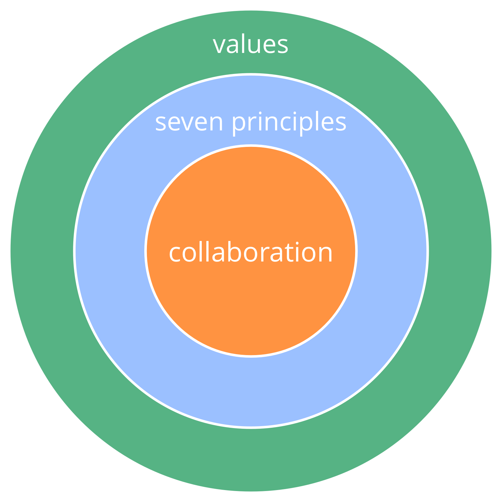

###  Patroon 3.3: Waarden vaststellen

**Bewust de cultuur van jouw organisatie vormgeven.**

_** Waarden ** zijn waardevolle principes die dienen als richtlijnen voor gewenst gedrag. Waarden definiëren de ruimte voor actie en ethische beperkingen._

- elk lid brengt zijn eigen waarden naar een organisatie, welke zijn gebaseerd op persoonlijke ervaringen en overtuigingen
- een team of organisatie kan ervoor **kiezen om collectieve waarden aan te nemen** om hun samenwerking te begeleiden

Waarden bieden richtlijnen om passende acties te bepalen, zelfs wanneer er geen expliciete overeenkomsten zijn.

Een reeks waarden die collectief worden aangenomen, ondersteunt de effectiviteit van een organisatie:

- vermindert de kans op **misverstanden**
- zorgt voor een **gezamenlijke basis** van waaruit besluiten worden genomen en acties ondernomen
- **trekt nieuwe leden, partners en klanten aan ** die passen bij de organisatie

Waarden zijn een overeenkomst en moeten dus ook **regelmatig geëvalueerd** worden.

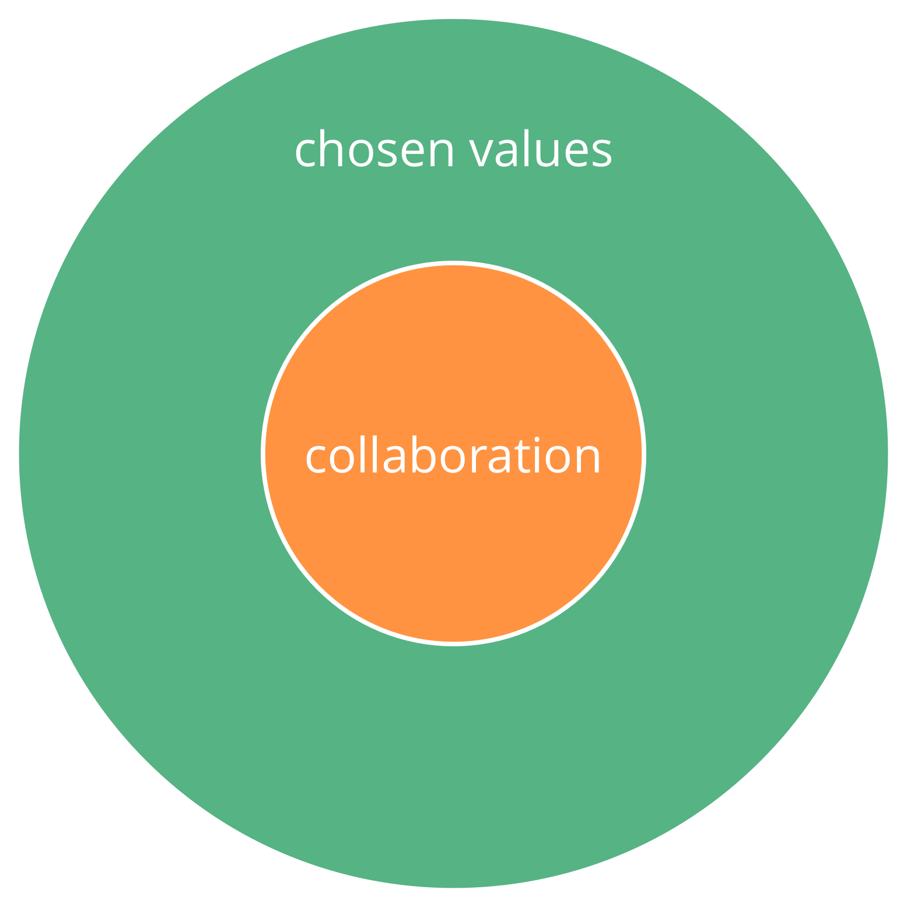

###  Patroon 3.4: Governance facilitator

**Selecteer iemand om governance vergaderingen te faciliteren.**

Een _governance_ facilitator:

- zorgt ervoor dat _governance vergaderingen_ goed verlopen en geëvalueerd worden
- is (meestal) 1 van de leden geselecteerd door het team (en voor een specifieke termijn)
- maakt zichzelf vertrouwd met de _Governance Backlog_
- is vaak degene die anderen uitnodigt om sommige agendapunten te faciliteren

Overweeg om als governance facilitator te leren over en gebruik te leren maken van de volgende patronen van S3:

- _Rondes_
- _Voorstel Vormen_
- _Consent Besluitvorming_
- _Rolselectie_
- _Vergaderingen evalueren_
- _Bezwaren Oplossen_
- _Peer Review_

###  Patroon 3.5: Overeenkomsten breken

Het breken van overeenkomsten is soms **noodzakelijk** maar kan wat **kosten** voor de gemeenschap.

Wees verantwoordelijk:

- **ruim op** eventuele schade
- zorg zo snel mogelijk voor **opvolging** met degenen die geraakt zijn
- **verander de overeenkomst** in plaats van deze herhaaldelijk te breken

###  Patroon 3.6: Contract voor succesvolle samenwerking

**Steun vanaf het begin een succesvolle samenwerking en bouw vertrouwen tussen partijen door wederzijds voordelige en juridisch solide contracten te creëren.**

Een **contract** is een reeks beloften tussen twee of meer partijen die zij juridisch bindend maken, dat wil zeggen als deze beloften worden geschonden, heeft de benadeelde partij toegang tot rechtsmiddelen of alternatieve oplossingen.

Het ontwikkelen van gedeeld begrip over behoeften en verwachtingen is essentieel voor een succesvolle samenwerking.

Tijdens de onderhandelingen en het sluiten van een contract, gedraag je dan passend bij de samenwerkingscultuur die je wilt ontwikkelen en bouw een positieve relatie met andere betrokken partijen.

Dit patroon heeft betrekking op contracten die verband houden met samenwerking rond elke transactie tussen een organisatie en andere partijen (bijvoorbeeld werknemers, consultants, dienstverleners, aandeelhouders of klanten). Het is vooral van belang voor contracten die een belangrijke invloed hebben op de toekomst van een organisatie of een van haar partners, zoals:

- arbeidscontracten en contracten met externe contractanten of adviseurs in _ondersteunende rollen_ (inclusief een overeenkomst die leidt tot een verandering van beloning of werktijden)
- contracten voor samenwerking met klanten, verkopers of dienstverleners
- aandeelhouder overeenkomsten

**Opmerking:** Veel overeenkomsten over samenwerking binnen een organisatie vereisen geen speciale contracten, omdat ze al worden geregeld door of onderworpen zijn aan bestaande contracten.

#### Succescriteria voor onderhandelingen over contracten

Bij het onderhandelen over een contract, zorg voor:

- gedeeld begrip over de reden voor de samenwerking, evenals het beoogde resultaat en belangrijke kaders
- alle partijen begrijpen wat van hen verwacht wordt
- alle partijen die door een contract geraakt worden, zijn betrokken bij het maken van het contract en houden zich hieraan op vrijwillige basis
- verwachtingen zijn realistisch
- de overeenkomst is gunstig voor alle partijen
- iedereen is van plan zich aan de gemaakte overeenkomst te houden

Als om enige reden niet aan een of meer van deze criteria kan worden voldaan, is het waarschijnlijk verstandig om niet te verder gaan.

#### Co-creatie van het contract

De manier waarop een contract wordt onderhandeld kan aanzienlijk bijdragen aan het opbouwen van vertrouwen tussen partijen. Benader het sluiten van het contract als het sluiten van een overeenkomst tussen partners, niet tegenstanders: co-creëer het contract, pas het aan de specifieke context aan en zorg ervoor dat het juridisch goed in elkaar zit.

- alle verwachtingen van de betrokken partijen moeten in het contract staan en in voldoende detail beschreven
- gebruik duidelijke en eenvoudige taal die alle partijen kunnen begrijpen en wees ondubbelzinnig over de juridische gevolgen
- als je specifieke technische of juridische voorwaarden moet gebruiken waar een partij niet bekend mee is, leg ze dan uit in een woordenlijst en maak die onderdeel van het contract
- overleg met een advocaat die de gewenste cultuur ondersteunt en die competent is op het gebied waarin je onderhandelt

#### Wanneer je een contract co-creeërt:

- zorg ervoor dat alle partijen afgevaardigden hebben die alle betrokken domeinen vertegenwoordigen (bijvoorbeeld niet alleen de verkoop, maar ook ontwikkeling / productie / ondersteuning, enz)
- maak de cultuur die je wilt ontwikkelen expliciet, met inachtneming van de gemeenschappelijkheden en eventuele culturele verschillen tussen partijen
- benoem de redenen om te willen gaan samenwerken en wees transparant over de verwachtingen en behoeften van alle partijen
- maak alle relevante informatie openbaar (indien nodig onder een NDA)
- wordt het eerst eens over de voorwaarden voor de relatie en de verwachtingen van alle partijen en overweeg vervolgens hoe je deze juridisch kunt onderbouwen
- stel een lijst op van specifieke wetten en regelgeving waaraan de overeenkomst moet voldoen
- onderhandel in meerdere iteraties, waardoor de tijd wordt geboden om de gevolgen te bestuderen en aanpassingen voor te stellen
- houd notulen van elke vergadering bij om potentiële misvattingen te voorkomen

#### Ondersteun de volledige levensduur van de Samenwerking:

Elk contract kan op elk moment worden gewijzigd, mits alle ondertekenaars het ermee eens zijn. De kans op conflict in latere fases van de samenwerking, wordt veel kleiner wanneer je de volledige duur van de samenwerking meeneemt in het contract:

- zorg voor benodigdheden om succesvol van start te gaan, door onboarding procedures te definiëren
- stel een proefperiode vast– waar alle partijen de samenwerking kunnen uitproberen – en een duidelijk protocol voor de manier waarop iedere partij het contract in de proefperiode kan worden beëindigd
- definieer en plan regelmatige evaluatiemomenten waar ondertekenaars samenkomen om te delen of het contract gewijzigd moet worden om beter te passen bij de veranderende context
- stel ook een duidelijke procedures vast voor het breken van het contract
- overweeg om alternatieve middelen voor geschillenbeslechting beschikbaar te stellen, bijvoorbeeld bemiddeling of arbitrage
- overweeg het contract te beperken tot een vaste termijn waarna het contract afloopt en kan worden verlengd indien nodig

#### Cultuur

Elk contract beïnvloedt de cultuur van de samenwerking die het bestuurt, zelfs als het alleen maar lijkt te beschrijven * wat* er moet worden geleverd:

- maak bewust de samenwerkingscultuur die u wilt zien door de verwachtingen over * hoe* dingen moeten worden gedaan te benoemen 
- stem het contract af op de organisatiestructuur (van alle partijen) en op wettelijke vereisten
- ontwikkel contracten die accountability mogelijk maken en aanmoedigen

als je vindt dat standaardcontracten in jouw industrie verkeerd zijn afgestemd op de cultuur die je wilt ontwikkelen, bouw een eigen verzameling van formats voor contracten en clausules op en overweeg deze te delen met anderen, zodat de ervaring uit het verleden gebruikt kan worden bij het maken van nieuwe contracten.

###  Patroon 3.7: Transparant Salaris

**Maak een eerlijke salarisformule en maak deze transparant.**

Transparant salaris (ookwel "open salaris") is het vaststellen van de vergoeding van elke werknemer volgens een reeks regels - de *salarisformule* - in plaats van dit vaststellen tijdens individuele onderhandelingen tussen werkgever en werknemer. De salarisformule – en vaak ook individuele vergoeding – is transparant voor alle leden van een organisatie, en soms voor het publiek.

Een transparante salarisformule moet in overeenstemming zijn met de context van een organisatie en door alle belanghebbenden als eerlijk genoeg worden beschouwd.

De beoordeling van de eerlijkheid verschilt van persoon tot persoon en per situatie, dus het creëren van een salarisformule vereist een gedeeld begrip van wat als rechtvaardig wordt beschouwd.

Wanneer er wordt besloten om te werken met een salarisformule voor een organisatie of afdeling, denk dan aan:

- wat een passend vast gedeelte zou zijn
- hoe de compensatie berekend moet worden op basis van behoeften, investeringen, productiviteit of verdiensten
- hoe de winst van de organisatie wordt verdeeld en de verliezen worden vergoed, in overeenstemming met de verwachtingen en behoeften van de verschillende belanghebbenden

Besluit hoe om te gaan met de beloning voor het veranderen van rollen en _ontwikkel een strategie_ om over te gaan naar de nieuwe contracten en compensatieovereenkomsten.

###  Patroon 3.8: Ondersteunende rol

**Dit rolpatroon is van toepassing op externe contractanten.**

- verhelderen en beschrijf de driver voor de _rol_
- maak een _domeinbeschrijving_
- indien waardevol, voer een selectieproces uit
- beperk de looptijd van het contract
- zorg voor regelmatige _peer reviews_

Externe contractanten stemmen in met hun rol.

**Zie ook:** _Contract voor Successvolle Samenwerking_

###  Patroon 3.9: Statuten

Leg de S3 principes en patronen vast in de statuten, indien dit nodig is om de **juridische integriteit ** en **organisatiecultuur** te beschermen

Denk aan:

- consent en gelijkwaardigheid in de besluitvorming
- selectie proces voor leiderschapsrollen
- organisatiestructuur, waarden en principes
- invloed van eigenaren of aandeelhouders
- delen van winst en kosten

## Organisaties Opbouwen 

###  Patroon 4.1: Delegeren van invloed

**Distribueer macht en invloed om het mogelijk te maken voor andere mensen om te besluiten en handelen binnen vooraf vastgestelde kaders.**

Een delegator kan gedelegeerden ondersteunen om waarde te leveren door:

- Duidelijk domeinen van autonomie en accountability te definiëren
- Leer- en ontwikkelmogelijkheden te garanderen
- Ondersteuning aan te bieden waar nodig

Pas kaders incrementeel op een hoger niveau aan, waarbij de mogelijkheden, betrouwbaarheid en resultaten in acht worden genomen.

Decentraliseer zoveel mogelijk en hou zoveel invloed als nodig vast.

###  Patroon 4.2: Cirkel

_Een **cirkel** is een zelfsturend en semi-autonoom team van gelijkwaardige mensen die samen verantwoording geven aan een domein._

Een cirkel:

- kan permanent of tijdelijk zijn
- kan zelforganiserend zijn
- is verantwoordelijk voor zijn eigen ontwikkeling en bijbehorende set aan overeenkomsten

- **semi-autonoom:**
    
    - De leden van een cirkel handelen binnen de kaders van hun domein.
    - Elke cirkel kan autonoom waarde creëren.
- **zelfsturend:** 
    - De leden van een cirkel beslissen voortdurend samen wat ze moeten doen om hun domein te verantwoorden en stellen beperkingen op hoe en wanneer het gebeurt.
- **gelijkwaardigheid van cirkelleden:** 
    - Alle leden van een cirkel zijn even verantwoordelijk voor de governance van het domein van de cirkel.

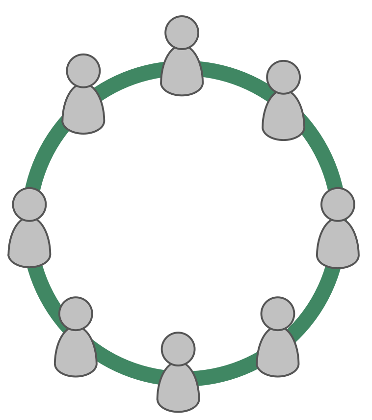

###  Patroon 4.3: Rol

**Delegeren van accountability voor een domein aan individuen.**

Een rol is een verantwoordelijkheidsgebied (een domein) dat gedelegeerd is aan een individu (**de rolbewaarder**) welke de autonomie heeft om beslissingen en actie te nemen binnen de kaders van het roldomein.

De rolhouder heeft de leiding bij het opstellen van een strategie over de manier waarop zij hun domein zullen invullen. Ze evolueren hun strategie in samenwerking met de delegator.

Een rol is een eenvoudige manier voor een organisatie (of team) om terugkerende taken of een specifiek werkterrein te delegeren aan een van haar leden.

- mensen kunnen de verantwoordelijkheid voor meer dan één rol op zich nemen
- in plaats van formeel een nieuw team op te richten, is het soms eenvoudiger om slechts één rol te delen tussen verschillende mensen
- rolhouders zijn geselecteerd met consent en voor een beperkte duur
- gelijken (collega's) ondersteunen elkaar om te ontwikkelen in de rollen die ze vervullen

Een rolhouder kan een governance backlog en een logboek bijhouden om te helpen vastleggen hoe zij van plan zijn waarde te leveren en om deze aanpak door te ontwikkelen.

**Opmerking**: In S3 worden richtlijnen, processen of protocollen die gemaakt zijn door personen in een rol als overeenkomst behandeld.

###  Patroon 4.4: Koppelen

**Maak de informatiestroom en beïnvloeding tussen twee teams mogelijk.**

Een team selecteert één van zijn leden om hun belangen te behartigen bij de governance besluiten van een ander team.

###  Patroon 4.5: Dubbele Koppeling

**Maak een *bidirectionele* informatiestroom en beïnvloeding tussen twee teams mogelijk.**

Twee onderling afhankelijke teams kiezen elk een van hun leden om hun belangen te behartigen in de governance besluiten van het andere team.

Een dubbele koppeling maakt gelijkwaardigheid tussen twee teams mogelijk en kan worden gebruikt om waardevolle informatie uit hiërarchische structuren te halen.

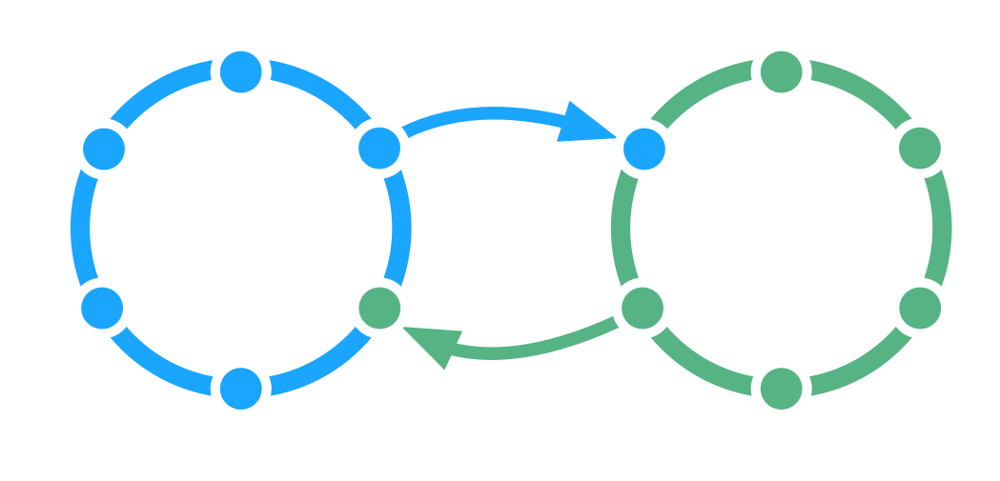

###  Patroon 4.6: Vertegenwoordiger

**Selecteer een teamlid om deel te nemen aan de governance van een ander team om de stroom van informatie en invloed mogelijk te maken.**

Vertegenwoordigers (a.k.a. links):

- representeer de belangen van één team bij een ander team
- zijn geselecteerd voor een beperkte termijn
- deelnemen aan de **governance** van het team waarmee ze verbonden zijn, en kan: 
    - items voor op de agenda voorstellen
    - meedoen aan het vormen van voorstellen
    - bezwaren hebben op voorstellen en bestaande overeenkomsten

###  Patroon 4.7: Hulpteam

**Vorm gelijkwaardige teams van mensen met het mandaat om een specifieke reeks van eisen uit te voeren welke bepaald zijn door een delegator.**

Hulpteam:

- is een manier voor een delegator om de capaciteit uit te breiden
- kan zelforganiserend zijn, of worden geleid door een _coördinator_ gekozen door de delegator
- wordt gestuurd door de delegator
- profiteert van een duidelijk gedefinieerd domein

Leden van het hulpteam:

- kan bezwaar maken tegen de besluiten van de delegator die hen raken
- kan items toevoegen aan de governance backlog van de delegator
- kunnen worden uitgenodigd om een _afgevaardigde_ te selecteren die deelneemt aan de governance besluiten van de delegator

###  Patroon 4.8: Open Domein

**Bewust accountable zijn voor een domein op uitnodiging in plaats van in opdracht en nodig degenen die kunnen bijdragen uit om dit te doen wanneer zij kunnen.**

De delegator van het open domein verduidelijkt:

- de primaire driver, kernverantwoordelijkheden en kaders van het open domein
- wie wordt uitgenodigd om bij te dragen aan het open domein
- kaders met betrekking tot de deelname van de delegator aan de governance van het open domein

Afhankelijk van de kaders die de delegator stelt, kunnen de medewerkers alleen maar werk organiseren en uitvoeren, of ook deelnemen aan governance.

Een delegator is verantwoordelijk voor het uitvoeren van regelmatige beoordelingen om effectiviteit van werk en besluitvorming op een open domein te ondersteunen.

###  Patroon 4.9: Open Systemen

**Intentioneel communiceren met en leren van anderen buiten uw systeem.**

Individuen, teams en hele organisaties kunnen onderlinge afhankelijkheid erkennen en mensen van buiten hun systeem bewust uitnodigen om **kennis, ervaring en invloed te introduceren** om bij te dragen aan besluitvorming en collectief leren te ondersteunen.

- **Externe deskundigen** kunnen een extern perspectief bieden en kennis, begrip en vaardigheden brengen
- **Vertegenwoordigers van betrokken partijen** kunnen de besluitvorming informeren en beïnvloeden op manieren die de algemene doelstellingen ten goede komen (zie _Zij die geraakt worden besluiten_)

## S3 binnen brengen 

###  Patroon 5.1: Patronen Aanpassen aan de Context

**Pas S3 patronen aan en ontwikkel deze om beter aan te sluiten bij jouw specifieke context.**

Zorg ervoor dat iedereen die wordt geraakt:

- begrijpt waarom het veranderen van het patroon noodzakelijk (of nuttig) is
- aanwezig of vertegenwoordigd is bij de beslissing welke veranderingen er worden doorgevoerd
- de S3 principes gebruikt als richtlijn bij de aanpassingen.

Experimenteer lang genoeg met de aanpassingen om echt te kunnen leren van de voordelen en eventuele valkuilen.

Deel waardevolle aanpassingen met de S3 community.

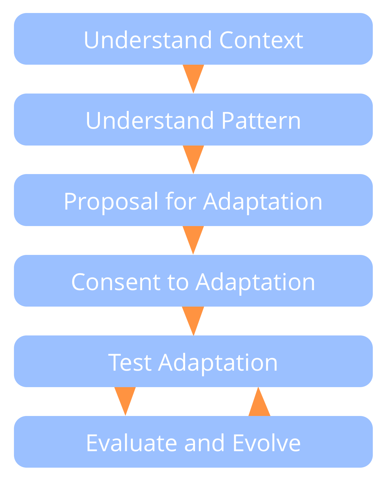

###  Patroon 5.2: Ontwikkel een Pull-systeem voor organisatorische verandering

**Ontwikkel een omgeving die het voor leden van de organisatie uitnodigend en mogelijk maakt om verandering te bewerkstelligen.**

Verander dingen wanneer het waarde heeft om dat te doen:

- Maak gebruik van patronen die helpen bij het oplossen van actuele en belangrijke problemen.
- Ga geen dingen repareren die niet kapot zijn!
- Ontmoet iedereen waar ze zijn…
- … en laat ze hun eigen tempo kiezen.

###  Patroon 5.3: Wees De Verandering

**Geef het goede voorbeeld.**

Gedraag je en handel op een manier die je ook van andere zou willen zien.

###  Patroon 5.4: Uitnodigen van verandering

**Maak de reden voor verandering duidelijk en nodig mensen uit om deel te nemen.**

Uitnodigen tot in plaats van het opleggen van verandering vermindert weerstand en stelt mensen in staat om zelf te kiezen.

Bij het uitnodigen:

- wees transparant over de reden voor verandering
- maak de verwachtingen en begrenzingen helder
- vermijd dwang of manipulatie
- erken iedere scepsis en twijfels

Nodig de betrokken en geraakte mensen uit om deel te nemen aan de reguliere evaluatie van resultaten.

###  Patroon 5.5: Open ruimte voor Verandering

**Nodig iedereen uit om experimenten te bedenken en uit te voeren voor de doorontwikkeling van de organisatie.**

- verhelder de driver voor verandering
- plan regelmatig open space evenementen: 
    - nodig alle leden uit om experimenten op te zetten en uit te voeren
    - definieer de kaders voor de experimenten welke de ontwikkeling van een sociocratische en agile manier van denken mogelijk maken (bijvoorbeeld S3 beginselen)
    - bekijk en leer van experimenten in de volgende open space

###  Patroon 5.6: Continue verbetering van het werkproces

**Onthul de drijfveren binnen een organisatie door het werkproces doorlopend te evalueren, verbeteren en verfijnen en ontwikkel aan de hand hiervan een op meetbare gegevens gebaseerd pull-systeem voor organisatorische verandering.**

- introduceer het principe van consent en _Navigeren via Spanning_ om werkprocessen in een team door te ontwikkelen
- overweeg om een facilitator te selecteren die de groepsprocessen kan begeleiden en om waardes te kiezen die dienen als richtlijnen voor gewenst gedrag
- initieer een proces van continue verbetering, bij. middels Kanban of regelmatige _Retrospectives_
- leden van het team kunnen daar waar nodig gebruik maken van S3 patronen
- indien waardevol, verbreed de scope van het experiment op iteratieve wijze naar andere teams
- let bewust op mogelijke belemmeringen 

#### Verspilling en Continue Verbetering

_**Verspilling** is alles dat onnodig is of in de weg staat om op een (meer) effectieve manier te reageren op de driver._

Verspilling bestaat in verschillende vormen en op verschillende niveaus van abstractie (taken, processen, organisatorische structuur, mentale modellen...)

Het opzetten van een proces voor de voortdurende eliminatie van verspilling maakt een natuurlijke evolutie van een organisatie naar een grotere effectiviteit en aanpassing aan veranderende context mogelijk.

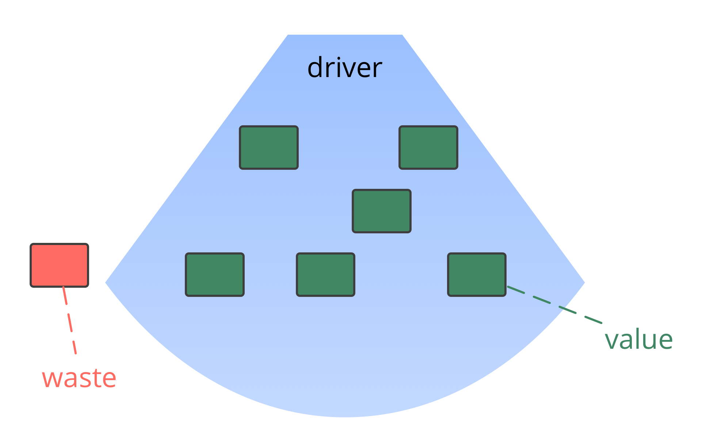

## Overeenkomsten Definiëren 

###  Patroon 6.1: Overeenkomst

_Een **overeenkomst** is een afspraak over een richtlijn, proces, beleid of protocol dat is ontworpen om de stroom van waarde zo goed mogelijk te geleiden._

Overeenkomsten worden gemaakt in reactie op drivers van de organisatie, worden **regelmatig gereviewed**, en zo nodig door ontwikkeld.

**Algehele accountability** voor een overeenkomst ligt bij de mensen die ze maken.

Een overeenkomst kan **delegatie van specifieke verantwoordelijkheden** aan individuen of groepen bevatten.

Neem **verwachtingen op** gerelateerd aan op te leveren resultaten, gedrag of middelen in de context van de overeenkomst.

**Opmerking:** In S3 worden richtlijnen, processen of protocollen die gemaakt zijn door personen in een rol ook als overeenkomst behandeld.

###  Patroon 6.2: Strategie Ontwikkelen

_Een **strategie** is een hoog over aanpak voor hoe mensen waarde gaan creëren om succesvol invulling te geven aan (de driver en doelstelling van) een domein._

Het is meestal effectiever als een team of een rolhouder het voortouw neemt bij het ontwikkelen van hun eigen strategie.

Een strategie bevat vaak een beschrijving van de beoogde resultaten van het uitvoeren van deze strategie.

Als de delegator de verantwoordelijkheid deelt voor domeinen die zij delegeren, is het waardevol dat zij de strategie van de gedelegeerden bekijken om te controleren of er potentiële belemmeringen zijn en om manieren voor te stellen waarop de strategie verbeterd kan worden.

Een strategie is een gedeelde overeenkomst tussen delegator(s) en gedelegeerden(s) die, indien nodig, regelmatig wordt herzien en bijgewerkt (*aanpassen of volharden*)

Strategieën worden geïmplementeerd en verfijnd door te experimenteren en te leren.

###  Patroon 6.3: Domeinen verduidelijken

**Helder begrip van tot waar iemands accountability en autonomie reikt, leidt tot verbeterde efficiëntie, effectieve samenwerking en meer wendbaarheid binnen de hele organisatie.**

Een eenvoudige manier om domeinen te verduidelijken is door gebruik te maken van een **domeinnaam beschrijving**:

- primaire driver (de **behoefte van de organisatie** die het domein moet vervullen)
- **kernverantwoordelijkheden** (belangrijkste op te leveren resultaten, eventuele kritieke risico's om te beheren, andere essentiële taken en te nemen besluiten die worden gedelegeerd)
- **kaders van de autonomie en invloed** voor degenen waaraan het domein wordt gedelegeerd (de *gedelegeerden*), meestal gerelateerd aan de organisatie zelf (bijv. afhankelijkheden, betrokkenheid van de delegator, rapporteren, etc.)
- **middelen** (tijd, geld, faciliteiten, privileges, tools)
- **evaluatiecriteria** en frequentie van evaluatie
- termijn (voor een rol)

Domeinbeschrijvingen kunnen worden gemaakt voor een _rol_, positie, _cirkel_, team, _open domein_, afdeling, eenheid of de hele organisatie.

Een andere manier om een domein te verduidelijken is door een [S3 Delegatie Canvas](http://s3canvas.sociocracy30.org/s3-delegation-canvas.html) in te vullen.

###  Patroon 6.4: Verduidelijk de Beoogde Resultaten

**Wees duidelijk over de verwachte resultaten van overeenkomsten, acties, projecten en strategieën.**

Spreek af wat de beoogde resultaten zijn en geef hier een korte beschrijving van.

De beoogde resultaten kunnen worden gebruikt om _Evaluatie Criteria_ te definiëren en een meetplan te maken voor het beoordelen van de werkelijke uitkomst.

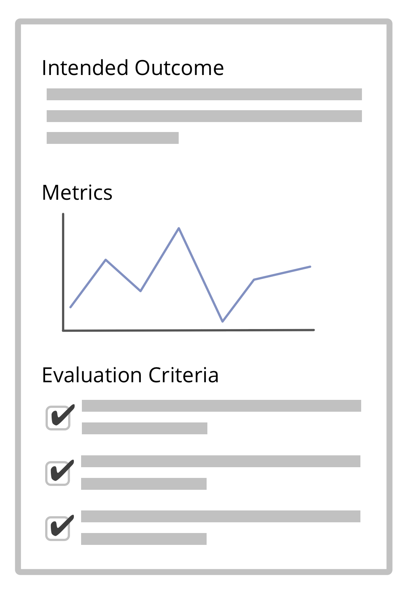

###  Patroon 6.5: Op te Leveren Resultaten Beschrijven

**Omschrijf op heldere wijze alle op te leveren resultaten in relatie tot de overeenkomst zodat er een gedeeld begrip is over de verwachtingen.**

_Een **deliverable** is een product, service, component of materiaal dat is geleverd in reactie op een driver van de organisatie._

Waar op te letten bij het beschrijven van op te leveren resultaten:

- voeg de juiste hoeveelheid details toe
- refereer aan andere documenten indien handig of nodig

Het is nuttig om de resultaten op een duidelijke manier te beschrijven, zodat de communicatie en de samenwerking binnen de organisatie, met de klant en met externe partners kan worden verbeterd.

**Voorbeeld:** Een populaire manier om op te leveren resultaten in software-engineering te beschrijven zijn zogenaamde **gebruikersverhalen**, die zich richten op de behoefte van gebruikers in verband met een software-systeem. Gebruikersverhalen worden ontwikkeld in dialoog tussen een klant (of hun vertegenwoordiger, de productmanager of "product owner"), en de software ontwikkelaar(s). Wat wordt opgeschreven is meestal één zin om het team te herinneren aan de behoefte en acceptatiecriteria en een lijst van benodigdheden voor de nieuwe functionaliteit. De klant kan dit gebruiken in een review vergadering om te beslissen of zij de nieuwe functionaliteit accepteren.

###  Patroon 6.6: Evaluatiecriteria

**Ontwikkel goed gedefinieerde evaluatiecriteria om te bepalen of het gewenste effect had op een overeenkomst.**

- ga voor **eenvoudige en ondubbelzinnige** criteria en documenteer ze (om discussie te vermijden bij het reviewen van de overeenkomsten)
- definieer **bruikbare statistieken** om de effecten en afwijkingen van de beoogde resultaten op te merken en te volgen
- overweeg criteria toe te voegen die het expliciet maken wanneer de uitkomst van een overeenkomst **mislukt**
- wanneer je een overeenkomst reviewed, denk **aan het evolueren van de beoordelingscriteria** gebaseerd op wat je geleerd hebt

###  Patroon 6.7: Logboek

**Onderhoud een coherent en toegankelijk systeem, waar alle benodigde informatie in terug te vinden is.**

Een logboek is een (digitaal) systeem om alle informatie op te slaan die relevant is voor het functioneren van een organisatie en zijn teams. Het logboek is toegankelijk voor alle leden van een organisatie en informatie wordt alleen vertrouwelijk gehouden als er goede redenen zijn om dat te doen.

Algemene platformen voor logboeken zijn Wikis (bijv. [Dokuwiki](https://www.dokuwiki.org/), [MediaWiki](https://www.mediawiki.org/), [Confluence](https://www.atlassian.com/software/confluence)), Content Management Systems (bijv. [Wordpress](https://wordpress.org/)), [G Pake](https://gsuite.google.com), [Evernote](https://evernote.com/business) of zelfs [Trello](https://trello.com/).

#### Logboek inhoud

Inhoud met betrekking tot de hele organisatie:

- primaire driver, strategie en waarden van de organisatie
- organisatiestructuur (domeinen en de verbindingen tussen hen)
- overeenkomsten 

Inhoud met betrekking tot een specifiek team of rol:

- cirkel beschrijving en strategie
- overeenkomsten (inclusief gedelegeerden' domeinomschrijvingen, strategieën en _ontwikkelplannen_)
- backlogs en andere informatie over werk en governance

###  Patroon 6.8: Logboekhouder

**Selecteer een lid van het team die specifiek verantwoordelijk is voor het bijhouden van alle informatie die het team nodig heeft.**

De logboekhouder is verantwoordelijk voor het onderhouden van het logboek van een team door:

- details van overeenkomsten, domein beschrijvingen, _selecties_, evaluatiecriteria, notulen van vergaderingen etc. vast te leggen.
- organiseer relevante informatie en verbeter het systeem indien waardevol
- houdt verslag up to date
- ervoor te zorgen dat het logboek voor iedereen in het team, en indien afgesproken de organisatie, toegankelijk is
- alle technische aspecten van logboek bijhouden

## Gerichte Interacties 

###  Patroon 7.1: Governance vergadering

**Teams komen regelmatig bijeen om te bepalen wat er moet worden gedaan om doelstellingen te bereiken en kaders vast te stellen over hoe en wanneer er iets zal gebeuren.**

Een governance vergadering is meestal:

- gefaciliteerd 
- vooraf voorbereid 
- _getimeboxed_ voor de duur van 90-120 minuten
- elke 2-4 weken gepland

Een typische governance vergadering omvat:

- opening: _check in_ met elkaar en stem af over de doelstelling van de bijeenkomst
- administratieve zaken 
    - controleer of de notulen van de laatste vergadering zijn goedgekeurd
    - ga akkoord op een datum voor de volgende vergadering
    - controleer of er nog last minute agendapunten zijn en haal consent over de agenda
- agenda items 
- _evaluatie van de vergadering:_ reflecteer op de interactie, vier successen en deel suggesties voor verbetering
- afsluiten: check in met elkaar voordat je de vergadering verlaat

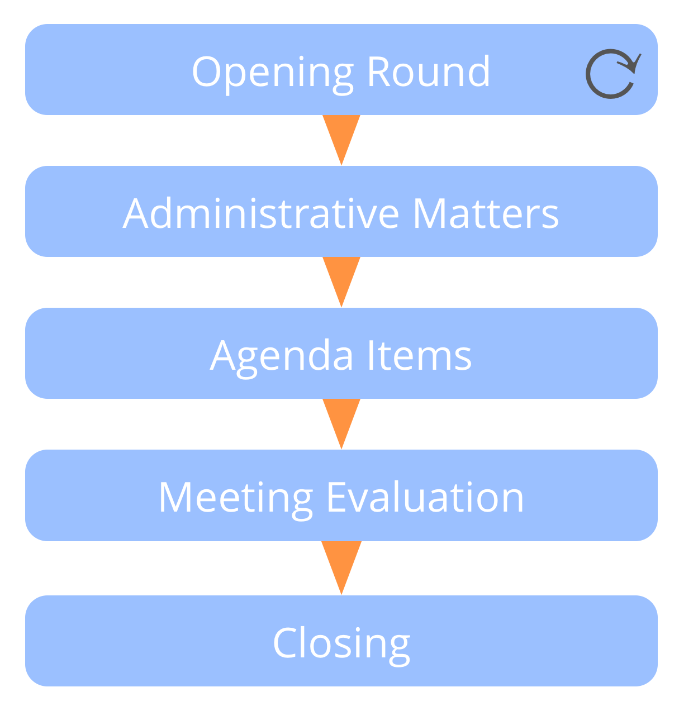

Typische agenda items omvatten:

- korte verslagen 
- evalueer bestaande overeenkomsten die gereviewed moeten worden
- mensen selecteren voor rollen 
- nieuwe driver waarover moet worden besloten, waaronder: 
    - _voorstellen vormen_
    - _overeenkomsten maken_
    - Het _ontwerpen van domeinen_ en het bepalen van de manier waarop ze verantwoord moeten worden (bijv. nieuwe _rollen_, _cirkels_, teams of _open domeinen_)

###  Patroon 7.2: Retrospectief

**Spendeer tijd aan het reflecteren op opgedane ervaringen, leer ervan en besluit hoe het werkproces verbeterd kan worden.**

- uitkomst: wijzigingen in het werkproces, nieuwe taken, "tussendoor" overeenkomsten, en drivers waar een afspraak over gemaakt moet worden
- gefaciliteerde vergadering (~1u)
- regelmatige intervallen (1-4 weken)
- aanpassen aan situatie en context

#### Vijf fases van een Retrospectief

1. Zorg voor de juiste sfeer 
2. Verzamel data
3. Genereer inzichten
4. Besluit wat te doen
5. Sluit de retrospectief

Veel verschillende activiteiten voor elke fase kunnen worden gevonden op [plans-for-retrospectives.com](http://www.plans-for-retrospectives.com/)

###  Patroon 7.3: Dagelijkse Standup

**Ontmoet dagelijks om werk te organiseren, leren te vergemakkelijken en productiviteit en doeltreffendheid te verbeteren.**

- Getimeboxed (meestal 15 minuten)
- dagelijks op hetzelfde moment
- het team verzamelt rond een zichtbaar projectmanagement board/tool om: 
    - dagelijks werk organiseren
    - aanpakken van belemmeringen/hindernissen
    - bestaande overeenkomsten aanpassen of ter plekke nieuwe overeenkomsten maken

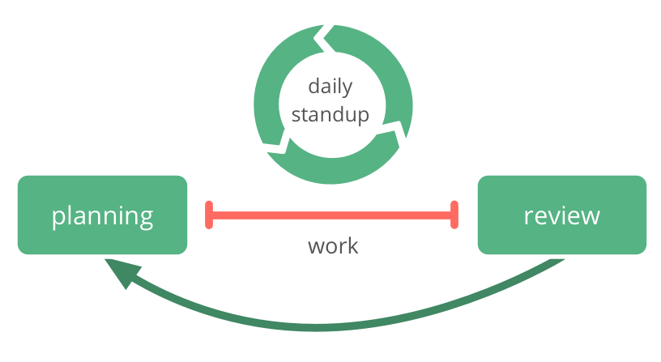

###  Patroon 7.4: Planning en Review Vergaderingen

**Mensen komen regelmatig bij elkaar (1-4 weken) in getimeboxte vergaderingen om werk te plannen en te evalueren.**

**Planning vergadering**: selecteer en schat in welke werkitems gepland worden voor de volgende iteratie.

**Review vergadering**: bekijk voltooide werkitems en besluit of er dingen opnieuw gedaan moeten worden of moeten worden aangepast voor de komende iteratie.

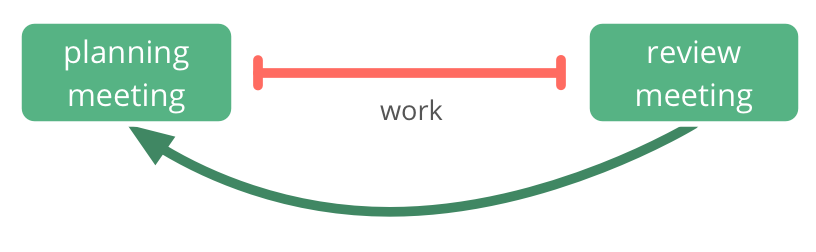

###  Patroon 7.5: Coördinatie Vergadering

**Kom regelmatig bij elkaar (meestal wekelijks) om over werk te rapporten en het te coördineren tussen domeinen.**

- faciliteer de vergadering (timebox gesprekken en gebruik rondes waar waardevol)
- wanneer nuttig, stel een agenda voor de vergadering op en deel deze van te voren met deelnemers 
    - voeg details toe van alle voorwaarden die deelnemers kunnen helpen zich voor te bereiden
    - overige agenda items kunnen boven tafel komen tijdens het horen van de status updates

Agenda items:

- synchronisatie en afstemming tussen domeinen
- prioritering en distributie van werk 
- reageren op de belemmeringen

## Vergaderpraktijken 

###  Patroon 8.1: Rondes

**In een groepsvergadering ga je de cirkel rond, zodat iedereen op zijn beurt het woord kan voeren.**

Rondes is een techniek waarmee je gelijkwaardigheid kunt faciliteren en een effectieve dialoog kunt ondersteunen.

Wees duidelijk over de doelstellingen en de beoogde resultaten van elke ronde.

Vorm een cirkel en begin elke ronde met een ander persoon en verander de richting (met of tegen de klok) om variatie aan te brengen in wie als eerst en als laatst spreekt, en in de volgorde van de bijdragen van mensen.

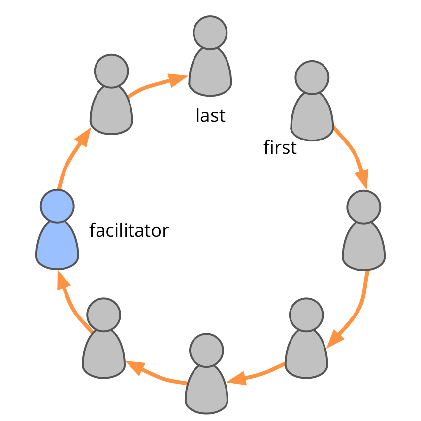

###  Patroon 8.2: Vergaderingen faciliteren

**Kies iemand om de vergadering te faciliteren en de groep te helpen focus te behouden, binnen de planning te blijven en creativiteit en wijsheid te ontlokken.**

Stel een agenda op voorafgaand aan elke vergadering en selecteer een facilitator om:

- houd de ruimte, houd de tijd in de gaten en navigeert de agenda tijdens de vergadering
- een geschikte activiteit of formaat voor elk topic te faciliteren
- een _evaluatie_ aan het eind van de vergadering te faciliteren

Overweeg om een facilitator te selecteren voor een bepaalde term. Zelfs een onervaren facilitator kan een positief verschil maken.

**Zie ook:** _Bereid voor voor Vergaderingen_, _Rolselectie_

###  Patroon 8.3: Voorbereiden voor Vergaderingen

**Vooraf voorbereiden om de vergaderingen effectiever te maken.**

Enkele overwegingen voor het succesvol voorbereiden van een vergadering:

- verhelderen en communiceren van de driver voor en de beoogde resultaten van de vergadering
- besluit wie uit te nodigen 
- maak een agenda
- de vergadering op tijd genoeg plannen, zodat mensen tijd hebben om zich voor te bereiden
- kies een passende duur voor de vergadering 
- wees duidelijk wie de _vergadering zal faciliteren_, wie aantekeningen neemt en wie er voor de follow-up zal zorgen

#### Agenda voorbereiden

Betrek mensen bij het voorbereiden en prioriteren van de vergadering en stuur deze vooraf rond

Stem voor elk agendapunt in over:

- de driver 
- de beoogde resultaten
- het proces
- de tijd die je eraan wilt besteden 
- wat mensen moeten doen om zich voor te bereiden

#### Ondersteun de voorbereiding van de deelnemers

- bedank wat er van tevoren kan worden gedaan om de vergadering voor te bereiden
- meld mensen over wat te verwachten en eventuele voorwaarden
- maak alle beschikbare middelen beschikbaar die mensen nodig hebben voor voorbereiding

#### Als deelnemer

- bekijk het patroon _Artful Participation_
- bekijk de agenda en bedenk hoe je kan bijdragen aan ieder item
- bespreek bezwaren op een agenda en los deze zo mogelijk op voorafgaand aan de vergadering
- review verbetersuggesties van de evaluatie van de vorige vergadering en bedenk hoe **jij** ernaar kunt handelen

###  Patroon 8.4: Check In

**Help mensen zich bewust te worden van zichzelf en anderen en zich te concentreren, aanwezig te zijn en zich te engageren.**

Deel tijdens de check in iets over wat jouw aandacht heeft, hoe het gaat, welke gedachten, gevoelens, afleidingen of behoeften je hebt.

De check in kan in de vorm van een openingsronde of afsluitronde tijdens een groepsbijeenkomst, of gewoon tijdens een 1 op 1.

Je kan ook een groeps check in hebben tijdens de vergadering, of een individuele check in nemen wanneer je denkt dat dit waardevol is.

Tijdens een groepscheck in moeten mensen ook kunnen passen.

In een nieuwe setting kunnen mensen ook hun naam noemen tijdens de check in, als een manier om zichzelf voor te stellen. (tip: vermijdt om over functie en status te praten, tenzij er een goede reden is om dat wel te doen.)

###  Patroon 8.5: Vergaderingen evalueren

**Neem tijd om te leren aan het einde van elke vergadering of workshop.**

Reflecteer op interacties, vier successen en deel suggesties voor verbetering voor het sluiten van de vergadering.

- reserveer hier 5 minuten voor bij 1 uur en 15 minuten bij een volledige workshop
- leg het geleerde vast en bekijk dit voorafgaand aan de volgende vergadering

Korte formats die u kunt gebruiken:

- minder doen/meer doen/mee beginnen/mee stoppen
- positief/minder goed/voorgestelde verbeteringen

#### Vergaderingen evalueren: Lang Formaat

Vraag iedereen in een _ronde_ kort iets te delen over een of meer van de volgende onderwerpen en degenen die belangrijk zijn voor de volgende keer vast te leggen:

- effectiviteit en indeling
- facilitering en deelname
- emotionele toon
- waarderingen en prestaties (ik vond... prettig)
- waar ruimte ligt voor groei en verbetersuggesties (ik wens...)
- wilde ideeën en radicale suggesties (wat als...)

###  Patroon 8.6: Host van de vergadering

**Selecteer iemand om verantwoordelijk te zijn voor het voorbereiden en opvolgen van workshops of andere bijeenkomsten.**

Een persoon kan de rol van host van de vergadering op zich nemen voor een specifieke gebeurtenis of voor verschillende bijeenkomsten gedurende een bepaalde periode.

#### Verantwoordelijkheden van een host van de vergadering

Voorbereiding:

- doelen en op te leveren resultaten identificeren
- agenda voorbereiden en uitdelen
- deelnemers identificeren en uitnodigen
- schat de vereiste tijd en plan de vergadering/workshop
- boek locatie (en transport indien nodig)
- de ruimte voorbereiden, vereiste materialen en informatie leveren
- zorg ervoor dat er, indien nodig, een facilitator is en een notulist

**Na de vergadering:** locatie opruimen, sleutels teruggeven, losse eindjes aan elkaar knopen en ervoor zorgen dat de notulen worden rond gedeeld.

**Zie ook:** _Vergaderingen faciliteren_, _Voorbereiden voor vergaderingen_

###  Patroon 8.7: Governance backlog

_Een **governance backlog** is een zichtbare, geprioriteerde lijst van items (drivers) die gerelateerd zijn aan het besturen van een domein en aandacht nodig hebben._

Een governance backlog bevat:

- zaken die een besluit vereisen
- voorstellen om te maken en overwegen
- mensen selecteren voor rollen

**Opmerking:** Aankomende verslagen en overeenkomsten die gereviewed moeten worden, worden meestal direct toegevoegd aan de agenda (in plaats van de backlog).

## Werk Organiseren 

###  Patroon 9.1: Backlog

_Een **backlog** (naar-do-list) is een (geprioriteerde) lijst van werk gerelateerde items (deliverables), of (drivers) die nog moeten worden opgepakt._

Overweeg om backlogs zichtbaar te maken, niet alleen voor andere leden van een team, maar ook voor de bredere organisatie.

Verschillende soorten backlogs:

- governance backlog
- activiteiten backlog
- _sprint_ backlog
- product backlog
- hindernissen backlog

**Implementatie:**

- **analoge backlog**: plakmemo's op een muur, of indexkaarten, magneten en whiteboard
- **digitale backlog:** bijv. [Google Sheets](https://www.google.com/sheets/about/), [Trello](https://trello.com/), [Kanban Flow](https://kanbanflow.com/), [Jira](https://www.atlassian.com/software/jira), [Asana](https://asana.com/)

Elk item op een (geprioriteerde) backlog bevat meestal:

- een **korte beschrijving** van een op te leveren resultaat of een driver
- een **uniek referentienummer** (of link) voor elk werkitem
- (de **volgorde van werk items**)
- **afhankelijkheden** met andere werkproducten of projecten
- **vervaldatum** (indien nodig)
- (optioneel) een manier om **waarde** te meten 
- (optioneel) een manier om **investering** te meten (vaak een schatting van tijd of complexiteit)

###  Patroon 9.2: Prioriteer Backlogs

**Orden al nog te voltooien werkitems en zet de belangrijkste bovenaan. Pak dan item voor item werk op, wanneer er capaciteit beschikbaar is.**

Geen twee punten kunnen even belangrijk zijn, wat betekent dat het noodzakelijk is om het eens te worden over prioriteiten en moeilijke keuzes te maken.

Een geprioriteerde backlog helpt om **focus** op de belangrijkste items te houden.

###  Patroon 9.3: Visualiseer Werk

**Onderhoud een systeem dat alle belanghebbenden in staat stelt om de stand van zaken van alle lopende, lopende of voltooide werkitems in te zien.**

- waardevol voor zelforganisatie en systemen van binnentrekken van werk
- systeem moet toegankelijk zijn voor iedereen die geraakt wordt
- **analoog**: plakmemo's op een muur, of indexkaarten, magneten en whiteboard
- **digitaal**: [Trello](https://trello.com/), [Kanbanery](https://kanbanery.com/), [Leankit](https://leankit.com/), [Jira](https://www.atlassian.com/software/jira), [Google Sheets](https://www.google.com/sheets/about/), etc.

#### Dingen om bij te houden:

- **type werkitems** (bijv. klantverzoeken, projecttaken, rapportagetaken, opnieuw te doen werk)
- **startdatum** (en **vervaldatum** indien nodig)
- **prioriteiten**
- **fases** van het werk (bijv. "te doen", "in uitvoering", "review" en "done")
- hindernis/grenzen
- wie werkt aan welke items
- overeenkomsten en verwachtingen die de werkstroom leiden (bijvoorbeeld definitie van voltooid, beleid, kwaliteitsnormen)
- gebruik kleuren, symbolen, hoogtepunten etc.

###  Patroon 9.4: Pull-systeem voor werk

**Mensen pakken nieuwe items op wanneer ze capaciteit hebben (in plaats van dat er werk naar hen toe wordt geduwd).**

Prioriteer openstaande werkitems om ervoor te zorgen dat de belangrijke items eerst worden opgepakt.

Het naar binnentrekken van werk voorkomt overbelasting van het systeem, vooral wanneer het _ werk in uitvoering wordt gelimiteerd_.

###  Patroon 9.5: Beperk Lopende Werkzaamheden

**Beperk het aantal lopende werkzaamheden in elke fase van het werkproces.**

Werk in uitvoering omvat:

- het aantal items in een backlog
- gelijktijdige projecten of taken voor teams of individuen
- producten in een portfolio

Wanneer een actie een overeengekomen limiet van lopende werkzaamheden overschrijdt, moet dit worden besproken in het team voordat ermee wordt doorgegaan.

###  Patroon 9.6: Activiteiten timeboxen

**Stel een tijdsbeperking in om focus te behouden, wees bewust van de tijd die je hebt en hoe je het gebruikt.**

_Een **timebox** is een vooraf afgesproken tijdsperiode die te besteden is aan een specifieke activiteit (die niet noodzakelijkerwijs is afgerond aan het einde van de timebox)._

- om waarde te krijgen uit de tijdvak, wees duidelijk wat je wilt bereiken
- ga akkoord met de duur van de tijdvak en visualiseer tijd
- onderhandel over en ga akkoord met het verlengen van een timebox voor er geen tijd meer is
- verdeel langere activiteiten in kleinere beheersbare timeboxes
- review regelmatig de voortgang
- overweeg iemand te kiezen (de "time keeper") om anderen te helpen zich bewust te blijven van de tijd

Wat je kunt timeboxen:

- vergaderingen, belletjes, gesprekken
- taken
- experimenten
- een poging om een probleem op te lossen
- email controleren
- pauze
- een langere werkperiode (een sprint)

###  Patroon 9.7: Uitlijnen van invloed, informatie- en waardestromen

**Om de waardestroom te organiseren is het van belang om de besluitvorming te laten plaatsvinden dichtbij waar de waarde wordt gecreëerd en om de stroom van invloed en informatie ook zo te laten lopen.**

**Waardestroom:** Deliverables die door de organisatie heen stromen richting andere stakeholders en/of klanten.

Bereik en onderhoud de uitlijning van de waardestroom door de overeenkomsten in een organisatie continue te blijven ontwikkelen:

- zorg ervoor dat alle besluiten die de waardestroom beïnvloeden, de waardestroom ondersteunen
- zorg ervoor dat de mensen met de juiste kennis en vaardigheden de besluiten kunnen beïnvloeden
- maak handige informatie beschikbaar
- richt op het creëren van korte feedback loops om leren te versnellen.

Wanneer de besluitvorming plaatsvindt dichtbij waar de waarde wordt gecreëerd, en de informatiestroom de voortdurende en constante waardestroom ondersteunt, wordt het potentieel voor ophoping van verspilling verminderd.

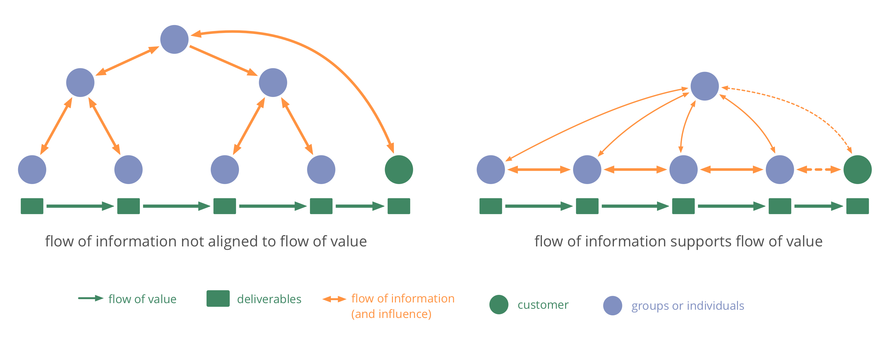

###  Patroon 9.8: Coördinator

Een persoon in de rol van een coördinator is verantwoordelijk voor het **coördineren van het werk binnen een domein** en is **geselecteerd voor een beperkte termijn.**

De coördinator kan worden geselecteerd door het team zelf, of door de delegator.

Meerdere coördinatoren kunnen samenwerken om werk te synchroniseren over meerdere domeinen.

In plaats van een coördinator te selecteren, kan een team kiezen voor zelforganisatie.

## Organisatiestructuur 

De organisatiestructuur is de feitelijke indeling van domeinen en hun verbindingen. Het geeft aan waar de invloed ligt en via welke kanalen de informatie en invloed stroomt.

Evolueer de structuur van uw organisatie continu naar:

- steun de continue stroom waarde
- maak effectief samenwerken rond afhankelijkheden mogelijk
- zorg ervoor dat informatie beschikbaar is voor degene die deze nodig heeft
- verdeel macht om daar waar nodig voldoende invloed te hebben

De basisbouwstenen voor de organisatiestructuur zijn onderling afhankelijk, verbonden domeinen.

Domeinen kunnen worden gekoppeld om een hiërarchie of een **heterarchy** (a.k.a. complex adaptief systeem, of netwerk, waar meerdere functionele structuren naast elkaar kunnen bestaan) te vormen.

Sociocratie 3.0 beschrijft een verscheidenheid aan **structurele patronen** om een organisatiestructuur op te bouwen.

- S3's structurele patronen zijn van toepassing op verschillende lagen van abstractie
- verschillende structurele patronen dienen verschillende drivers
- structurele patronen kunnen worden aangepast en gecombineerd indien nodig
- meer patronen zijn er en zullen worden ontdekt

###  Patroon 10.1: Service cirkel

**Uitbesteden van diensten vereist door twee of meer domeinen.**

Een service cirkel kan worden bemenst door leden van de domeinen die het dient, en/of door andere mensen.

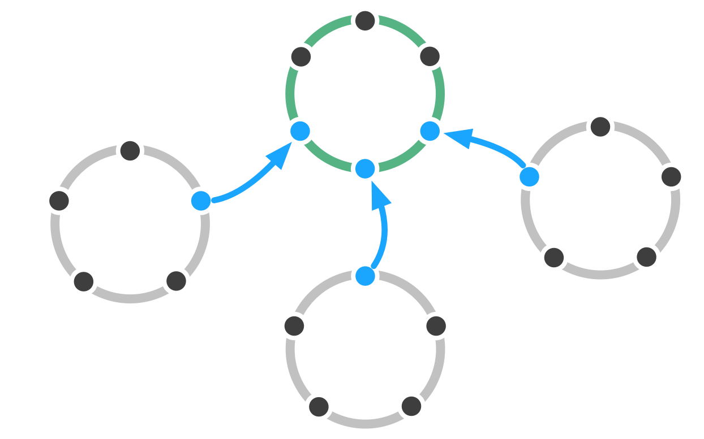

###  Patroon 10.2: Cirkel van Afgevaardigden

**Delegeer het nemen van governance besluiten die invloed hebben op meerdere domeinen aan afgevaardigden die door deze domeinen zijn geselecteerd.**

Om governance belsuiten te nemen namens hen, sturen stakeholders _afgevaardigden_ om een cirkel van afgevaardigden te vormen.

Acties volgende uit besluiten van een gedelegeerde cirkel worden uitgevoerd binnen de verschillende domeinen die in desbetreffende cirkel worden vertegenwoordigd.

Cirkels van afgevaardigden bieden organisaties een manier om de waardestroom binnen de organisatie goed te laten lopen en zorgt voor diversiteit aan perspectieven bij governance besluiten.

Een cirkel van afgevaardigden kan andere mensen (bijvoorbeeld externe deskundigen) inzetten om specifieke beslissingen te nemen, of zelfs als lid van de cirkel.

###  Patroon 10.3: Perzik Organisatie

**Lever waarde in complexe en concurrerende omgevingen via **decentralisatie** (van resources en invloed) en **directe interactie** tussen de makers van waarde en de klanten die ze dienen.**

Teams in de periferie:

- lever waarde in directe uitwisseling met de buitenwereld (klanten, partners, gemeenschappen, gemeenten etc.) 
- beheert de monetaire middelen en stuurt de organisatie

Het centrum biedt interne diensten om de organisatie te ondersteunen.

Domeinen zijn verbonden rondom de afhankelijkheden, zodat de stroom van informatie en invloed en de samenwerking is ondersteunt.

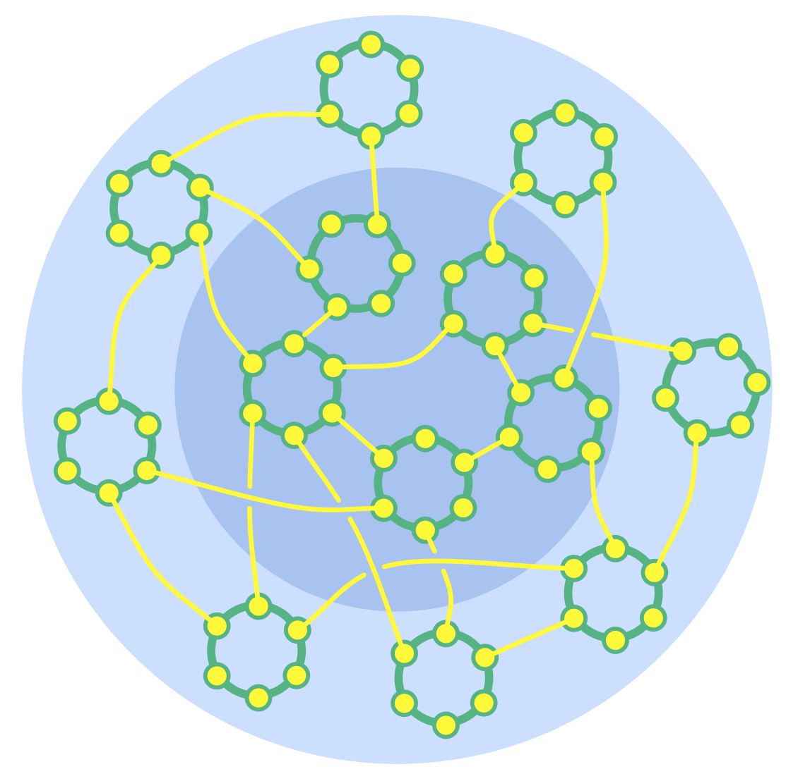

###  Patroon 10.4: Dubbel-gelinkte Hiërarchie

**Alle autoriteit om governance besluiten te nemen wordt gedelegeerd naar zelfsturende cirkels, dubbel gekoppeld binnen alle niveau's van de hiërarchie om van een traditionele hiërarchie over te gaan naar een structuur die beter geschikt is om de collectieve intelligentie te gebruiken en betrokkenheid te vergroten.**

1. Verplaats het nemen van governance besluiten van individuen naar teams door  zelforganiserendecirkels te vormen op alle lagen van de organisatie.
2. De leden van elke cirkel kiezen iemand van hun groep om hun belangen te vertegenwoordigen en deel te nemen aan de governance vergaderingen van de volgende hogere cirkel, en omgekeerd.

Een dubbel-gelinkte hiërarchie:

- brengt gelijkwaardigheid in governance
- behoud de mogelijkheid om een functionele hiërarchie in stand te houden (als het de stroom van waarde mogelijk maakt).

**Zie ook:** _Cirkel_, _Dubbele Koppeling_, _Afgevaardigde_

###  Patroon 10.5: Service organisatie

**Samenwerking en afstemming tussen verschillende belanghebbenden met een gezamenlijke driver.**

- verbetert het potentieel voor gelijkwaardigheid tussen verschillende entiteiten
- verhoog de onderlinge afstemming tussen verschillende afdelingen/organisaties
- steunt de samenwerking tussen verschillende instanties en/of organisaties met verschillende primaire beweegredenen of die in conflict zijn
- geschikt voor eenmalige projecten of lopende samenwerking

**Opmerking:** een service organisatie wordt vaak aangeduid als **backbone organisatie**.

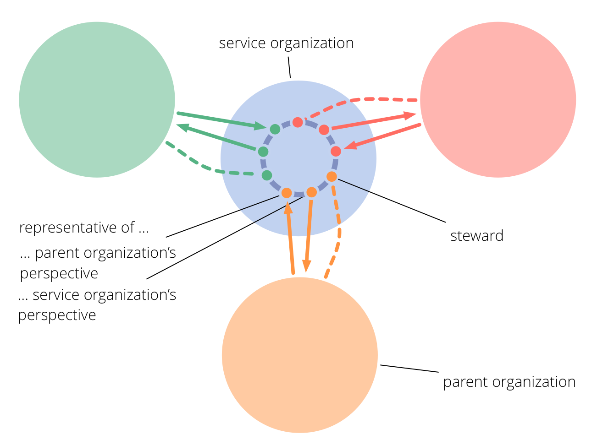

###  Patroon 10.6: Fractale organisatie

**Meerdere entiteiten (organisaties of projecten) met een gemeenschappelijke (of vergelijkbare) primaire driver en structuur die lessen kunnen delen over functionele domeinen, actie op één lijn te brengen en besluiten op hoog niveau te nemen (bijv. algemene strategie)**.

Een fractale organisatie kan een groot netwerk inschakelen om snel te reageren op veranderende contexten.

Indien nodig kan het patroon herhaald worden om meerdere fractale organisaties te verbinden tot één.

#### Randvoorwaarden

Een fractale organisatie kan worden gevormd door meerdere (onderling) afhankelijke organisaties die een gemeenschappelijke (primaire) driver delen, of door meerdere branches, afdelingen of projecten binnen een grotere organisatie.

Deze entiteiten (dat wil zeggen organisaties, branches, afdelingen of projecten) moeten ten minste enkele - en meestal de meeste - functionele domeinen delen (bijv. boekhouding, productbeheer of ontwikkeling).

#### Rangen

Een fractie organisatie heeft ten minste drie rangen:

- eerste rang: de **kiesgerechtigden** (dat wil zeggen organisaties, branches, afdelingen of projecten)
- tweede rang: **functie-specifieke _cirkels van afgevaardigden_** om lessen te delen en om overeenkomsten te maken, namens functie specifieke domeinen
- derde rang: een **cross-functionele cirkel van afgevaardigden** om overeenkomsten te maken en te evolueren in reactie op drivers die alle kiesgerechtigden beïnvloeden

#### Een fractale organisatie vormen

1. Het vormen van de **tweede rang**: Bij elke entiteit besluiten de leden van elk zelfde soort functioneel domein wie hen zal vertegenwoordigen in een **functie specifieke cirkel van afgevaardigden**, waar zij hun kennis en lessen delen, en bijdragen aan het maken en doorontwikkelen van overeenkomsten. Vertegenwoordigers zijn geselecteerd voor een beperkte termijn (waarna een nieuwe selectie wordt gemaakt).
2. Het vormen van de **derde rang**: afgevaardigden van de tweede rang selecteren allemaal een afgevaardigde voor een **cross-functionele cirkel van afgevaardigden**.

#### Impact op de organisatie(s)

Elke kiesgerechtigde:

- krijgt toegang tot een breed scala aan ervaring, wijsheid en vaardigheden om de effectiviteit en innovatie te vergroten.
- kunnen hulpbronnen, infrastructuur en ervaring delen met andere kiesgerechtigden op basis van capaciteit en behoefte

De tweede en derde rang:

- kan besluiten tegelijkertijd testen uit te voeren binnen meerdere functie-specifiek domeinen, waardoor er uitgebreide feedback is en er snel geleerd kan worden
- organiseer, stem af en stuur het hele systeem, met behoud van autonomie en eigenheid van de individuele kiesgerechtigden

# Appendix

## Wijzigingen

### Wijzigingen 2019-05-03

- verfijnde glossary termen voor overaankomst, organisatie en team, voegde woordenlijst term toe voor Doelstelling
- Prinses van Accountability: verduidelijkt de individuele accountablity voor het werk en voor samenwerking
- _contract voor succesvolle samenwerking_: paste tekst aan
- _op te leveren resultaten beschrijven_: user stories toegevoegd als voorbeeld
- _Dubbele-gelinkte Hiërarchie_: herziene samenvatting
- _Cirkel van afgevaardigden_: verbeterde beschrijving
- _Bezwaar_: verfijnde definitie van bezwaar en bezorgdheid, voegde een illustratie toe voor een proces om bezwaar te kwalificeren
- _Voorstel Vormen_: ontbrekende procesillustratie toegevoegd
- _Rolselectie_: kleine aanpassing aan de illustratie
- _transparant salaris_: uitgelegd wat een salarisformule is

### Wijzigingen 2019-03-08

**Algemene wijzigingen**

- de introductie uitgebreid met meer informatie over S3 en de geschiedenis van sociocratie die voorheen alleen beschikbaar was op de hoofdS3 website
- de sectie over governance in de inleiding bijgewerkt
- bijschriften toegevoegd aan alle illustraties
- patroongroep "Zaken die co-creatie mogelijk maken" naar "Zaken die samenwerking mogelijk maken" hernoemd
- slide deck versie verwijderd en verbeterde lay-out en opmaak van pdf en ePub versie
- website versie: klikbare patroon kaart toegevoegd voor eenvoudigere navigatie en woordenlijsten in veel patronen

**Woordenlijst:**

- team toegevoegd aan woordenlijst (en vervang groep met team gedurende de praktische gids waar van toepassing)
- de definitie van Op te leveren resultaten verbeterd
- **driver statement** uit tekst en woordenlijst verwijder
- de definities voor governance, activiteiten, en zelforganisatie geupdate

**Illustraties:**

- aangepaste formats voor domein beschrijving en rolbeschrijving
- illustraties voor _Koppelen_ en _Dubbele Koppeling_ bijgewerkt

**Wijzigingen aan patronen:**

- _Overeenkomst_: beschrijving vermeldt nu dat alle verwachtingen moeten worden geregistreerd
- _Op te leveren resultaten beschrijven_: verbeterde beschrijving
- _Beschrijf Drivers van de organisatie_: meer informatie over het samenvattenvan drivers
- _Bezwaren oplossen_: beide illustraties bijgewerkt

### Wijzigingen 2018-08-17

**Algemene wijzigingen**

- de korte samenvatting voor veel van de patronen toegevoegd en herzien
- bullets points verwijderd en vervangen voor zinnen in veel patronen
- veel kleine verbeteringen in grammatica en taal
- de URL naar de webversie van de praktische handleiding opgenomen 

**Woordenlijst:**

- **bijgewerkt:** verantwoording geven aan (v.), zorg, deliverable, governance, bezwaar, activiteiten, primaire driver, principe, rol, zelf-organisatie, semi-autonomie, subdriver, waarden
- **toegevoegd:** kiezer, coördinatie, afgevaardigden, driver statement, evolueren (v) van de waardestroom, hulpteam, open domein
- **verwijderd:** peer driver

**Wijzigingen in Introductie**

- de driver voor het maken van Sociocratie 3.0 toegevoegd
- De zeven principes: 
    - *Het principe van empirie*: de verwijzing naar “falsificatie” is verwijderd 
    - *Het principe van Consent* wordt nu duidelijker uitgelegd als "Benoem, zoek en los bezwaren tegen besluiten en acties op" 
- *Governance, Semi-Autonomie en Zelforganisatie*: we hebben de definities van governance, activiteiten en zelforganisatie verfijnd, elke verwijzing naar “coördinatie”, verwijderd en het onderscheid tussen governance en activiteiten verduidelijkt
- *Drivers en domeinen* - we hebben duidelijk gemaakt hoe domeinen kunnen worden begrepen met betrekking tot drivers van de organisatie

**Wijzigingen aan patronen:**

- _overeenstemmen over waarden_: verbeterde beschrijving
- _Flow uitlijnen_: verbeterde beschrijving en illustratie
- _Patronen aanpassen aan de context_: verbeterde beschrijving
- _Overeenkomst_: verbeterde beschrijving, bijgewerkt template
- _Artful Participation_: verbeterde samenvatting
- _ De beoogde resultaten verduidelijken _ (hernoemd van * Beoogde uitkomst *): verbeterde beschrijving
- _Consent Besluitvorming_: verbeterde beschrijving, bijgewerkte afbeelding
- _Continue verbetering van het Werkproces_: verbeterde beschrijving
- _Contract voor succesvolle samenwerking_: het patroon hernoemd naar een meer beschrijvende naam, en het proces van het maken van contracten, en wat er in moet staan uitgelegd
- _Coördinatie Vergadering_: agenda-items verduidelijkt, bijgewerkte afbeelding
- _Cirkel van afgevaardigden_: verbeterde beschrijving
- _Delegeren van invloed_: verbeterde beschrijving
- _Deliverables beschrijven_: verbeterde beschrijving
- _Drivers van de organisatie beschrijven_: expliciet gemaakt dat een driver meestal slechts 1-2 zinnen is, herziene sectie over het uitleggen van de behoefte, het gedeelte over het beoordelen van drivers verplaatst van *Reageren op drivers van de organisatie* naar dit patroon en een nieuwe illustratie toegevoegd die *uitlegt hoe* organisatiedrivers moeten worden beschreven
- _Dubbel koppelen_: beschrijving afgestemd op *Link*
- _Dubbele-gelinkte Hiërarchie_: in meer detail uitgelegd wat een dubbel gelinkte hiërarchie is en hoe dit wordt gemaakt
- _ Overeenkomsten evalueren en evolueren_: de volgorde van de tekst aangepast, zodat het duidelijk is dat er een lang en een kort formaat is
- _Evaluatie Criteria_: voorstel om een drempel voor succes vast te stellen en we hebben uitgelegd hoe de evaluatiecriteria evolueren met overeenkomsten
- _Vergaderingen faciliteren_: verbeterde beschrijving
- _Fractale Organisatie_: uitgebreide en verbeterde beschrijving
- _Governance backlog_: verbeterde beschrijving
- _Governance Vergadering_: verbeterde beschrijving, verhelderde agendapunten
- _Uitnodiging van Verandering_: beschrijving richt zich nu op *hoe* verandering uit te nodigen
- _ koppelen _: beschrijving afgestemd op _ dubbele link _
- _Logboek_: verduidelijkt dat er geen verschil is tussen logboeken voor groepen en logboeken voor rollen
- _Navigeren via spanning_: verbeterde beschrijving, een nieuwe afbeelding toegevoegd om het onderscheid tussen *Navigeren via spanning*, *Beschrijven van drivers van de organisatie* en *Reageren op drivers van de organisatie* te verduidelijken
- _Bezwaar_: het verschil verduidelijkt tussen bezwaar en zorg, verduidelijkt wanneer iets gekwalificeerd wordt als een bezwaar en hoe bezwaren in een groepscontext kunnen worden behandeld
- _Open domein_: verbeterde beschrijving en bijgewerkte illustratie
- _Open systemen_: verbeterde beschrijving
- _Open ruimte voor verandering_: hernoemd van *Open S3 Adoptie*, verbeterde beschrijving
- _Perzik Organisatie_: relatie opgehelderd tussen de het periferie en centrum
- _ Voorstel Vormen _: herziene tekst en illustratie om het proces van het kiezen van tuners duidelijker te maken, bijgewerkt template voor een voorstel om deze afte stemmen op het template voor de overeenkomst
- _Vertegenwoordiger_: verbeterde beschrijving
- _Bezwaren oplossen_: beide illustraties bijgewerkt
- _Reageren op drivers van de organisatie_: verbeterde beschrijving, kwalificatie van drivers voor de organisatie versimpeld
- _Rol_: verbeterde beschrijving
- _Rol Selectie_: verbeterde beschrijving, beschrijving van elke stap toegevoegd
- _ Rondes _: verbeterde beschrijving
- _ Transparant salaris _: meer details over eerlijkheid toegevoegd, en over hoe een salaris formule te ontwikkelen

**Patronen hernoemd:**

- *Overeenkomsten evalueren* naar *Overeenkomsten evalueren en evolueren*
- *Beoogd resultaat* naar *Beoogde resultaten verduidelijken* 
- *Open S3 Adoptie* naar *Open ruimte voor verandering*
- *Contracting en accountability* naar *Contract voor succesvolle samenwerking*

**Toegevoegde patronen:**

- _Check In_
- _Voorstellen co-creëren_
- _Voorbereiden van vergaderingen_
- _Activiteiten timeboxen_

### Wijzigingen 2018-03-31

- patroon *Beschrijf Drivers* naar *Beschrijf drivers van de organisatie* hernoemd
- _Beschrijf drivers van de organisatie_: de vier aspecten van een driver uitgelegd: de huidige situatie, de gevolgen van de situatie voor de organisatie, de behoefte van de organisatie in verband met deze situatie en de gevolgen van het feit dat zij zich bezighouden met het vervullen van de behoefte
- *behoefte* aan woordenlijst toegevoegd

### Wijzigingen 2017-11-16

- kleine correcties
- woordenlijst omschrijving van *Cirkel* en *Rol* afgestemd op de tekst bij het patroon
- *Ontwikkelingsplan*: verduidelijking van verantwoordelijkheden
- *Rol*: doorontwikkeling van de strategie verduidelijkt

### Wijzigingen 2017-11-10

- verschillende kleine verduidelijkingen en correcties
- *Cirkel*: relatie tussen cirkel en domein verduidelijkt
- *Rol*: verbeterde beschrijving
- *Rondes*: verbeterde beschrijving
- *Open domein*, *Hulpteam* en *Open Systemen* verplaatst naar categorie "Organisaties opbouwen"
- meerdere termen toegevoegd aan de woordenlijst

### Wijzigingen 2017-10-21

- Liliana David toegevoegd aan auteurs
- de term "framework" vervangen door "praktische gids"
- volgorde van patronen aangepast
- een index van alle patronen toegevoegd 
- een woordenlijst toegevoegd 
- "dank aan.." toegevoegd
- verschillende kleine verduidelijkingen en correcties op tekst en illustraties
- bijgewerkte formats voor overeenkomst en ontwikkelplan

**Wijzigingen in Introductie**

- voegde "wat is er in voor mij?" toe
- nieuwe definities voor governance, zelforganisatie, semi-autonomie, activiteiten toegevoegd
- domeinen en hun relatie met drivers verhelderd
- kernconcepten uitgewerkt
- alle principes in actieve vorm geschreven

**Wijzigingen aan patronen:**

- *Artful Participation*: verbeterde beschrijving
- *Overeenkomst*: verduidelijkt dat het concept van overeenkomsten van toepassing is op mensen die een rol spelen
- * Domeinen verduidelijken *: verbeterde beschrijving
- *Cirkel*: bijgewerkte definitie van "cirkel", verbeterde beschrijving
- *Driver*: bijgewerkte definitie van "driver"
- *Ontwikkelingsplan*: verbeterde beschrijving, bijgewerkt sjabloon
- *Ontwikkel strategie*: bijgewerkte definitie van "strategie", verbeterde beschrijving
- *Dubbele-gelinkte Hiërarchie*: nieuwe illustratie
- *Overeenkomsten evalueren*: vragen afgestemd op "peer review"
- *Governance Backlog*: verbeterde beschrijving
- *Logboek*: voeg details over governance toe aan persoonlijke logboek
- *Bezwaren*: kwalificeren van bezwaren verhelderd
- *Peer review*: verbeterde beschrijving
- *Reageer op drivers van de organisatie*: informatie geïntegreerd over het kwalificeren van drivers
- *Rol*: verduidelijkt dat de rolhouder een governance backlog kan hebben, de term "rolhouder" ingevoerd voor een persoon in een rol
- *Voorstel vormen *: criteria voor het selecteren van tuners toegevoegd, stap voor prioritering overwegingen toegevoegd, kleine verduidelijkingen
- *Bezwaren oplossen*: bijgewerkte afbeelding om het proces beter te weerspiegelen

**Patronen hernoemd:**

- *Backbone Organisatie* naar *Service Organisatie*
- *Effectiviteitsreview* naar *Peer Review*
- *Strategie* naar *Ontwikkel Strategie*
- *Domein Beschrijving* naar *Domeinen verduidelijken*
- *Beoogde resultaten beschrijven* naar *Beschrijf beoogde resultaten*

**Toegevoegde patronen:**

- *Delegeren van invloed*
- *Drivers Beschrijven*
- *Open Domein*

**Verwijderde patronen:**

- *Coördinatie cirkel*
- *Ingenestelde domeinen*
- *Kwalificeer Driver*

## Links

De **nieuwste online versie** van de Praktische gids bij [http://patronen.sociocracy30.org](http://patterns.sociocracy30.org) kan worden geannoteerd via hypothes.is en komt met een alfabetische index en een patroon kaart voor eenvoudige navigatie.

Diverse andere formaten en talen kunnen worden gevonden op <http://sociocracy30.org/guide/>

**Meer S3 bronnen**: [http://sociocracy30.org/resources/](http://sociocracy30.org/resources)

**S3 website:** <http://sociocracy30.org>

**Volg ons op twitter:** *@sociocracy30*

## Licentie

"Sociocracy 3.0 - Een Practicale gids" van Bernhard Bockelbrink, James Priest en Liliana David is gelicentieerd onder een **Creative Commons Attribution-ShareAlike 4.0 International License**, welke een **Free Culture License** is.

Deze licentie verleent u:

1. Vrijheid om het werk zelf te gebruiken.
2. De vrijheid om de informatie in het werk voor elk doel te gebruiken, zelfs commercieel.
3. De vrijheid om kopieën van het werk voor elk doel te delen, zelfs commercieel.
4. Vrijheid om remixes en andere afgeleiden te maken en te delen voor elk doel.

Je moet **de originele auteur van de materialen** benoemen, en **alle afgeleiden moeten worden gedeeld onder dezelfde licentie**.

Om een kopie van deze licentie te bekijken, bezoek <https://creativecommons.org/licenses/by-sa/4.0/legalcode>

Er is meer over het onderwerp van de vrije cultuur op de website van [Creative Commons](https://creativecommons.org/freeworks).

### Attributie van afgeleide werken

Als je een afgeleid werk maakt, moet je deze aan het originele werk attribueren. Ook moet je aangeven wat je hebt veranderd. Een goede attributie bevat titel, auteur, bron en licentie, zoals dit:

> Dit werk, “[naam van je werk]” is een afgeleide van ‘Sociocracy 3.0 - Een praktische gids’ van James Priest, Bernhard Bockelbrink en Liliana David die wordt gebruikt onder CC BY SA. “[naam van uw werk]” is gelicentieerd onder CC BY SA door [uw naam].

U kunt meer weten over attributie op de pagina [Creative Commons over beste praktijken voor attributie](https://wiki.creativecommons.org/wiki/best_practices_for_attribution).

## De Intentionele Commitment voor praktische uitvoering en leraren van Sociocratie 3.0 (ICPT)

Deze verbintenis ondersteunt:

**Beoefenaars en leraren** met duidelijke begeleiding over hoe ze hun ervaring en vaardigheden voortdurend kunnen ontwikkelen bij het delen en toepassen van S3 patronen, en hun kennis en begrip van S3 kunnen verbeteren naarmate het evolueert.

**Cliënten en studenten** bij het selecteren van de mensen waarmee ze willen werken en waarvan ze willen leren, volgens hun niveau van ervaring en de kwaliteit en integriteit van hun werk.

Als je deze vrijwillige verbintenis volgt, kan je onze banners toevoegen aan je website of aan andere materialen die je promoot als beoefenaar of leraar van Sociocratie 3.0. Overweeg om de verbintenis te ondertekenen, zodat wij je kunnen informeren over de voorgestelde wijzigingen in de ICPT en eventuele bezwaren of zorgen kunnen zoeken. Bedankt.

U kunt meer weten over de ICPT op <https://sociocracy30.org/s3-intentional-commitment/>

### Volledige tekst van de ICPT

**De Intentionele Commitment voor praktische uitvoering en leraren van Sociocratie 3.0 (Icpt)**

Ik zet mij in voor de ontwikkeling van een sociocratische en agile mindset, en ik houd me verantwoordelijk voor het integer beoefenen en overbrengen van S3, door deze richtlijnen te volgen:

Ik probeer de zeven principes in mijn dagelijks leven te volgen. Ik commiteer mij aan artful participation in mijn samenwerking met anderen.

Ik maak gebruik van en faciliteer S3 patronen.

Ik ga op vertrouwelijke wijze om met kwesties die betrekking hebben op mijn klanten.

Ik zal werken overeenkomstig met mijn competenties en de behoeften van de klant en ik zal het vertellen wanneer iets boven mijn kunnen ligt.

Ik blijf up-to-date met de huidige ontwikkelingen van de S3 en de manier waarop deze worden gepresenteerd. (bijv. door de wijzigingen te volgen in de nieuwste versie van de praktische handleiding)

Ik zal verder leren over S3 en mijn begrip er van en van verwante onderwerpen verdiepen.

Ik ben transparant over mijn ervaring, mijn begrip van S3, de feedback die ik ontvang en mijn ontwikkelplan.

Ik voer regelmatig peer reviews uit en ik integreer feedback van klanten en collega's in de doorontwikkeling van wat ik doe.

Ik zal alle klanten/peers de kans geven om feedback publiekelijk te delen.

Ik maak deel uit van een georganiseerde intervisiegroep (van ten minste 3 mensen, bijvoorbeeld een driehoek of een cirkel) voor het gezamenlijk leren en om mijn ontwikkeling te ondersteunen. Ik deel daar mijn praktijkervaring en geef en ontvang hulp van collega's, inclusief middelen die ieder van ons creëert.

Ik zal enige tijd besteden om anderen van de S3-gemeenschap actief te ondersteunen om te leren en te groeien.

Ik zal de S3-middelen die ik aanpas of maak beschikbaar stellen onder een Creative Commons Attribution-ShareAlike license.

Ik zal in mijn intervisigroep eventuele bezwaren tegen S3-patronen bespreken en aan de ontwikkelaars van S3 doorgeven als ik denk dat ze in aanmerking komen.

## Met dank aan

De inhoud van Sociocratie 3.0 weerspiegelt de opgedane ervaring en de wijsheid van verschillende mensen over generaties heen. Deze mensen delen een gemeenschappelijke zoektocht in het evolueren naar meer effectieve, harmonieuze en bewuste manieren van samenwerken.

Speciale erkenning gaat naar Gerard Endenburg en anderen die zich de afgelopen jaren hebben gecommiteerd aan het ontwikkelen en vastleggen van de Sociocratische Kring Organisatie Methode, die van zeer grote waarde en inspiratie is geweest voor de ontwikkeling van Sociocratie 3.0.

We zouden ook iedereen willen erkennen die zich heeft ingezet om de opkomst van een meer agile en lean mentaliteit te vergemakkelijken, en degenen die verschillende praktijken met de wereld hebben gedeeld en ontwikkeld.

Tot slot wil ik onze talrijke collega's, klanten, klanten en deelnemers van de Sociocratie 3.0 cursussen bedanken die ervoor hebben gekozen om te experimenteren met Sociocratie 3.0. Bedankt voor jullie voortdurende feedback om ons te helpen de patronen te evolueren en ons allemaal in staat te stellen te leren en te groeien.

Dit is zeker geen uitputtende lijst, maar wij willen de volgende mensen bedanken die rechtstreeks hebben bijgedragen aan de ontwikkeling van Sociocratie 3.0, of wiens werk invloed heeft gehad op wat het vandaag is:

Gojko Adzic, Lysa Adkins, Christopher Alexander, David J. Anderson, Ruth Andrade, Jurgen Appelo, Kent Beck, Sue Bell, Angelina Bockelbrink, Jesper Boeg, Kees Boeke, Mary Boone, John Buck, Betty Cadbury, Diana Leafe Christian, Mike Cohn, Stephen Covey, Gigi Coyle, Jef Cumps, David Deida, Esther Derby, Kourosh Dini, Jutta Eckstein, Frands Frydendal, Gerard Endenburg, Andreas Hertel, Andrei Iuoraia, François Knuchel, Diana Larsen, Helmut Leitner, Jim and Michele McCarthy, Pieter van der Meche, Daniel Mezick, Susanne Mühlbauer, Niels Pfläging, Mary and Tom Poppendieck, Karl Popper, Brian Robertson, Marshall Rosenberg, Dave Snowden, Hal and Sidra Stone, Ken Schwaber, Jeff Sutherland, Sharon Villines, Nathaniel Whitestone, Ken Wilber, Jack Zimmerman.

## Auteurs

We verkopen consultancy, faciliteren leren, coaching en mentoring, ook gericht op, maar niet beperkt tot *Sociocratie 3.0*. We besteden een deel van onze tijd en geld aan het creëren van gratis middelen over *Sociocratie 3.0* als onderdeel van onze voortdurende inzet om sociocratie en aanverwante ideeën toegankelijker te maken voor de rest van de wereld.

### James Priest

... dient internationaal, biedt consultancy op het gebied van organisatieontwikkeling, faciliteert leren en begeleidt mensen die in collaboratieve, adaptieve organisaties op elke schaal willen ontwikkelen.

<https://thriveincollaboration.com>

<james@thriveincollaboration.com>

### Bernhard Bockelbrink

... is een agile coach, trainer en consultant die individuen, teams en organisaties steunt bij het navigeren van complexe uitdagingen en het ontwikkelen van een cultuur van effectieve, bewuste en prettige samenwerking.

<https://evolvingcollaboration.com>

<bernhard.bockelbrink@evolvingcollaboration.com>

### Liliana David

... dient internationaal, biedt training, facilitatie en begeleiding voor teams en organisaties die een grotere effectiviteit en gelijkwaardigheid in samenwerking willen ontwikkelen.

<https://thriveincollaboration.com>

<lili@thriveincollaboration.com>

## Woordenlijst 

**Accountability (principe):** Reageer wanneer er iets nodig is, houd je aan afspraken, en neem verantwoordelijkheid over het beloop van de organisatie.

**Activiteiten:** Het doen en organiseren van werk en dagelijks activiteiten binnen de kaders die zijn gedefinieerd door governance.

**Activiteiten backlog:** Een zichtbare lijst van (meestal geprioriteerde) nog op te leveren werkitems (op te leveren resultaten).

**Alignment:** Het proces om de acties van alle delen van een organisatie op één lijn te brengen met de doelstellingen van de organisatie.

**Backlog:** Een (geprioriteerde) lijst van werk gerelateerde items (deliverables), of (drivers) die nog moeten worden opgepakt.

**Behoefte:** Het gebrek aan iets wat gewenst of noodzakelijk is (een vereiste).

**Beoogde Resultaat:** Het verwachte resultaat van een overeenkomst, actie, project of strategie.

**Bezwaar:** Een _argument_ – gerelateerd aan een voorstel, besluit, bestaande overeenkomst of actie – die onbedoelde gevolgen of potentiële manieren om te verbeteren onthult.

**Cirkel:** Een zelfsturend en semi-autonoom team van gelijkwaardige mensen die samen verantwoording geven aan een domein.

**Complexiteit:** Een omgeving waar onbekenden onbekend zijn, oorzaak en gevolg alleen achteraf begrepen kunnen worden, en acties tot onvoorspelbare veranderingen leiden. [Snowden en Boone]

**Continue Verbeteren (beginsel):** Incrementeel veranderen zodat gestaag empirisch leren kan plaatsvinden.

**Coördinatie:** Het proces dat het mogelijk maakt voor individuen of teams om effectief samen te werken over verschillende domeinen heen om zo gemeenschappelijke doelstellingen te bereiken.

**Delegator:** Een individu of groep die de verantwoording voor een domein overdragen aan (een) ander(en).

**Delegeren:** Het verlenen van gezag van de ene partij (de delegator) aan een andere (de gedelegeerde) om verantwoording te geven aan een domein, (dat wil zeggen bepaalde dingen te doen en/of bepaalde besluiten te nemen) waarvoor de delegator de algemene verantwoordelijkheid behoudt.

**Deliverable:** Een product, service, component of materiaal dat is geleverd in reactie op een driver van de organisatie.

**Doel:** Een (specifiek) resultaat dat een persoon of team of organisatie wil bereiken; een streven of een doel.

**Domein:** Een afgebakend gebied van invloed, activiteit en besluitvorming binnen een organisatie.

**Domein op gelijk niveau:** Twee domeinen bevinden zich binnen hetzelfde directe superdomein en kunnen overlappen.

**Driver:** Het motief van een persoon of een groep om te reageren op een specifieke situatie.

**Driver van de Organisatie:** Een driver is het motief van een persoon of groep om te reageren op een specifieke situatie. Een driver is een **driver van de organisatie** als een reactie op deze driver de organisatie zou helpen om waarde te genereren, verspilling te elimineren of schade te voorkomen.

**Effectiviteit (beginsel):** Besteed alleen tijd aan wat je dichter bij het bereiken van je doelstellingen brengt.

**Empirisme (beginsel):** Test alle veronderstellingen door te experimenteren en te reviseren.

**Evolueren (v.):** geleidelijk ontwikkelen.

**Gedelegeerde:** Een individu of groep die de aansprakelijkheid aanvaardt voor een domein dat aan hen is overgedragen.

**Gekozen waarden:** Een set van principes van een team (of een organisatie) die zij gezamenlijk hebben gekozen en aangenomen als richtlijnen voor gewenst gedrag in de samenwerking.

**Gelijkwaardigheid (beginsel):** Betrek mensen bij het nemen van de beslissingen die hen raken.

**Governance:** Het vaststellen van doelstellingen en het nemen en ontwikkelen van besluiten die ervoor moeten zorgen dat deze doelstellingen ook worden bereikt.

**Governance backlog:** Een zichtbare, geprioriteerde lijst van items (drivers) die gerelateerd zijn aan het besturen van een domein en aandacht nodig hebben.

**Hulpteam:** Een team van gelijkwaardige mensen met het mandaat om een specifieke reeks van eisen uit te voeren welke bepaald zijn door een delegerende persoon.

**Inchecken:** Een korte vermelding waar u iets deelt over wat u aandacht heeft, hoe het met u gaat, welke gedachten, gevoelens, afleidingen of behoeften u heeft.

**Instemming (beginsel):** Zoek bewust naar en benoem bezwaren op beslissingen en acties en zoek naar oplossingen voor deze bezwaren.

**Kernverantwoordelijkheden:** Essentieel werk en besluitvorming noodzakelijk in de context van een domein.

**Kiezer:** Een team (bijv. een cirkel, team, afdeling, branch, project of organisatie) dat autoriteit delegeert aan een vertegenwoordiger om namens hen te handelen in andere teams of organisaties.

**Logboek:** Een (digitaal) systeem om alle informatie op te slaan die relevant is voor het sturen van een organisatie.

**Open Domein:** Een domein dat wordt verantwoord door een groep mensen die worden uitgenodigd om bij te dragen wanneer ze dat kunnen.

**Organisatie:** Een groep mensen die samenwerken aan een gedeelde driver (of doel). Vaak verdeelt een organisatie zich in verschillende teams.

**Overeenkomst:** Een overeengekomen richtlijn, proces, beleid of protocol dat is ontworpen om de stroom van waarde zo goed mogelijk te geleiden.

**Patroon:** Een sjabloon voor het succesvol navigeren van een specifieke context.

**Primaire Driver:** De primaire driver voor een domein is de hoofddriver waar mensen die verantwoordelijk zijn voor dat domein op reageren.

**Principe:** Een basisidee of regel die richting geeft aan gedrag, of bepaalt of verklaard hoe iets gebeurt of werkt.

**Rol:** Een domein dat is gedelegeerd aan een individu.

**Semi-autonomie:** De autonomie van mensen om waarde te creëren binnen hun domein, verder beperkt door hun eigen governance besluiten en bezwaren (waaronder die van de delegator en van vertegenwoordigers).

**Sociocratie:** Een denkwijze waarbij mensen die door besluiten worden getroffen, deze kunnen beïnvloeden op basis van redenen om dat te doen.

**Sociocratische Kring-organisatie Methode (SKM):** Een op sociocratisch principes gebaseerde egalitaire bestuursmethode voor organisaties, ontwikkeld door Gerard Endenburg in Nederland.

**Spanning:** Een persoonlijke ervaring, een teken van dissonantie tussen hoe iemand zou willen dat het is en hoe iemand vindt dat het werkelijk is.

**Strategie:** Een hoog over aanpak voor hoe mensen waarde gaan creëren om succesvol invulling te geven aan (de driver en doelstelling van) een domein.

**Stroom van waarde:** Deliverables die door de organisatie heen stromen richting andere stakeholders en/of klanten.

**Subdomein:** Een domein dat volledig binnen een ander domein valt.

**Subdriver:** Een subdriver ontstaat als gevolg van het reageren op een andere driver (de superdriver) en is van essentieel belang om effectief te reageren op de superdriver.

**Superdomein:** Een domein dat een ander domein volledig omvat.

**Superdriver:** zie subdriver.

**Team:** Een groep mensen die samenwerken naar een gedeelde bestuurder (of objectief). Meestal maakt een team deel uit van een organisatie, of wordt het gevormd als een samenwerking van verschillende organisaties.

**Timebox:** Een vooraf afgesproken tijdsperiode die te besteden is aan een specifieke activiteit (die niet noodzakelijkerwijs is afgerond aan het einde van de timebox).

**Transparantie (beginsel):** Alle informatie toegankelijk maken voor iedereen in een organisatie, tenzij er een goede reden is om dit niet te doen.

**Verantwoordelijk zijn voor (w.):** de verantwoordelijkheid nemen voor iets.

**Verspilling:** Alles dat onnodig is of in de weg staat om op een (meer) effectieve manier te reageren op de driver.

**Waarde:** Het belang of nut van iets in relatie tot de driver. Het kan ook een principe zijn dat dient als richtlijn voor gedrag, dan meestal in het meervoud (waardes).

**Waarden:** Waardevolle principes die dienen als richtlijnen voor gewenst gedrag. Niet te verwarren met waarde (enkelvoud) in de context van een driver.

**Zelforganisatie:** Elke activiteit of proces waarmee mensen hun dagelijkse werk organiseren zonder invloed van een externe tussenpersonen, en binnen kaders die zijn gedefinieerd door governance. In elke organisatie of team bestaan zelforganisatie en externe invloed naast elkaar.

**Zelfsturing:** Mensen die zichzelf besturen binnen
de kaders van een domein.

**Zorg:** Een aanname dat iets doen (zelfs in de afwezigheid van bezwaren) mogelijk in de weg kan staan van een (meer) effectieve reactie op een organisatiedrijfveer.

