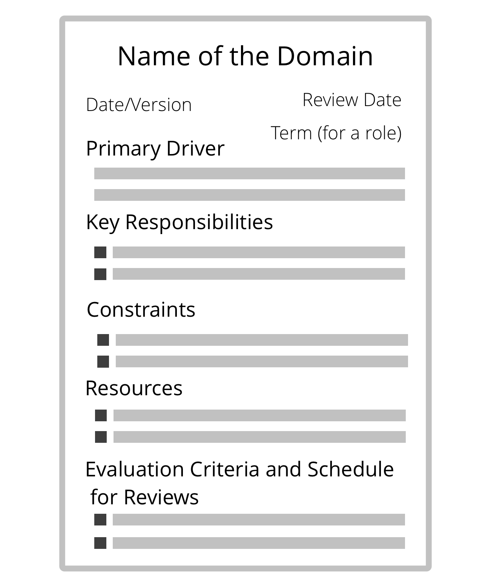

**Helder begrip van tot waar iemands accountability en autonomie reikt, leidt tot verbeterde efficiëntie, effectieve samenwerking en meer wendbaarheid binnen de hele organisatie.**

Een eenvoudige manier om <dfn data-info="Domein: Een afgebakend gebied van invloed, activiteit en besluitvorming binnen een organisatie.">domeinen</dfn> te verduidelijken is door gebruik te maken van een **domeinnaam beschrijving**:

- <dfn data-info="Primaire Driver: The primary driver for a domain is the main driver that people who account for that domain respond to.">primaire driver</dfn> (de **behoefte van de organisatie** die het domein moet vervullen)
- **kernverantwoordelijkheden** (belangrijkste op te leveren resultaten, eventuele kritieke risico's om te beheren, andere essentiële taken en te nemen besluiten die worden gedelegeerd)
- **kaders van de autonomie en invloed** voor degenen waaraan het domein wordt <dfn data-info="Delegeren: Het verlenen van gezag van de ene partij (de delegator) aan een andere (de gedelegeerde) om verantwoording te geven aan een domein, (dat wil zeggen bepaalde dingen te doen en/of bepaalde besluiten te nemen) waarvoor de delegator de algemene verantwoordelijkheid behoudt.">gedelegeerd</dfn> (de *gedelegeerden*), meestal gerelateerd aan de organisatie zelf (bijv. afhankelijkheden, betrokkenheid van de <dfn data-info="Delegator: Een individu of groep die de verantwoording voor een domein overdragen aan (een) ander(en).">delegator</dfn>, rapporteren, etc.)
- **middelen** (tijd, geld, faciliteiten, privileges, tools)
- **evaluatiecriteria** en frequentie van evaluatie
- termijn (voor een rol)

Domeinbeschrijvingen kunnen worden gemaakt voor een [rol](role.html), positie, [cirkel](circle.html), <dfn data-info="Team: Een groep mensen die samenwerken naar een gedeelde bestuurder (of objectief). Meestal maakt een team deel uit van een organisatie, of wordt het gevormd als een samenwerking van verschillende organisaties.">team</dfn>, [open domein](open-domain.html), afdeling, eenheid of de hele organisatie.

Een andere manier om een domein te verduidelijken is door een [S3 Delegatie Canvas](http://s3canvas.sociocracy30.org/s3-delegation-canvas.html) in te vullen.

[&#9654; Verduidelijk de Beoogde Resultaten](clarify-intended-outcome.html) [&#9664; Strategie Ontwikkelen](develop-strategy.html) [&#9650; Overeenkomsten Definiëren](defining-agreements.html)

