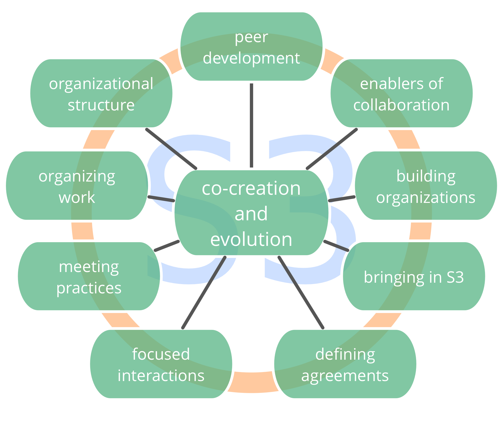
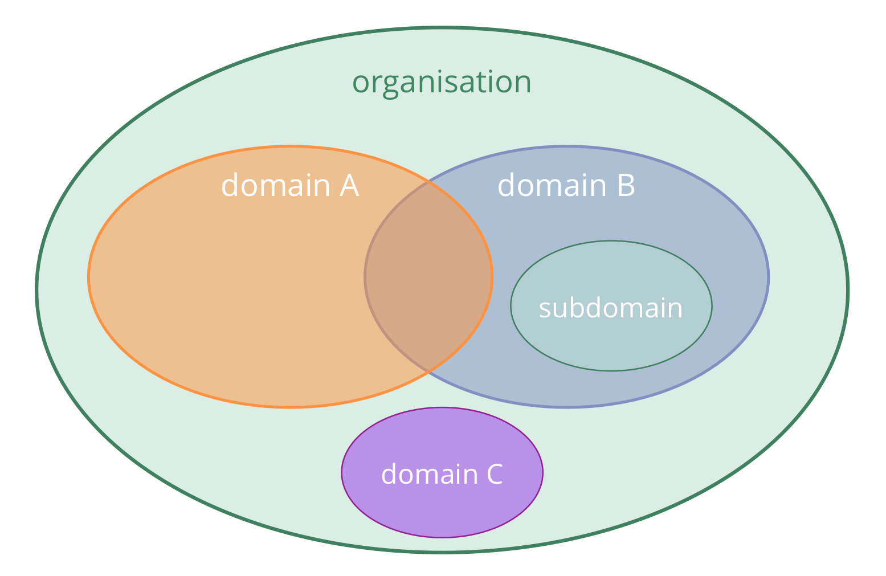

Ga naar

- [Patronen en de zeven principes](#patterns-and-the-seven-principles): [Patronen](#patterns) \ [De zeven principes](#the-seven-principles)
- [Belangrijke concepten om inzicht te krijgen in organisaties](#key-concepts-for-making-sense-of-organizations): [Drivers](#drivers) \ [Domeinen](#domains) \ [bezwaren](#objections) \ [Overeenkomsten](#agreements) \ [Governance and Operationele activiteiten](#governance-and-operations)

## Patronen en de zeven principes
### Patronen

S3 biedt een op patronen gebaseerde benadering voor verandering in organisaties.

Een **patroon** is een proces, praktijk of richtlijn dat als sjabloon dient om succesvol te reageren op een specifiek soort uitdaging of kans. S3 patronen worden ontdekt door te observeren hoe mensen samenwerken in organisaties wanneer ze werken aan het oplossen van problemen reageren op kansen die zij tegenkomen. Wanneer je ontdekt dat de manier waarop je gewoonlijk aan de slag gaat niet leidt tot de resultaten waar je naar op zoek bent, kan het helpen om te kijken welke patronen uit S3 mogelijk zouden kunnen helpen.

De patronen zijn onderverdeeld in tien categorieën, zodat het makkelijker is om te identificeren welke handig kunnen zijn voor jou. Ze zijn modulair en aan te passen, kunnen los van elkaar gebruikt worden en versterken elkaar en vullen elkaar aan wanneer ze gezamenlijk worden gebruikt. S3 patronen kunnen doorontwikkeld en aangepast worden om beter aan te sluiten bij jou specifieke behoeften.

Door een menu aan patronen aan te bieden waar uit gekozen kan worden al naargelang waar behoefte aan, moedigt S3 aan tot een organische, **iteratieve aanpak voor verandering, zonder grote investering op voorhand **. Het ontmoet mensen waar ze zijn en helpt om verder te ontwikkelen door patronen in te zetten op een eigen tempo en passend bij de eigen unieke context.

### De zeven principes

Sociocratie is gebouwd op zeven principes die de organisatiecultuur vormgeven. Omdat de zeven principes terug te vinden zijn in ieder patroon, helpt het om deze te begrijpen wanneer je de patronen gaat toepassen. Het is noodzakelijk deze te begrijpen wanneer je de patronen gaat aanpassen.

Het beoefenen van Sociocratie 3.0 helpt mensen om de toegevoegde waarde van deze kernprincipes, voor individuen en organisaties te erkennen en waarderen. Dit bevordert ook het integreren van deze principes in de cultuur van de organisatie.

**Effectiviteit:** *Besteed alleen tijd aan wat je dichter bij het bereiken van je doelstellingen brengt.*

**Consent:** *Zoek bewust naar en benoem bezwaren op beslissingen en acties en zoek naar oplossingen voor deze bezwaren.*

**Empirie:** *Test alle aannames waar jij op steunt, door te experimenteren en te reviseren.*

**Continue verbeteren:** *Incrementeel veranderen zodat gestaag empirisch leren kan plaatsvinden.*

**Gelijkwaardigheid:** *Betrek mensen bij het nemen van de beslissingen die hen raken.*

**Transparantie:** *Bewaar alle informatie die van waarde is voor de organisatie en maak deze voor iedereen toegankelijk, tenzij er een goede reden is voor vertrouwelijkheid.*

**Accountability:** *Reageer wanneer er iets nodig is, houd je aan afspraken, en neem verantwoordelijkheid over het beloop van de organisatie.*
#### Het principe van Accountability

*Reageer wanneer er iets nodig is, houd je aan afspraken, en neem verantwoordelijkheid over het beloop van de organisatie.*

Handel binnen de kaders van de overeenkomsten binnen het domein waar jij verantwoordelijk voor bent, inclusief de organisatie zelf, teams waar je deel van uitmaakt en rollen die je vervult.

Elk lid van de organisatie is er verantwoordelijk voor om effectief te reageren op drivers van de organisatie, zowel in het uitvoeren van werk als in de samenwerking.

Individuen zijn ook verantwoordelijk voor hun werk, hun ontwikkelen en leren en voor het ondersteunen van elkaar.

Iedereen in een organisatie is er verantwoordelijk voor om te handelen in overeenstemming met de waarden van de organisatie.

## Sleutelconcepten om inzicht te krijgen in organisaties

In dit onderdeel leer je over de volgende sleutelconcepten:

- Driver
- Domein
- Overeenkomst
- Bezwaar
- Governance en Operationele activiteiten

Het zal ook duidelijk worden hoe deze concepten gerelateerd zijn aan waarde (en verspilling), delegeren (en accountability), zelforganisatie, zelfsturing en semi-autonomie.

Wanneer mensen deze concepten begrijpen hebben zij een gemeenschappelijke taal om duidelijk te omschrijven wat er aan de hand is in een organisatie. Dit helpt om meer onderling begrip te creëren en op constructieve wijze met elkaar in gesprek te gaan over wat er nodig is.

Wanneer er termen bij zitten die je niet begrijpt, kun je deze opzoeken in de woordenlijst aan het eind.
### Drivers

_Een **driver** is het motief van een persoon of een groep om te reageren op een specifieke situatie._

Drivers:

- kunnen worden gebruikt om doelen, doelstellingen, missies, visies, streven en de bedoeling af te leiden
- kan veranderen met de tijd

#### Drivers, waarde en verspilling

_**Waarde** is het belang of nut van iets in relatie tot de driver._

_**Verspilling** is alles dat overbodig is of belemmerend voor een (meer) effectieve reactie op de driver._

Door het concept van waarde en verspilling aan te nemen, kunnen veel werkwijzen en ideeën van **lean productie** en **lean software ontwikkeling** worden gebruikt door organisaties S3 patronen beginnen te gebruiken:

- value stream mapping
- verschillende strategieën voor het elimineren van verspilling
- de Kanban methode
### Domeinen

_Een **domein** een afgebakend gebied van invloed, activiteit en besluitvorming binnen een organisatie._

Alle domeinen vallen binnen het algemene domein van een organisatie en kunnen overlappen en/of volledig binnen andere domeinen vallen.

#### Verantwoordelijkheid voor domeinen delegeren

_Delegeren is het verlenen van de autoriteit over een domein van de ene partij aan de andere._

Verantwoordelijkheid voor domeinen wordt gedelegeerd aan mensen (bijvoorbeeld aan een eenheid, afdeling, team of aan individuen), die vervolgens vrij zijn om te handelen binnen de vastgestelde kaders van invloed en autonomie.

Als een domein aan een groep mensen wordt gedelegeerd, worden ze een team, als ze aan een individu worden gedelegeerd, worden ze houder van de rol.

Degenen die de verantwoordelijkheid voor een domein delegeren (de delegatoren) aan anderen behouden nog steeds de algehele verantwoordelijkheid voor dat domein, wijzen **middelen** toe en definiëren vaak:

- de **behoefte van de organisatie** waarvoor het domein is ontwikkeld om op te reageren
- **kernverantwoordelijkheden** (belangrijkste op te leveren resultaten, eventuele kritieke risico's om te beheren, andere essentiële taken en te nemen besluiten die worden gedelegeerd)
- **kaders van de autonomie en invloed** voor degenen waaraan het domein wordt gedelegeerd (de *gedelegeerden*), meestal gerelateerd aan de organisatie zelf (bijv. afhankelijkheden, betrokkenheid van de delegator, rapporteren, etc.)

#### Drivers en domeinen

Het is ook mogelijk om een domein te begrijpen door te kijken naar de verhouding met drivers van de organisatie:

- de **primaire driver** van het domein is de hoofddriver waar de mensen die voor dat domein verantwoordelijk zijn (de *gedelegeerden*) op reageren
- de reeks subdrivers waar de organisatie aandacht aan moet besteden om te reageren op de primaire driver. Denk hierbij aan: 
    - **kernverantwoordelijkheden** (elke driver die direct voortkomt uit de primaire driver van het domein)
    - drivers voor **kaders van het domein** (die meestal betrekking hebben op de bredere context van de organisatie)

### Bezwaren

_Een **bezwaar** is een argument dat verduidelijkt hoe een (voorgestelde) overeenkomst of actie onbedoelde consequenties heeft die je liever wil vermijden of dat er nog aanzienlijke verbeteringen mogelijk zijn en er schade zit in het missen van waarde die voortkomt uit de verbetering._

Bezwaren onthullen informatie over mogelijke **onbedoelde gevolgen**, of over **aanzienlijke verbeteringen**.

Wees ervan bewust dat het achterhouden van bezwaren het vermogen van individuen, teams of de hele organisatie om hun doelen te bereiken kan schaden.

Het is de verantwoordelijkheid van individuen om potentiële bezwaren tegen voorstellen, besluiten, bestaande <dfn data-info="Overeenkomst: Een overeengekomen richtlijn, proces, beleid of protocol dat is ontworpen om de stroom van waarde zo goed mogelijk te geleiden.">overeenkomsten</dfn> of activiteiten te uiten.

Degenen die verantwoordelijk zijn voor een activiteit of (voorgestelde) overeenkomst, zijn ook verantwoordelijk voor het overwegen van argumenten en het aanpakken van bezwaren die naar voren zijn gebracht</em>.

Bij het zoeken naar potentiële bezwaren, overweeg:

- waarom de <dfn data-info="Beoogde Resultaat: Het verwachte resultaat van een overeenkomst, actie, project of strategie.">beoogde uitkomst</dfn> niet (volledig) bereikt gaat worden: **effectiviteit**
- waarom het zonde zou zijn om door te gaan zoals voorgesteld (of eerder overeengekomen): **efficientie**
- de negatieve gevolgen van iets op andere plekken (in hetzelfde <dfn data-info="Domein: Een afgebakend gebied van invloed, activiteit en besluitvorming binnen een organisatie.">domein</dfn>, in de bredere organisatie of daarbuiten): **neveneffecten**

De informatie die door bezwaren wordt onthuld, kan worden gebruikt om de volgende zaken te verbeteren:

-   huidige en geplande activiteit
-   hoe mensen besluiten uitvoeren
-   bestaande overeenkomsten
-   voorstellen
-   gedeeld begrip van drivers

Bouw een cultuur waarin mensen zich comfortabel voelen om op elk moment *mogelijke* bezwaren te agenderen, zodat ze de rust voelen om besluiten te nemen die *goed genoeg zijn en veilig genoeg om te proberen*. Hierdoor wordt men aangemoedigd om een voorkeur te ontwikkelen om dingen uit te proberen, in plaats van te proberen van te voren te overzien en te anticiperen op welke mogelijkheden er allemaal zijn.

Gebruik een verscheidenheid aan perspectieven en sta er voor open om de jouwe uit te dagen, zodat je kunt ontdekken wanneer verandering nodig is en wat er veranderd moet worden. Ga voor snel leren en aanpassen door te experimenteren en gaandeweg te leren van de uitkomsten.

#### Zorgen

**Niet alle argumenten zijn ook bezwaren. Maak onderscheid tussen bezwaren, die altijd waardevolle informatie onthullen, en andere argumenten die enkel gebaseerd zijn op vermoedens of persoonlijke voorkeuren en meningen.**

_Een **zorg** is een vermoeden - of mening - dat iets doen (zelfs in de afwezigheid van bezwaren) **mogelijk** in de weg zou kunnen staan van een (meer) effectieve reactie op een driver van de organisatie._

Bij [consent besluitvorming](consent-decision-making.html) kunnen zorgen aangeven hoe overeenkomsten in de toekomst mogelijk verder ontwikkeld kunnen worden (bijvoorbeeld de evaluatiecriteria of reviewfrequentie). Noem zorgen wanneer je denkt dat het waardevol is om deze in overweging te nemen en leg ze vast bij de overeenkomst. Blijf de uitkomsten monitoren.

Als je twijfelt over de vraag of je bezwaar of bezorgdheid hebt, wees dan proactief en check bij anderen wat zij ervan denken. (zie [Argumenten Kwalificeren](test-arguments-qualify-as-objections.html)). 

### Overeenkomsten

_Een **overeenkomst** is een afspraak over een richtlijn, proces, beleid of protocol dat is ontworpen om de stroom van waarde zo goed mogelijk te geleiden._

Overeengekomen richtlijnen over waarom, hoe en wanneer te handelen en wat specifiek vereist is, maken effectief samenwerken mogelijk.

Overeenkomsten worden gemaakt in reactie op <dfn data-info="Driver van de Organisatie: Een driver is het motief van een persoon of groep om over te gaan tot actie in een specifieke situatie. Een driver is een **driver van de organisatie** wanneer het reageren hierop waarde oplevert voor de organisatie, of verspilling en schade voorkomt.">drivers van de organisatie</dfn>, worden **regelmatig gereviewed**, en door ontwikkeld waar nodig.

**Algehele accountability** voor een overeenkomst ligt bij de mensen die ze maken.

Een overeenkomst kan gaan over het **delegeren van specifieke verantwoordelijkheden** aan individuen of groepen.

### Governance en Activiteiten

S3 wil productiviteit mogelijk maken door mensen vrij te maken om zoveel mogelijk zelf te doen en te beslissen, en dit tegelijkertijd te doen in samenwerking om zo een succesvolle en effectieve organisatie te waarborgen.

Meer autonomie van individuen en teams vereist duidelijke overeenkomsten (dat wil zeggen richtlijnen en kaders) om een soepele samenwerking tussen deze teams en individuen mogelijk te maken en die het bereiken van zowel langetermijn- als kortetermijndoelstellingen ondersteunen. Regelmatige reviews en een geleidelijke ontwikkeling van overeenkomsten zorgen ervoor dat ze blijven passen bij het doel.

Hoewel besluiten met korte termijn gevolgen gemakkelijk ter plaatse kunnen worden gewijzigd, profiteren overeenkomsten die meer consequenties kunnen hebben voor de lange termijn van een participatief en weloverwogen [besluitvormingsproces](consent-decision-making.html).

Dergelijke overeenkomsten moeten worden vastgelegd, zowel om ze te onthouden als om effectieve [reviews te ondersteunen](evaluate-and-evolve-agreements.html) en om te worden doorgegeven aan degenen die het raakt (die het liefst ook [betrokken zijn bij de ontwikkeling en evolutie](those-affected-decide.html) van deze overeenkomsten).

Het is daarom waardevol om een onderscheid te maken tussen twee categorieën activiteiten in een organisatie, waarvan we één governance noemen, en de andere activiteiten:

_**Governance** in een organisatie (of een domein) is het vaststellen van doelstellingen en het nemen en ontwikkelen van besluiten die ervoor moeten zorgen dat deze doelstellingen ook worden bereikt._

_**Activiteiten** is het doen en organiseren van werk en dagelijks activiteiten binnen de kaders die zijn gedefinieerd door governance._

Voor elk domein in een organisatie is er een *bestuursorgaan*: mensen met een mandaat om overeenkomsten te maken en te ontwikkelen die bepalen hoe de mensen die het werk doen in dat domein waarde creëren.

Er zijn veel manieren om werk en governance te verdelen. Soms is het bestuursorgaan één persoon, bijvoorbeeld in het geval van een team lead, en soms is het een groep mensen, bijvoorbeeld in een cirkel waarin alle leden van de cirkel de verantwoordelijkheid voor governance delen binnen de kaders van het domein.

**Governance besluiten** kaderen activiteiten en sturen toekomstige beslissingen.

Dit omvat:

- definiëren van domeinen
- invloed delegeren aan mensen
- toewijzing van middelen en capaciteit
- specificeren en prioriteren van op te leveren resultaten

Governance besluiten kunnen op elk moment en op elke plaats worden genomen, niet alleen in een specifieke vergadering, hoewel een [regelmatige vergadering voor het maken en ontwikkelen van overeenkomsten](governance-meeting.html) vaak een goed idee is.

#### Gerelateerde Concepten

**Zelfsturing**: Mensen die zichzelf besturen binnen
de kaders van een domein.

**Semi-autonomie**: De autonomie van mensen om waarde te creëren binnen hun domein, verder beperkt door hun eigen governance besluiten en bezwaren (waaronder die van de delegator en van vertegenwoordigers).

**Zelforganisatie**: Elke activiteit of proces waarmee mensen hun dagelijkse werk organiseren zonder invloed van een externe tussenpersonen, en binnen kaders die zijn gedefinieerd door governance. In elke organisatie of team bestaan zelforganisatie en externe invloed naast elkaar.

Afhankelijk van de kaders die de delegator stelt, hebben teams min of meer de bevoegdheid om governance te doen en te bepalen hoe ze hun activiteiten organiseren, en zijn ze dus min of meer zelfsturend en zelforganiserend.

[&#9654; Co-Creatie en Evolutie](co-creation-and-evolution.html)

