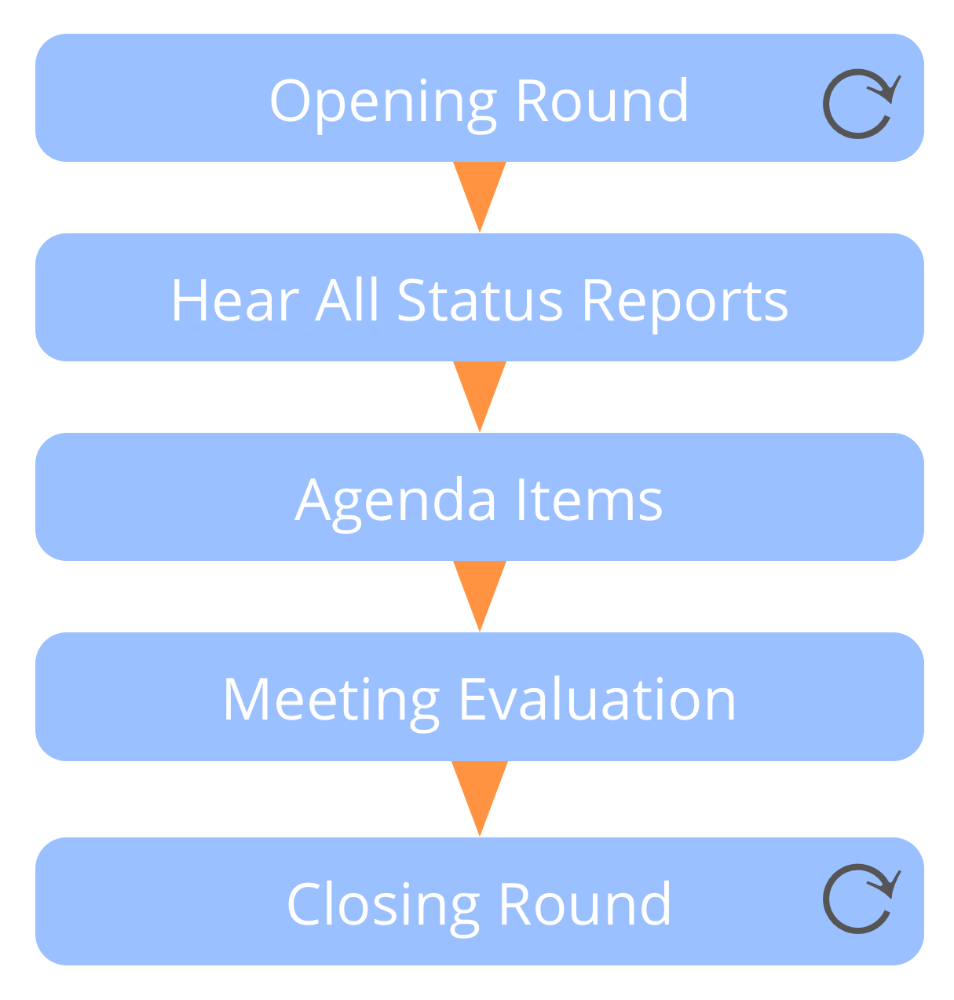

**Kom regelmatig bij elkaar (meestal wekelijks) om over werk te rapporten en het te coördineren tussen domeinen.**

- faciliteer de vergadering (<dfn data-info="Timebox: Een vooraf afgesproken tijdsperiode die te besteden is aan een specifieke activiteit (die niet noodzakelijkerwijs is afgerond aan het einde van de timebox).">timebox</dfn> gesprekken en gebruik rondes waar waardevol)
- wanneer nuttig, stel een agenda voor de vergadering op en deel deze van te voren met deelnemers 
    - voeg details toe van alle voorwaarden die deelnemers kunnen helpen zich voor te bereiden
    - overige agenda items kunnen boven tafel komen tijdens het horen van de status updates

Agenda items:

- synchronisatie en afstemming tussen domeinen
- prioritering en distributie van werk 
- reageren op de belemmeringen

[&#9654; Vergaderpraktijken](meeting-practices.html) [&#9664; Planning en Review Vergaderingen](planning-and-review-meetings.html) [&#9650; Gerichte Interacties](focused-interactions.html)

