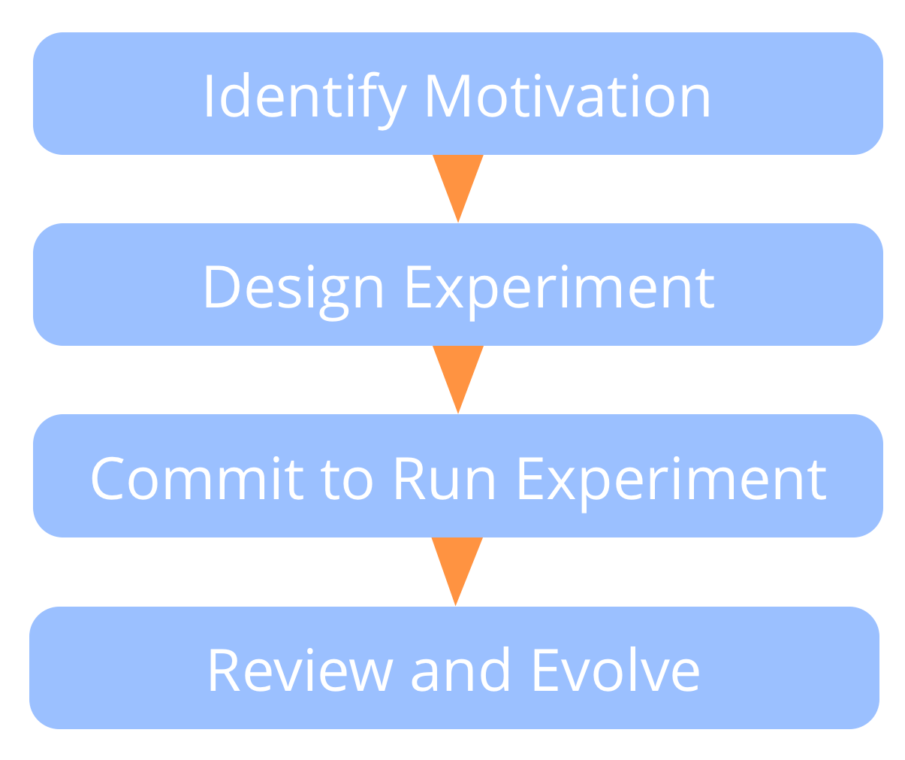
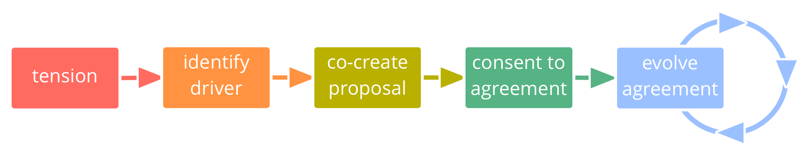

- [Overeenkomst](agreement.html)
- [Strategie Ontwikkelen](develop-strategy.html)
- [Domeinen Verduidelijken](clarify-domains.html)
- [Verduidelijk de Beoogde Resultaten](clarify-intended-outcome.html)
- [Op te Leveren Resultaten Beschrijven](describe-deliverables.html)
- [Evaluatiecriteria](evaluation-criteria.html)
- [Logboek](logbook.html)
- [Logboekhouder](logbook-keeper.html)

[&#9654; Overeenkomst](agreement.html) [&#9664; Continue Verbetering van het Werkproces](continuous-improvement-of-work-process.html)

