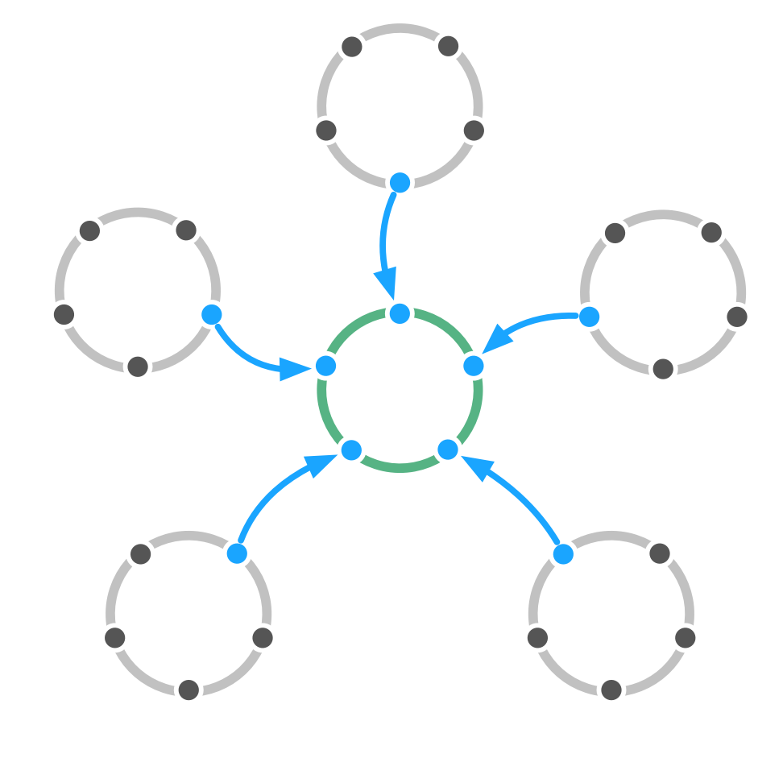

**Delegeer het nemen van governance besluiten die invloed hebben op meerdere domeinen aan afgevaardigden die door deze domeinen zijn geselecteerd.**

Om <dfn data-info="Governance: Het vaststellen van doelstellingen en het nemen en ontwikkelen van besluiten die ervoor moeten zorgen dat deze doelstellingen ook worden bereikt.">governance belsuiten</dfn> te nemen namens hen, sturen stakeholders [afgevaardigden](representative.html) om een cirkel van afgevaardigden te vormen.

Acties volgende uit besluiten van een gedelegeerde cirkel worden uitgevoerd binnen de verschillende <dfn data-info="Domein: Een afgebakend gebied van invloed, activiteit en besluitvorming binnen een organisatie.">domeinen</dfn> die in desbetreffende cirkel worden vertegenwoordigd.

Cirkels van afgevaardigden bieden organisaties een manier om de <dfn data-info="Stroom van waarde: Deliverables die door de organisatie heen stromen richting andere stakeholders en/of klanten.">waardestroom</dfn> binnen de organisatie goed te laten lopen en zorgt voor diversiteit aan perspectieven bij governance besluiten.

Een cirkel van afgevaardigden kan andere mensen (bijvoorbeeld externe deskundigen) inzetten om specifieke beslissingen te nemen, of zelfs als lid van de cirkel.

[&#9654; Perzik Organisatie](peach-organization.html) [&#9664; Service cirkel](service-circle.html) [&#9650; Organisatiestructuur](organizational-structure.html)

