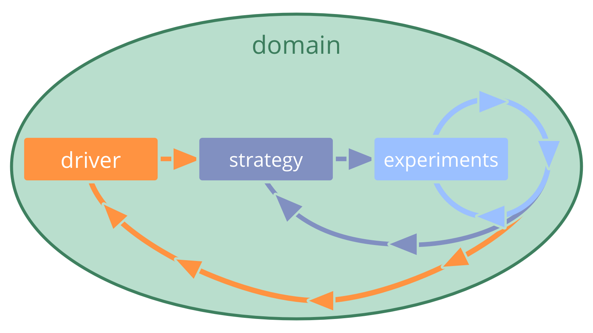

_Een **strategie** is een hoog over aanpak voor hoe mensen waarde gaan creëren om succesvol invulling te geven aan (de driver en doelstelling van) een domein._

Het is meestal effectiever als een team of een rolhouder het voortouw neemt bij het ontwikkelen van hun eigen strategie.

Een strategie bevat vaak een beschrijving van de <dfn data-info="Beoogde Resultaat: Het verwachte resultaat van een overeenkomst, actie, project of strategie.">beoogde resultaten</dfn> van het uitvoeren van deze strategie.

Als de <dfn data-info="Delegator: Een individu of groep die de verantwoording voor een domein overdragen aan (een) ander(en).">delegator</dfn> de verantwoordelijkheid deelt voor <dfn data-info="Domein: Een afgebakend gebied van invloed, activiteit en besluitvorming binnen een organisatie.">domeinen</dfn> die zij delegeren, is het waardevol dat zij de strategie van de <dfn data-info="Gedelegeerde: Een individu of groep die de aansprakelijkheid aanvaardt voor een domein dat aan hen is overgedragen.">gedelegeerden</dfn> bekijken om te controleren of er potentiële belemmeringen zijn en om manieren voor te stellen waarop de strategie verbeterd kan worden.

Een strategie is een gedeelde overeenkomst tussen delegator(s) en gedelegeerden(s) die, indien nodig, regelmatig wordt herzien en bijgewerkt (*aanpassen of volharden*)

Strategieën worden geïmplementeerd en verfijnd door te experimenteren en te leren.

[&#9654; Domeinen Verduidelijken](clarify-domains.html) [&#9664; Overeenkomst](agreement.html) [&#9650; Overeenkomsten Definiëren](defining-agreements.html)

