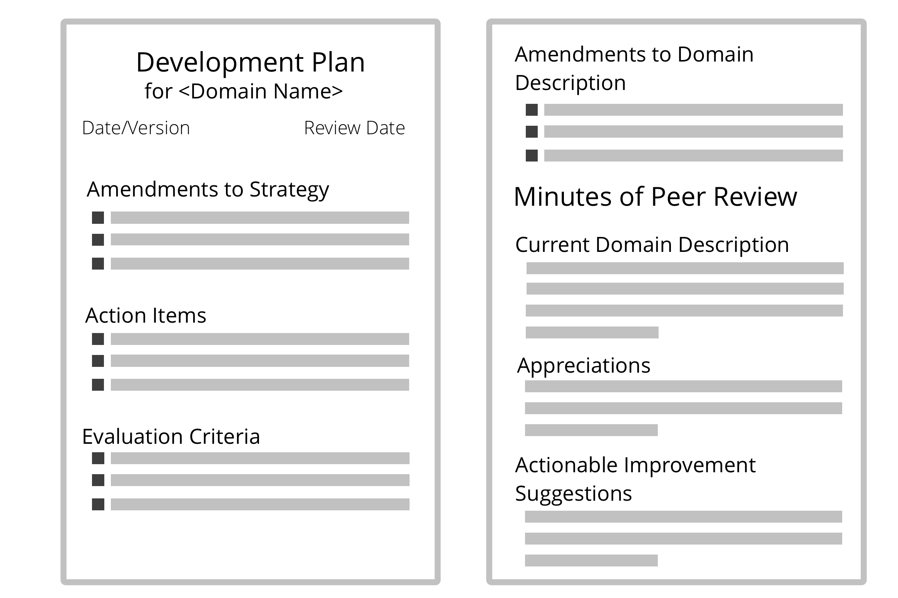

**Een plan voor de ontwikkeling van effectievere manieren om te reageren op een domein, overeengekomen tussen delegator en gedelegeerde.**

Het ontwikkelingsplan kan worden gemaakt voor een persoon in een rol, of voor een team (bijv. een afdeling, [cirkel](circle.html) of [open domein](open-domain.html)).

Ontwikkeling kan gebeuren door de beschrijving van [driver](organizational-driver.html) en het <dfn data-info="Domein: Een afgebakend gebied van invloed, activiteit en besluitvorming binnen een organisatie.">domein</dfn> te verfijnen, het wijzigen van de <dfn data-info="Strategie: Een hoog over aanpak voor hoe mensen waarde gaan creëren om succesvol invulling te geven aan (de driver en doelstelling van) een domein.">strategie</dfn>, of door nieuwe of bijgewerkte overeenkomsten en specifieke acties die moeten worden ondernomen, hetzij binnen het domein van de delegator, hetzij binnen het domein van de gedelegeerde.

Een ontwikkelplan (en alle bijbehorende aanbevelingen voor wijzigingen in de beschrijvingen van het <dfn data-info="Domein: Een afgebakend gebied van invloed, activiteit en besluitvorming binnen een organisatie.">domein</dfn> en de <dfn data-info="Driver van de Organisatie: Een driver is het motief van een persoon of groep om te reageren op een specifieke situatie. Een driver is een **driver van de organisatie** als een reactie op deze driver de organisatie zou helpen om waarde te genereren, verspilling te elimineren of schade te voorkomen.">driver</dfn>) vereist consent van zowel de <dfn data-info="Gedelegeerde: Een individu of groep die de aansprakelijkheid aanvaardt voor een domein dat aan hen is overgedragen.">gedelegeerde</dfn> als de <dfn data-info="Delegator: Een individu of groep die de verantwoording voor een domein overdragen aan (een) ander(en).">delegator</dfn>.

[&#9654; Zaken die Co-creatie mogelijk maken](enablers-of-collaboration.html) [&#9664; Peer Review](peer-review.html) [&#9650; Gezamenlijke ontwikkeling](peer-development.html)

