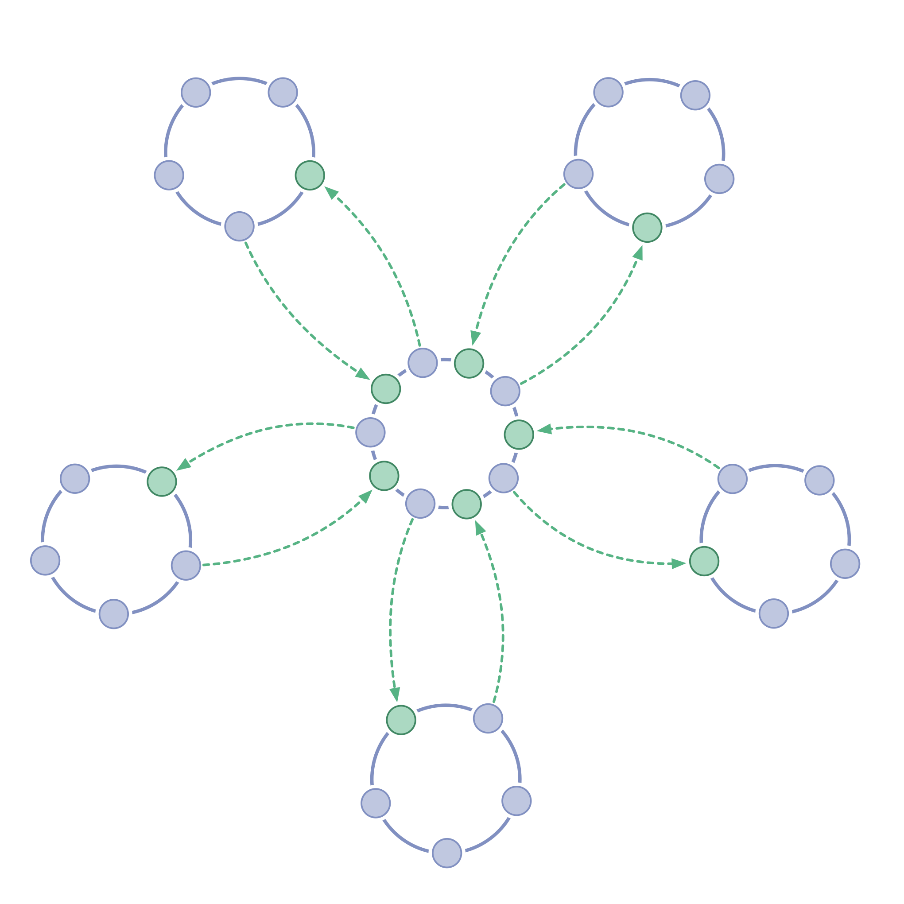

<strong>Alle autoriteit om governance besluiten te nemen wordt gedelegeerd naar zelfsturende cirkels, dubbel gekoppeld binnen alle niveau's van de hiërarchie, om van een traditionele hiërarchie over te gaan naar een structuur die gelijkwaardiger is en beter geschikt om de collectieve intelligentie te gebruiken en betrokkenheid te vergroten.</strong>

1. Verplaats het nemen van governance besluiten van individuen naar teams door <dfn data-info="Zelfsturing: Mensen die zichzelf besturen binnen
de kaders van een domein."> zelforganiserende</dfn><dfn data-info="Cirkel: Een zelfsturend en semi-autonoom team van gelijkwaardige mensen die samen verantwoording geven aan een domein.">cirkels</dfn> te vormen op alle lagen van de organisatie.
2. De leden van elke cirkel kiezen iemand van hun groep om hun belangen te vertegenwoordigen en deel te nemen aan de <dfn data-info="Governance: Het vaststellen van doelstellingen en het nemen en ontwikkelen van besluiten die ervoor moeten zorgen dat deze doelstellingen ook worden bereikt.">governance</dfn> vergaderingen van de volgende hogere cirkel, en omgekeerd.

Een dubbel-gelinkte hiërarchie:

- brengt gelijkwaardigheid in governance
- behoud de mogelijkheid om een functionele hiërarchie in stand te houden (als het de stroom van waarde mogelijk maakt).

**Zie ook:** [Cirkel](Circle.html), [Dubbele Koppeling](Double-Linking.html), [Afgevaardigde](Representative.html)

[&#9654; Service organisatie](service-organization.html) [&#9664; Perzik Organisatie](peach-organization.html) [&#9650; Organisatiestructuur](organizational-structure.html)

