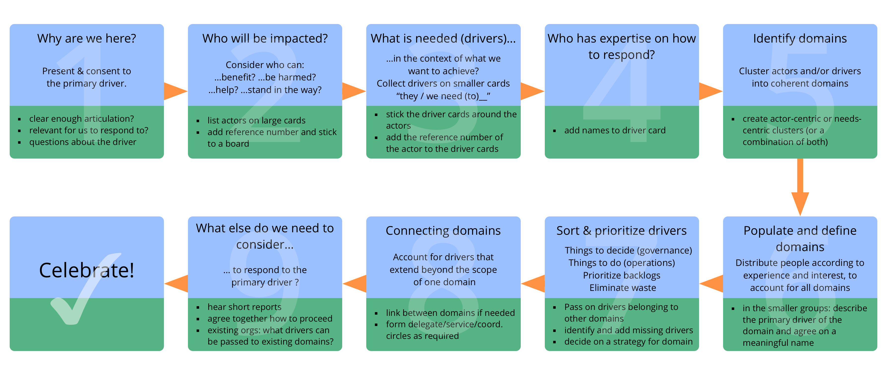
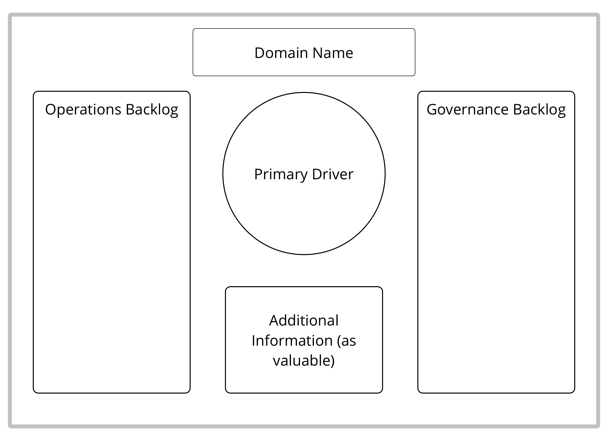

Een workshop format om een effectieve manier te vinden om om te gaan met een complexe situatie: start-ups opzetten, projecten starten, grote belemmeringen of mogelijkheden in kaart brengen en aanpakken, de organisatorische structuur afstemmen op de <dfn data-info="Stroom van waarde: Deliverables die door de organisatie heen stromen richting andere stakeholders en/of klanten.">waardestroom</dfn>.

Een (kleine of grote) groep identificeert en clustert <dfn data-info="Driver: Het motief van een persoon of een groep om te reageren op een specifieke situatie.">drivers</dfn>, om ze vervolgens snel van concept om te zetten naar actie in kleinere, zelforganiserende teams.

[&#9654; Gezamenlijke ontwikkeling](peer-development.html) [&#9664; Rol Selectie](role-selection.html) [&#9650; Co-Creatie en Evolutie](co-creation-and-evolution.html)

