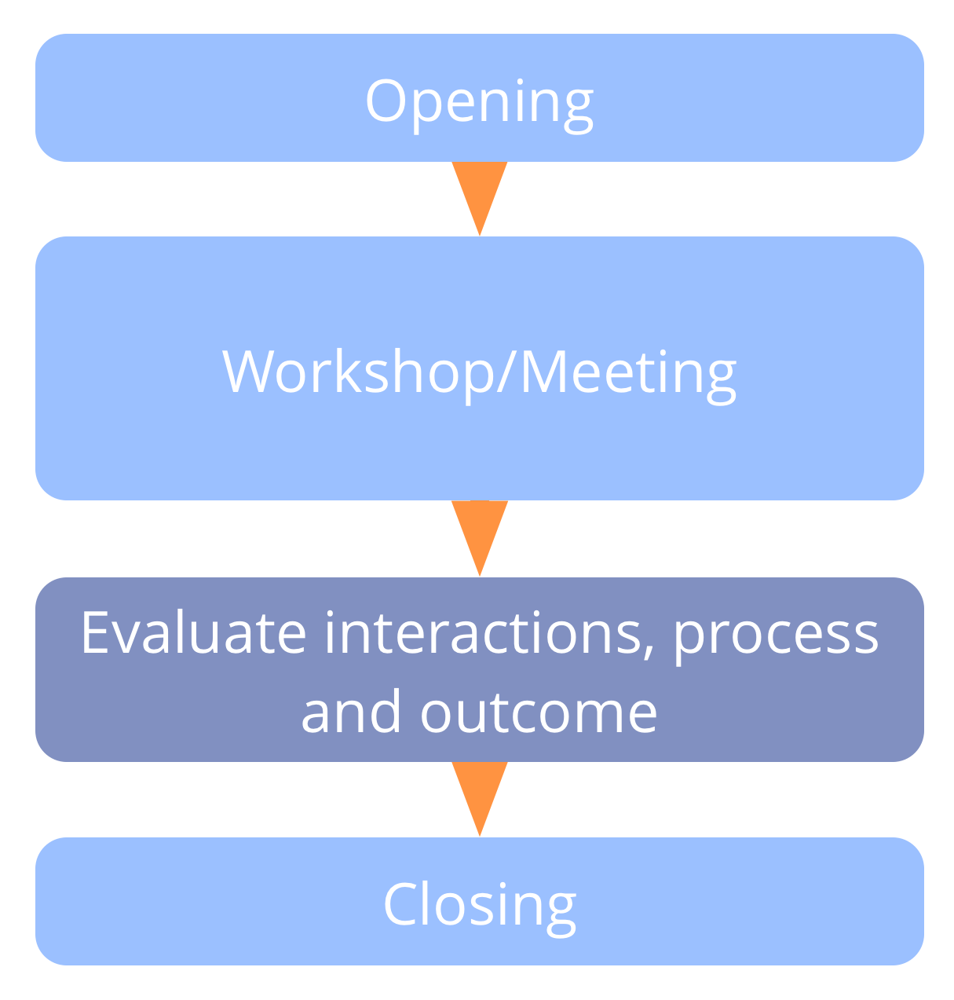

<strong>Neem tijd om te leren aan het einde van elke vergadering of workshop.</strong>

Reflecteer op interacties, vier successen en deel suggesties voor verbetering voor het sluiten van de vergadering.

- reserveer hier 5 minuten voor bij 1 uur en 15 minuten bij een volledige workshop
- leg het geleerde vast en bekijk dit voorafgaand aan de volgende vergadering

Korte formats die u kunt gebruiken:

- minder doen/meer doen/mee beginnen/mee stoppen
- positief/minder goed/voorgestelde verbeteringen

### Vergaderingen evalueren: Lang Formaat

Vraag iedereen in een [ronde](round.html) kort iets te delen over een of meer van de volgende onderwerpen en degenen die belangrijk zijn voor de volgende keer vast te leggen:

- effectiviteit en indeling
- facilitering en deelname
- emotionele toon
- waarderingen en prestaties (ik vond... prettig)
- waar ruimte ligt voor groei en verbetersuggesties (ik wens...)
- wilde ideeën en radicale suggesties (wat als...)

[&#9654; Host van de Vergadering](meeting-host.html) [&#9664; Check in](check-in.html) [&#9650; Vergaderwerkwijzen](meeting-practices.html)

