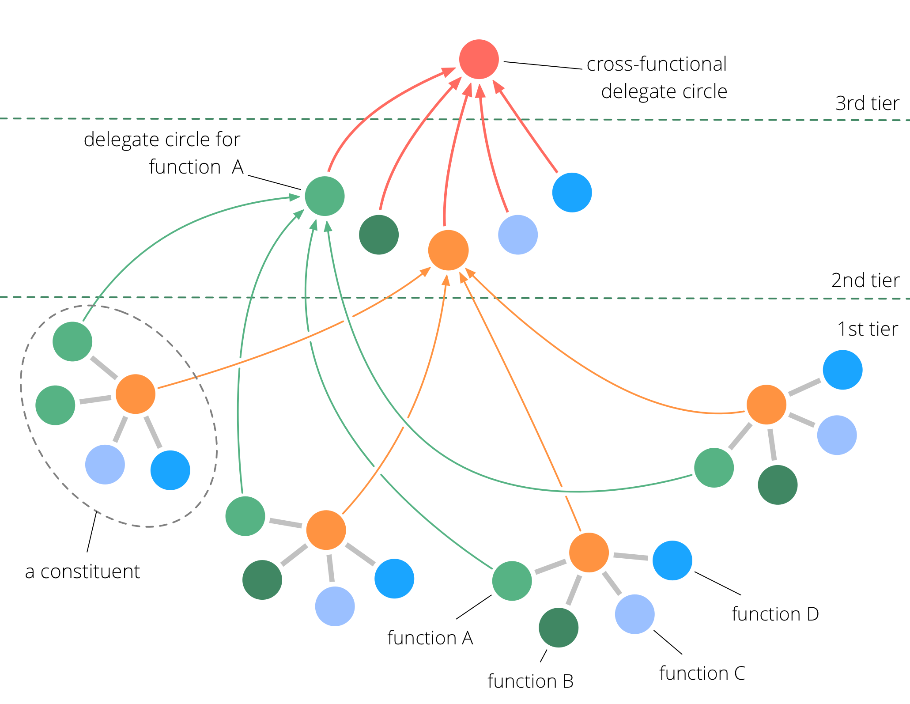

<strong><strong>Meerdere entiteiten (organisaties of projecten) met een gemeenschappelijke (of vergelijkbare) primaire driver en structuur kunnen als functionele domeinen van elkaar leren, acties afstemmen en hoog over besluiten nemen (bijv. algemene strategie)</strong>.</strong>

Een fractale organisatie kan een groot netwerk inschakelen om snel te reageren op veranderende contexten.

Indien nodig kan het patroon herhaald worden om meerdere fractale organisaties te verbinden tot één.

### Randvoorwaarden

Een fractale organisatie kan worden gevormd door meerdere (onderling) afhankelijke organisaties die een gemeenschappelijke (primaire) <dfn data-info="Driver: Het motief van een persoon of een groep om te reageren op een specifieke situatie.">driver</dfn> delen, of door meerdere branches, afdelingen of projecten binnen een grotere organisatie.

Deze <dfn data-info="Kiezer: Een team (bijv. een cirkel, team, afdeling, branch, project of organisatie) dat autoriteit delegeert aan een vertegenwoordiger om namens hen te handelen in andere teams of organisaties.">entiteiten</dfn> (dat wil zeggen organisaties, branches, afdelingen of projecten) moeten ten minste enkele - en meestal de meeste - functionele <dfn data-info="Domein: Een afgebakend gebied van invloed, activiteit en besluitvorming binnen een organisatie.">domeinen</dfn> delen (bijv. boekhouding, productbeheer of ontwikkeling).

### Rangen

Een fractie organisatie heeft ten minste drie rangen:

- eerste rang: de **kiesgerechtigden** (dat wil zeggen organisaties, branches, afdelingen of projecten)
- tweede rang: **functie-specifieke [cirkels van afgevaardigden](delegate-circle.html)** om lessen te delen en om overeenkomsten te maken, namens functie specifieke domeinen
- derde rang: een **cross-functionele cirkel van afgevaardigden** om overeenkomsten te maken en te evolueren in reactie op drivers die alle kiesgerechtigden beïnvloeden

### Een fractale organisatie vormen

1. Het vormen van de **tweede rang**: Bij elke entiteit besluiten de leden van elk zelfde soort functioneel domein wie hen zal vertegenwoordigen in een **functie specifieke cirkel van afgevaardigden**, waar zij hun kennis en lessen delen, en bijdragen aan het maken en doorontwikkelen van overeenkomsten. Vertegenwoordigers zijn geselecteerd voor een beperkte termijn (waarna een nieuwe selectie wordt gemaakt).
2. Het vormen van de **derde rang**: afgevaardigden van de tweede rang selecteren allemaal een afgevaardigde voor een **cross-functionele cirkel van afgevaardigden**.

### Impact op de organisatie(s)

Elke kiesgerechtigde:

- krijgt toegang tot een breed scala aan ervaring, wijsheid en vaardigheden om de effectiviteit en innovatie te vergroten.
- kunnen hulpbronnen, infrastructuur en ervaring delen met andere kiesgerechtigden op basis van capaciteit en behoefte

De tweede en derde rang:

- kan besluiten tegelijkertijd testen uit te voeren binnen meerdere functie-specifiek domeinen, waardoor er uitgebreide feedback is en er snel geleerd kan worden
- organiseer, stem af en stuur het hele systeem, met behoud van autonomie en eigenheid van de individuele kiesgerechtigden

[&#9654; Co-Creatie en Evolutie](co-creation-and-evolution.html) [&#9664; Service organisatie](service-organization.html) [&#9650; Organisatiestructuur](organizational-structure.html)

