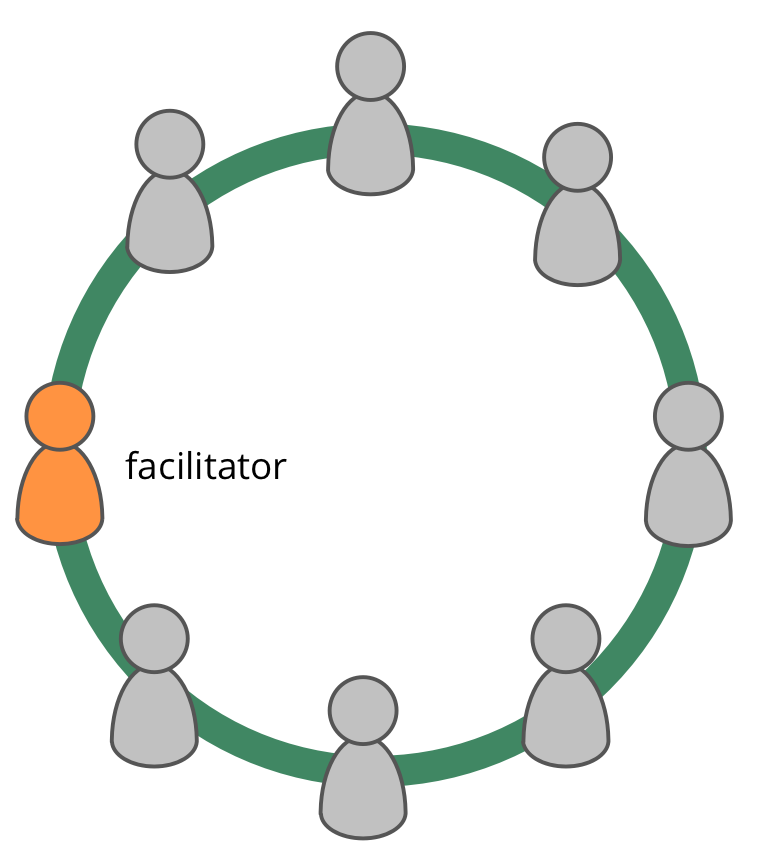

**Selecteer iemand om governance vergaderingen te faciliteren.**

Een [governance](governance.html) facilitator:

- zorgt ervoor dat [governance vergaderingen](governance-meeting.html) goed verlopen en geëvalueerd worden
- is (meestal) 1 van de leden geselecteerd door het <dfn data-info="Team: Een groep mensen die samenwerken naar een gedeelde bestuurder (of objectief). Meestal maakt een team deel uit van een organisatie, of wordt het gevormd als een samenwerking van verschillende organisaties.">team</dfn> (en voor een specifieke termijn)
- maakt zichzelf vertrouwd met de [Governance Backlog](governance-backlog.html)
- is vaak degene die anderen uitnodigt om sommige agendapunten te faciliteren

Overweeg om als governance facilitator te leren over en gebruik te leren maken van de volgende patronen van S3:

- [Rondes](rounds.html)
- [Voorstel Vormen](proposal-forming.html)
- [Consent Besluitvorming](consent-decision-making.html)
- [Rol Selectie](role-selection.html)
- [Vergaderingen evalueren](evaluate-meetings.html)
- [Bezwaren Oplossen](resolve-objections.html)
- [Peer Review](peer-review.html)

[&#9654; Overeenkomsten breken](breaking-agreements.html) [&#9664; Waarden Vaststellen](agree-on-values.html) [&#9650; Zaken die Co-creatie mogelijk maken](enablers-of-collaboration.html)

