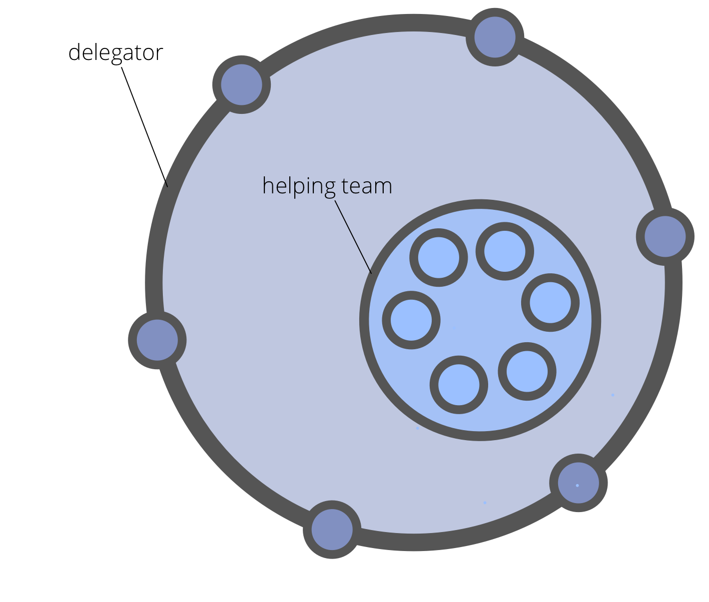

**Vorm gelijkwaardige teams van mensen met het mandaat om een specifieke reeks van eisen uit te voeren welke bepaald zijn door een delegator.**

Hulpteam:

- is een manier voor een <dfn data-info="Delegator: Een individu of groep die de verantwoording voor een domein overdragen aan (een) ander(en).">delegator</dfn> om de capaciteit uit te breiden
- kan zelforganiserend zijn, of worden geleid door een [coördinator](coordinator.html) gekozen door de delegator
- wordt gestuurd door de delegator
- profiteert van een duidelijk gedefinieerd <dfn data-info="Domein: Een afgebakend gebied van invloed, activiteit en besluitvorming binnen een organisatie.">domein</dfn>

Leden van het hulpteam:

- kan bezwaar maken tegen de besluiten van de delegator die hen raken
- kan items toevoegen aan de <dfn data-info="Governance backlog: Een zichtbare, geprioriteerde lijst van items (drivers) die gerelateerd zijn aan het besturen van een domein en aandacht nodig hebben.">governance backlog</dfn> van de delegator
- kunnen worden uitgenodigd om een [afgevaardigde](representative.html) te selecteren die deelneemt aan de governance besluiten van de delegator

[&#9654; Open Domein](open-domain.html) [&#9664; Vertegenwoordiger](representative.html) [&#9650; Organisaties Opbouwen](building-organizations.html)

