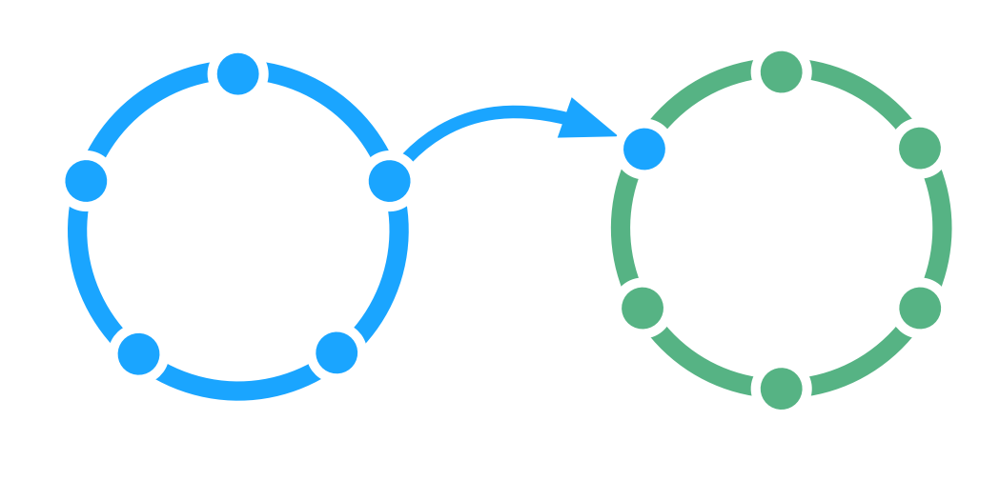

<strong>Maak het stromen van informatie en invloed tussen twee teams mogelijk.</strong>

Een team selecteert één van zijn leden om hun belangen te behartigen bij de <dfn data-info="Governance: Het vaststellen van doelstellingen en het nemen en ontwikkelen van besluiten die ervoor moeten zorgen dat deze doelstellingen ook worden bereikt.">governance</dfn> besluiten van een ander team.

[&#9654; Dubbele Koppeling](double-linking.html) [&#9664; Rol](role.html) [&#9650; Organisaties Opbouwen](building-organizations.html)

