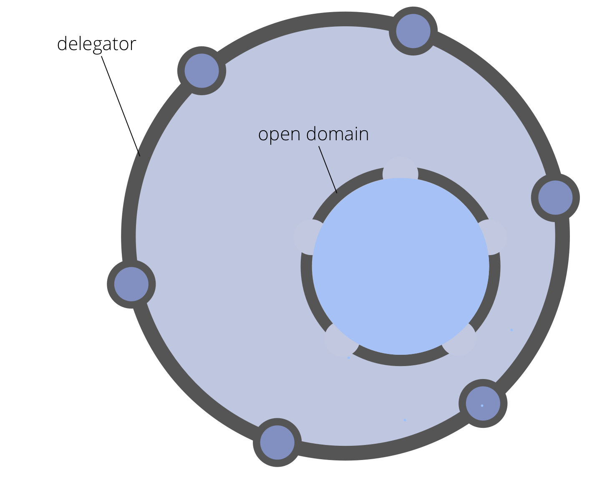

<strong>Kies bewust voor de verantwoording voor een domein op uitnodiging, in plaats van opdracht en de genodigden om een bijdrage te leveren wanneer zij kunnen.</strong>

De <dfn data-info="Delegator: Een individu of groep die de verantwoordelijkheid voor een domein aan anderen delegeert.">delegator</dfn> van het open domein verduidelijkt:

- de <dfn data-info="Primaire Driver: De primaire driver voor een domein is de hoofddriver waar mensen die verantwoordelijk zijn voor dat domein op reageren.">primaire driver</dfn>, kernverantwoordelijkheden en kaders van het open domein
- wie wordt uitgenodigd om bij te dragen aan het open domein
- kaders met betrekking tot de deelname van de delegator aan de <dfn data-info="Governance: Het vaststellen van doelstellingen en het nemen en ontwikkelen van besluiten die ervoor moeten zorgen dat deze doelstellingen ook worden bereikt.">governance</dfn> van het open domein

Afhankelijk van de kaders die de delegator stelt, kunnen de medewerkers alleen maar <dfn data-info="Activiteiten: Het doen en organiseren van werk en dagelijks activiteiten binnen de kaders die zijn gedefinieerd door governance.">werk organiseren en uitvoeren</dfn>, of ook deelnemen aan governance.

Een delegator is verantwoordelijk voor het uitvoeren van regelmatige beoordelingen om effectiviteit van werk en besluitvorming op een open domein te ondersteunen.

[&#9654; Open Systemen](open-systems.html) [&#9664; Hulpteam](helping-team.html) [&#9650; Organisaties Opbouwen](building-organizations.html)

