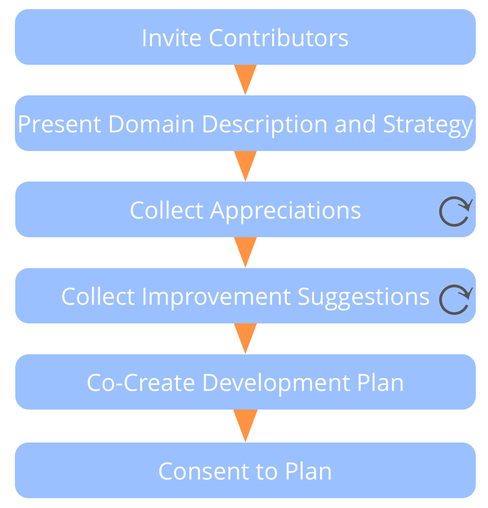
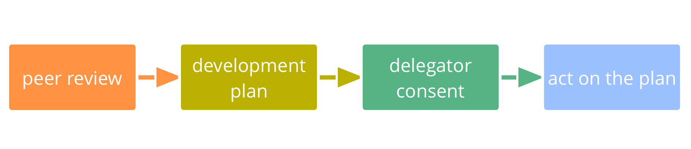

**Ondersteun elkaar om te leren en te groeien binnen jouw rollen en teams.**

De rolhouder - of het team - leidt de peer review door het proces op te zetten en in elke stap als eerst te spreken.

Zorg ervoor dat er mensen met aanvullende perspectieven worden uitgenodigd om bij te dragen aan de review, en dat er een [facilitator](facilitate-meetings.html) is.

Verbetersuggesties kunnen betrekking hebben op persoonlijke ontwikkeling, samenwerking, updates van de <dfn data-info="Domein: Een afgebakend gebied van invloed, activiteit en besluitvorming binnen een organisatie.">domein</dfn>beschrijving (inclusief de <dfn data-info="Driver van de Organisatie: Een driver is het motief van een persoon of groep om te reageren op een specifieke situatie. Een driver is een **driver van de organisatie** als een reactie op deze driver de organisatie zou helpen om waarde te genereren, verspilling te elimineren of schade te voorkomen.">driver</dfn>) en <dfn data-info="Strategie: Een hoog over aanpak voor hoe mensen waarde gaan creëren om succesvol invulling te geven aan (de driver en doelstelling van) een domein.">strategie</dfn>.

[&#9654; Ontwikkelplan](development-plan.html) [&#9664; Peer Feedback](peer-feedback.html) [&#9650; Gezamenlijke ontwikkeling](peer-development.html)

