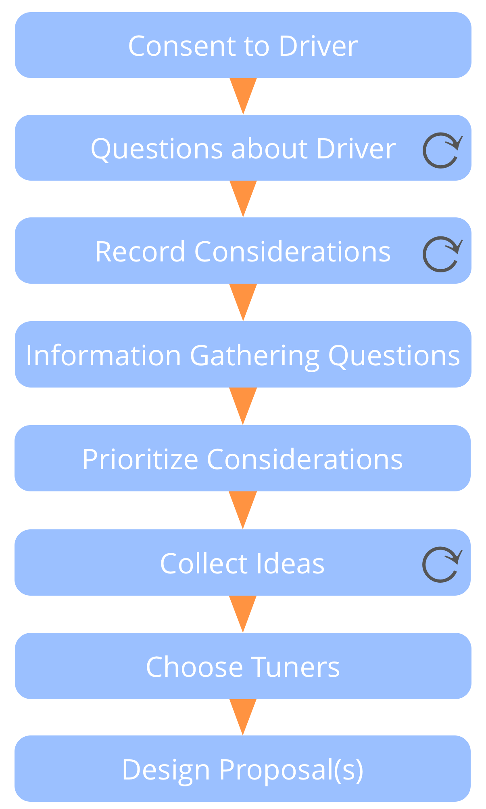

**Een (gefaciliteerd) groepsproces waarmee in co-creatie bedacht wordt hoe er het best op een driver gereageerd kan worden.**

- maakt gebruik van de collectieve intelligentie en diversiteit aan perspectief binnen een groep
- mensen betrekken bij het co-creeëren van afspraken
- bevordert accountability en een gevoel van eigenaarschap

*Voorstel vormen* kan ook worden gebruikt door een individu.

### Voorstel vorm stappen

**Consent over de driver:** Presenteer de <dfn data-info="Driver van de Organisatie: Een driver is het motief van een persoon of groep om te reageren op een specifieke situatie. Een driver is een **driver van de organisatie** als een reactie op deze driver de organisatie zou helpen om waarde te genereren, verspilling te elimineren of schade te voorkomen.">driver</dfn> kort. *Is deze driver relevant voor ons om op te reageren? Zijn er essentiële aanpassingen op wat er is voorgesteld?*

**Verdiep gedeeld begrip van de driver:** nodig uit om essentiële vragen te stellen en meer details te verzamelen over de driver.

**Verzamel overwegingen** geformuleerd als vragen met betrekking tot mogelijke oplossingen. Vragen onthullen beperkingen (vragen verzamelen van informatie) of mogelijkheden (generatieve vragen).

**Antwoord** alle informatieve vragen waar direct een antwoord op is te geven.

**Prioriteer** overwegingen.

**Verzamel ideeën** als mogelijke ingrediënten voor een voorstel.

**Ontwerp een voorstel** over hoe te reageren op de driver, door de creatieve ideeën en informatie die tot nu toe verzameld is te gebruiken. Dit wordt meestal gedaan door een kleinere groep (tuners).

### Choosing Tuners

Denk aan:

- wie zou er moeten er zijn?
- wie wil er zijn?
- wie kan eventueel nog meer een waardevolle bijdrage leveren?
- denk aan expertise, blik van buiten, en inspiratie

Tussen twee en drie tuners is meestal voldoende. Controleer op eventuele bezwaren tegen de voorgestelde tuner(s).

[&#9654; Rol Selectie](role-selection.html) [&#9664; Voorstellen co-creëren](co-create-proposals.html) [&#9650; Co-Creatie en Evolutie](co-creation-and-evolution.html)

