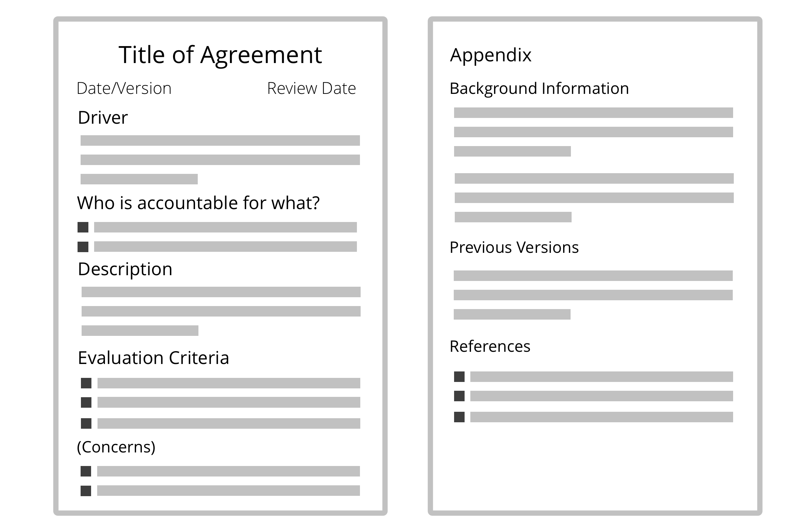

**Leg de details van ene overeenkomst vast, zodat je er later op kan terugkomen om de uitkomst te evalueren en de overeenkomst door te ontwikkelen.** 

_Een **overeenkomst** is een afspraak over een richtlijn, proces, beleid of protocol dat is ontworpen om de stroom van waarde zo goed mogelijk te geleiden._

**Opmerking:** In S3 zijn richtlijnen, processen of protocollen gemaakt door personen in een rol ook overeenkomsten.

Houdt gegevens rondom overeenkomsten up-to-date, bijvoorbeeld in een <dfn data-info="Logboek: Een (digitaal) systeem om alle informatie op te slaan die relevant is voor het sturen van een organisatie.">Logboek</dfn>.

### Wat leg je vast?

Overeenkomsten moeten voldoende details bevatten om belangrijke informatie later nog te kunnen terughalen.

Zorg in ieder geval voor een omschrijving van de driver, wat er overeengekomen is, wie waarvoor verantwoordelijk is, welke evaluatiecriteria er zijn en wanneer de review plaatsvindt.

Afhankelijk van de scope en het belang van de overeenkomst kunnen de volgende punten worden vastgelegd:

-   Een titel voor de overeenkomst
-   [Beschrijving van de driver](describe-organizational-drivers.html)
-   Aanmaakdatum (en/of versie)
-   Vervaldatum of leverdatum
-   Review datum (of frequentie)
-   Wie is verantwoordelijk voor wat?
-   Een beschrijving van de overeenkomst, waaronder:
    - Relevante vereisten en verwachtingen
    - Actiepunten
    - Middelen
    - Beperkingen
    - [Beoogde resultaten](clarify-intended-outcome.html)
    - [Op te leveren producten](describe-deliverables.html)
    - Achtergrond
-   [Evaluatiecriteria](evaluation-criteria.html) (en mogelijke <dfn data-info="Zorg: Een vermoeden - of mening - dat iets doen (zelfs in de afwezigheid van bezwaren) mogelijk in de weg zou kunnen staan van een (meer) effectieve reactie op een driver van de organisatie.">zorgen</dfn>)
-   Appendix:
    - Achtergrondinformatie
    - Vorige versies van de overeenkomsten
    - Referenties

[&#9654; Strategie Ontwikkelen](develop-strategy.html) [&#9650; Overeenkomsten Definiëren](defining-agreements.html)

