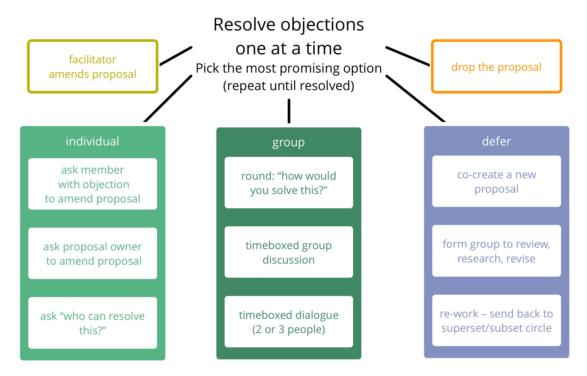
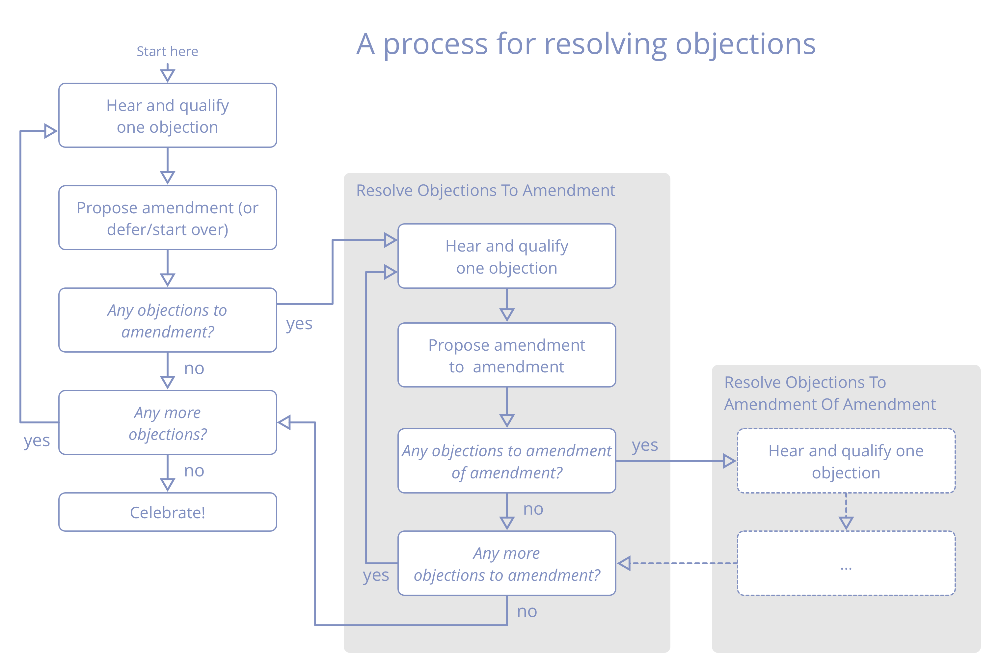

**Los bezwaren één voor één op door de informatie die zij bevatten te gebruiken om voorstellen aan te passen.**

Kies de meest veelbelovende optie om <dfn data-info="Bezwaar: Een _argument_ – gerelateerd aan een voorstel, besluit, bestaande overeenkomst of actie – die onbedoelde gevolgen of potentiële manieren om te verbeteren onthult.">bezwaren</dfn> op te lossen en kies, als dat niet lukt, een andere. Elke poging zal helpen om meer informatie te krijgen over de inhoud van het bezwaar en een fractie dichter bij de aanpassing van het voorstel brengen die het bezwaar oplost.

Vaak is het handig om te beginnen bij de persoon die het bezwaar uitte wanneer er wordt gezocht naar een aanpassing van het voorstel.

Meestal is het het meest effectief om**één bezwaar per keer** op te lossen, alle op de voorgestelde aanpassing op te lossen en vervolgens door te gaan met het volgende bezwaar op het gehele voorstel.

[&#9654; Overeenkomsten evalueren en doorontwikkelen](evaluate-and-evolve-agreements.html) [&#9664; Bezwaar](objection.html) [&#9650; Co-Creatie en Evolutie](co-creation-and-evolution.html)

