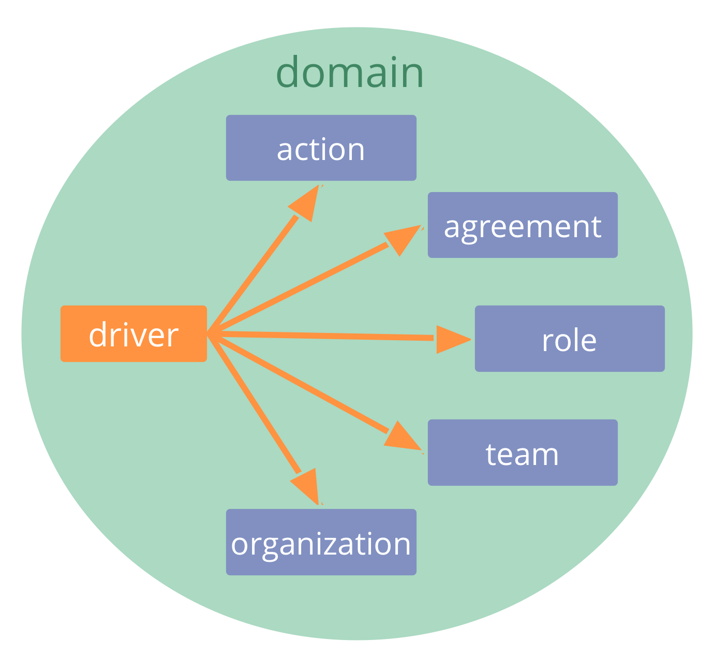

<strong>Verduidelijk drivers van de organisatie (d.w.z. wat er gebeurt en waar behoefte aan is in relatie tot de organisatie), en reageer op passende wijze.</strong>

Reacties op <dfn data-info="Driver van de Organisatie: Een driver is het motief van een persoon of groep om over te gaan tot actie in een specifieke situatie. Een driver is een **driver van de organisatie** wanneer het reageren hierop waarde oplevert voor de organisatie, of verspilling en schade voorkomt.">drivers van de organisatie</dfn> omvatten:

- directe actie (<dfn data-info="Activiteiten: Het doen en organiseren van werk en dagelijks activiteiten binnen de kaders die zijn gedefinieerd door governance.">activiteiten</dfn>)
- (zelf) organiseren hoe werk zal worden gedaan 
- governance besluiten nemen

De reactie op een driver van de organisatie wordt doorgaans behandeld als een experiment dat in de loop der tijd geëvalueerd en ontwikkeld wordt.

### Drivers kwalificeren die van belang zijn voor de organisatie.

Een driver is het motief van een persoon of groep om over te gaan tot actie in een specifieke situatie. Een driver is een **driver van de organisatie** wanneer het reageren hierop waarde oplevert voor de organisatie, of verspilling en schade voorkomt.

Een eenvoudige manier om te kwalificeren of een driver binnen het <dfn data-info="Domein: Een afgebakend gebied van invloed, activiteit en besluitvorming binnen een organisatie.">domein</dfn> van een organisatie valt is door te controleren:

*Zou het de organisatie helpen wanneer we op deze driver reageren? Of leidt het tot onbedoelde schade wanneer we dit niet doen?*

[&#9654; Navigeren via spanning](navigate-via-tension.html) [&#9650; Co-Creatie en Evolutie](co-creation-and-evolution.html)

