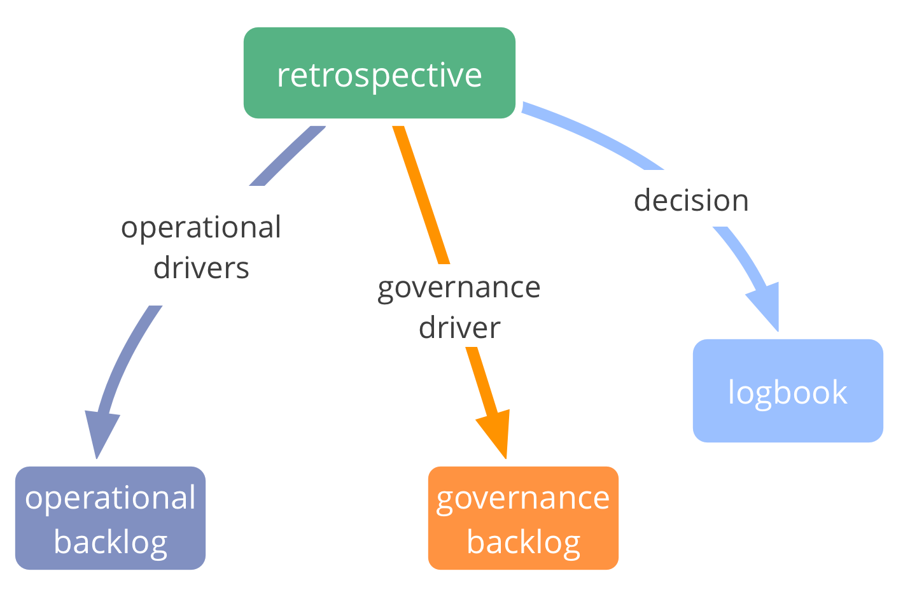

**Dedicate time to reflect on past experience, learn, and decide how to improve work process.**

- uitkomst: wijzigingen in het werkproces, nieuwe taken, "tussendoor" <dfn data-info="Overeenkomst: Een overeengekomen richtlijn, proces, beleid of protocol dat is ontworpen om de stroom van waarde zo goed mogelijk te geleiden.">overeenkomsten</dfn>, en <dfn data-info="Driver van de Organisatie: Een driver is het motief van een persoon of groep om te reageren op een specifieke situatie. Een driver is een **driver van de organisatie** als een reactie op deze driver de organisatie zou helpen om waarde te genereren, verspilling te elimineren of schade te voorkomen.">drivers</dfn> waar een afspraak over gemaakt moet worden
- gefaciliteerde vergadering (~1u)
- regelmatige intervallen (1-4 weken)
- aanpassen aan situatie en context

### Vijf fases van een Retrospectief

1. Zorg voor de juiste sfeer 
2. Verzamel data
3. Genereer inzichten
4. Besluit wat te doen
5. Sluit de retrospectief

Veel verschillende activiteiten voor elke fase kunnen worden gevonden op [plans-for-retrospectives.com](http://www.plans-for-retrospectives.com/)

[&#9654; Dagelijkse Standup](daily-standup.html) [&#9664; Governance Vergadering](governance-meeting.html) [&#9650; Gerichte Interacties](focused-interactions.html)

