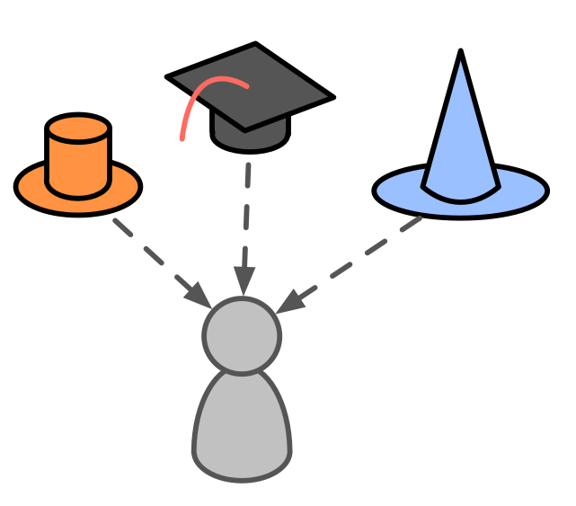

**Delegeren van accountability voor een domein aan individuen.**

Een rol is een verantwoordelijkheidsgebied (een <dfn data-info="Domein: Een afgebakend gebied van invloed, activiteit en besluitvorming binnen een organisatie.">domein</dfn>) dat <dfn data-info="Delegeren: Het verlenen van gezag van de ene partij (de delegator) aan een andere (de gedelegeerde) om verantwoording te geven aan een domein, (dat wil zeggen bepaalde dingen te doen en/of bepaalde besluiten te nemen) waarvoor de delegator de algemene verantwoordelijkheid behoudt.">gedelegeerd</dfn> is aan een individu (**de rolbewaarder**) welke de autonomie heeft om beslissingen en actie te nemen binnen de kaders van het roldomein.

De rolhouder heeft de leiding bij het opstellen van een <dfn data-info="Strategie: Een hoog over aanpak voor hoe mensen waarde gaan creëren om succesvol invulling te geven aan (de driver en doelstelling van) een domein.">strategie</dfn> over de manier waarop zij hun domein zullen invullen. Ze evolueren hun strategie in samenwerking met de <dfn data-info="Delegator: Een individu of groep die de verantwoording voor een domein overdragen aan (een) ander(en).">delegator</dfn>.

Een rol is een eenvoudige manier voor een organisatie (of <dfn data-info="Team: Een groep mensen die samenwerken naar een gedeelde bestuurder (of objectief). Meestal maakt een team deel uit van een organisatie, of wordt het gevormd als een samenwerking van verschillende organisaties.">team</dfn>) om terugkerende taken of een specifiek werkterrein te delegeren aan een van haar leden.

- people can take responsibility for more than one role
- in plaats van formeel een nieuw team op te richten, is het soms eenvoudiger om slechts één rol te delen tussen verschillende mensen
- rol houders zijn geselecteerd met consent en voor een beperkte duur
- peers support one another to develop in the roles they keep

Een rolhouder kan een governance <dfn data-info="Backlog: Een (geprioriteerde) lijst van werk gerelateerde items (deliverables), of (drivers) die nog moeten worden opgepakt.">backlog</dfn> en een <dfn data-info="Logboek: Een (digitaal) systeem om alle informatie op te slaan die relevant is voor het sturen van een organisatie.">logboek</dfn> bijhouden om te helpen vastleggen hoe zij van plan zijn <dfn data-info="Waarde: Het belang of nut van iets in relatie tot de driver. Het kan ook een principe zijn dat dient als richtlijn voor gedrag, dan meestal in het meervoud (waardes).">waarde</dfn> te leveren en om deze aanpak door te ontwikkelen.

**Opmerking**: In S3 worden richtlijnen, processen of protocollen die gemaakt zijn door personen in een rol als overeenkomst behandeld.

[&#9654; Koppelen](linking.html) [&#9664; Cirkel](circle.html) [&#9650; Organisaties Opbouwen](building-organizations.html)

