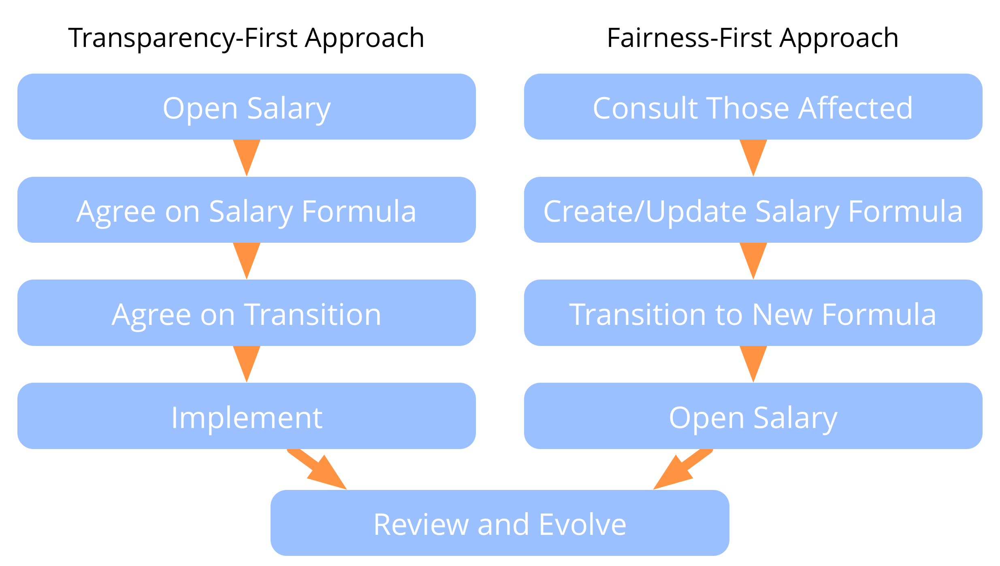

**Maak een eerlijke salarisformule en maak deze transparant.**

Transparant salaris (ookwel "open salaris") is het vaststellen van de vergoeding van elke werknemer volgens een reeks regels - de *salarisformule* - in plaats van dit vaststellen tijdens individuele onderhandelingen tussen werkgever en werknemer. De salarisformule – en vaak ook individuele vergoeding – is transparant voor alle leden van een organisatie, en soms voor het publiek.

Een transparante salarisformule moet in overeenstemming zijn met de context van een organisatie en door alle belanghebbenden als eerlijk genoeg worden beschouwd.

De beoordeling van de eerlijkheid verschilt van persoon tot persoon en per situatie, dus het creëren van een salarisformule vereist een gedeeld begrip van wat als rechtvaardig wordt beschouwd.

Wanneer er wordt besloten om te werken met een salarisformule voor een organisatie of afdeling, denk dan aan:

- wat een passend vast gedeelte zou zijn
- hoe de compensatie berekend moet worden op basis van behoeften, investeringen, productiviteit of verdiensten
- hoe de winst van de organisatie wordt verdeeld en de verliezen worden vergoed, in overeenstemming met de verwachtingen en behoeften van de verschillende belanghebbenden

Besluit hoe om te gaan met de beloning voor het veranderen van rollen en [ontwikkel een strategie](develop-strategy.html) om over te gaan naar de nieuwe contracten en compensatieovereenkomsten.

[&#9654; Ondersteunende rol](support-role.html) [&#9664; Contract voor succesvolle samenwerking](contract-for-successful-collaboration.html) [&#9650; Zaken die Co-creatie mogelijk maken](enablers-of-collaboration.html)

