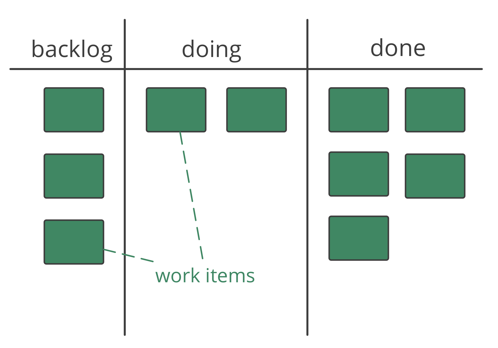
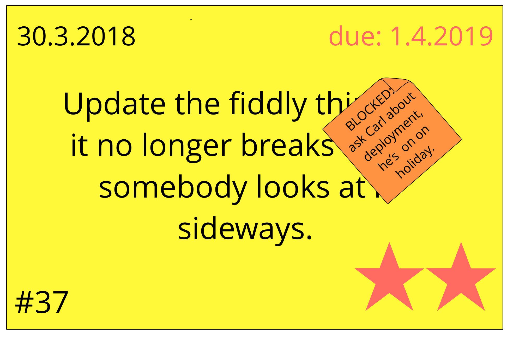

<strong>Gebruik een systeem dat alle stakeholders in staat stelt om de stand van zaken van alle wachtende, lopende en voltooide werkitems in te zien.</strong>

- waardevol voor <dfn data-info="Zelforganisatie: Elke activiteit of proces waarmee mensen hun dagelijkse werk organiseren zonder invloed van een externe tussenpersonen, en binnen kaders die zijn gedefinieerd door governance. In elke organisatie of team bestaan zelforganisatie en externe invloed naast elkaar.">zelforganisatie</dfn> en systemen van binnentrekken van werk
- systeem moet toegankelijk zijn voor iedereen die geraakt wordt
- **analoog**: plakmemo's op een muur, of indexkaarten, magneten en whiteboard
- **digitaal**: [Trello](https://trello.com/), [Kanbanery](https://kanbanery.com/), [Leankit](https://leankit.com/), [Jira](https://www.atlassian.com/software/jira), [Google Sheets](https://www.google.com/sheets/about/), etc.

### Dingen om bij te houden:

- **type werkitems** (bijv. klantverzoeken, projecttaken, rapportagetaken, opnieuw te doen werk)
- **startdatum** (en **vervaldatum** indien nodig)
- **prioriteiten**
- **fases** van het werk (bijv. "te doen", "in uitvoering", "review" en "done")
- hindernis/grenzen
- wie werkt aan welke items
- <dfn data-info="Overeenkomst: Een overeengekomen richtlijn, proces, beleid of protocol dat is ontworpen om de stroom van waarde zo goed mogelijk te geleiden.">overeenkomsten</dfn> en verwachtingen die de werkstroom leiden (bijvoorbeeld definitie van voltooid, beleid, kwaliteitsnormen)
- gebruik kleuren, symbolen, hoogtepunten etc.

[&#9654; Pull-systeem voor Werk](pull-system-for-work.html) [&#9664; Prioriteer backlogs](prioritize-backlogs.html) [&#9650; Werk Organiseren](organizing-work.html)

